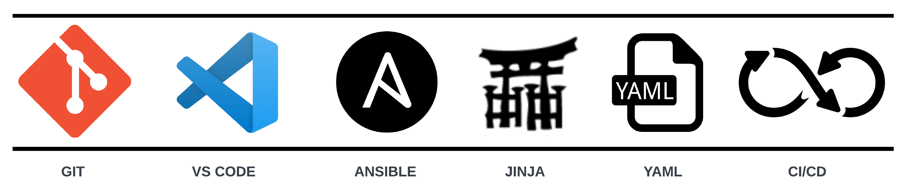

# Arista CI Workshops



The Arista CI Workshops are intended for engineers looking to learn the fundamentals of automation tools and get hands-on experience deploying network-wide configurations with Arista Validated Designs (AVD). The workshops are split into two in-person sessions allowing time to grasp the basic automation concepts before moving into building Data Models to deploy AVD. The content on this site is an overview of the concepts we will cover in person with full details and examples.

- **Workshop #1** - Automation Fundamentals 101
- **Workshop #2** - Arista CI - AVD
- **Workshop #3** - Arista CI - AVD with CI/CD

## Fundamentals

- [Git](workshops/git.md)
- [VS Code](workshops/vscode.md)
- [Jinja/YAML](workshops/jinja-yaml.md)
- [Ansible](workshops/ansible.md)

## Arista CI

- [AVD - L2LS](workshops/l2ls/overview.md)
- [AVD - L3LS with EVPN/VXLAN](workshops/l3ls/overview.md)
- [CI/CD Basics](workshops/cicd-basics.md)

## Contributing

If you would like to edit any content or contribute a new workshops, please follow the following guidelines.

- [Fork](https://github.com/aristanetworks/avd-workshops) this repository
- Create a working branch
- Run pre-commit on all updates
- Create pull request

### Prepare contributor environment

This repository comes with a devcontainer that you may leverage. If you'd like to work locally, preparing your contributor environment is relatively straight forward.

```shell
git clone https://github.com/aristanetworks/avd-workshops.git
cd avd-workshops
python3 -m venv venv
source venv/bin/activate
pip install -r requirements.txt
```

### Run pre-commit

Pre-commit should be installed in your environment.

```shell
pre-commit install
pre-commit run --all-files
```

### Preview site updates

> Note: This site uses mkdocs material insiders, some changes may not reflect locally.

```shell
mkdocs serve
```
