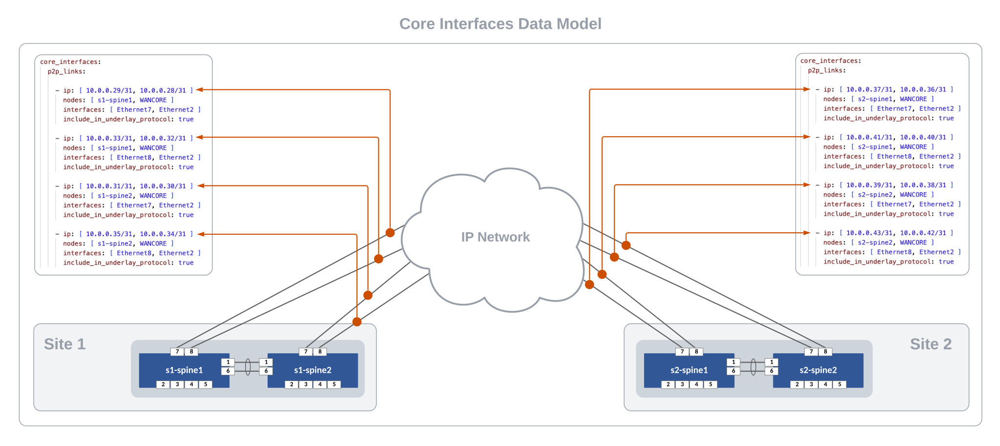

# AVD Lab Guide

## AVD Lab Guide Overview

The AVD Lab Guide is meant to be a follow along set of instructions to deploy a dual data center L2LS fabric design. The data model overview and details can be found [here](avd.md). In the following steps we will explore updating the data models to add services, ports and WAN links to our fabrics and test traffic between sites.


### Host Addresses

| Host     |  IP Address  |
|:--------:|:------------:|
| s1-host1 | 10.10.10.100 |
| s1-host2 | 10.20.20.100 |
| s2-host1 | 10.30.30.100 |
| s2-host2 | 10.40.40.100 |

## Prepare Lab Environment

### **STEP #1** - Access the ATD Lab

Connect to your ATD Lab and start the Programmability IDE. Next start a new Terminal.

### **STEP #2** - Fork and Clone branch to ATD Lab

An ATD Dual Data Center L2LS data model is posted on GitHub here: [https://github.com/PacketAnglers/workshops-avd](https://github.com/PacketAnglers/workshops-avd)

- Fork this [repository](https://github.com/PacketAnglers/workshops-avd) to your own GitHub account.
- Next, clone your forked repo to you ATD lab instance.

``` bash
cd /home/coder/project/labfiles
git clone <your copied URL>
cd workshops-avd
```

### **STEP #3** - Update AVD to latest version

AVD has been pre-installed in your lab environment, however it is on an older version. The following steps will update AVD and modules to the latest versions.

``` bash
ansible-galaxy collection install arista.avd arista.cvp --force
export ARISTA_AVD_DIR=$(ansible-galaxy collection list arista.avd --format yaml | head -1 | cut -d: -f1)
pip3 config set global.disable-pip-version-check true
pip3 install -r ${ARISTA_AVD_DIR}/arista/avd/requirements.txt
```

???+ Note

    IMPORTANT: The above steps must be ran each time you start your lab.

### **STEP #4** - Setup Lab Password Environment Variable

Each lab comes with a unique password. With the following command we set an environment variable called `LABPASSPHRASE`. The variable is later used to generate local user passwords and connect to our switches to push configs.

``` bash
export LABPASSPHRASE=`cat /home/coder/.config/code-server/config.yaml| grep "password:" | awk '{print $2}'`
```

You can view the password is set. This is the same password that is displayed when you click the link to access your lab.

``` bash
echo $LABPASSPHRASE
```

### **STEP #5** - Prepare WAN IP Network and Test Hosts

The last step in preparing your lab is to push pre-defined configurations to the WAN IP Network (cloud) and the four hosts used to test traffic. The spines from each site will connect to the WAN IP Network with P2P links. The hosts (two per site) have port-channels to the leaf pairs and are pre-configured with an IP address and route to reach the other hosts.

Run the following to push the configs.

``` bash
make preplab
```

## SITE 1 - Build and Deploy

This section will be devoted to reviewing and updating the existing L2LS data model.  We will add features to enable Vlans, SVIs, connected endpoints, and P2P links to the WAN IP Network. At the completion of the lab, you will have enabled an L2LS dual data center network through automation with AVD. YAML data models and ansible playbooks will be used to generate EOS Cli configurations and deploy them to each site. We will start by focusing efforts on building out Site 1 and then repeat similar steps for Site 2. Finally we will enable connectivity to the WAN IP Network to to allow traffic to pass between sites.

### Summary

1. Build Site 1
2. Build Site 2
3. Connect Sites to WAN IP Network
4. Verify routing
5. Test traffic

### **STEP #1** - Build and Deploy Initial Fabric

Run & Deploy initial Build of Fabric (most features will be commented out)

- Basic configs will be created
- show configs and docs
- Deploy configs
- COMMIT  files changes before moving on

### **STEP #2** - Add Services to the Fabric

Add Services (vlan and svis)

- Uncomment services key/value pairs
- Run build & deploy
- Check file diffs
- Verify configs active on Site 1 devices (watch show mlag)
- COMMIT changes

### **STEP #3** - Add Ports for Hosts

Add Ports for Hosts

- Uncomment services key/value pairs
- Run build & deploy
- Check file diffs
- Verify configs active on Site 1 devices (watch show mlag)
- Verify pings are working between hosts within Site 1
- COMMIT changes

## SITE 2 - Build and Deploy

Repeat the previous steps for Site 2.

- Add Services
- Add Ports
- Build and Deploy Configs

At the end of this step, you should be able to ping between hosts within a site but not between sites. We will build connectivity to the `WAN IP Network` in the next section.

## Connect Sites to WAN IP Network

The WAN IP Network can be defined with the`core_interfaces` data model. Full data model documentation is located [here](https://avd.sh/en/stable/roles/eos_designs/doc/core-interfaces-BETA.html).

### Steps to be followed for Site 1 and 2

- Update data models for core_interfaces (Site 1 & 2)
  - Add `core_interfaces:` to the `SITE1_FABRIC.yml` and `SITE2_FABRIC.yml`
- Build & Deploy
- Validate Routing in Spines
- Test Traffic between hosts across sites



### Site #1

Add the following YAML code block to the bottom of `sites/site_1/group_vars/SITE1_FABRIC.yml`.

``` yaml
core_interfaces:
  p2p_links:

    - ip: [ 10.0.0.29/31, 10.0.0.28/31 ]
      nodes: [ s1-spine1, WANCORE ]
      interfaces: [ Ethernet7, Ethernet2 ]
      include_in_underlay_protocol: true

    - ip: [ 10.0.0.33/31, 10.0.0.32/31 ]
      nodes: [ s1-spine1, WANCORE ]
      interfaces: [ Ethernet8, Ethernet2 ]
      include_in_underlay_protocol: true

    - ip: [ 10.0.0.31/31, 10.0.0.30/31 ]
      nodes: [ s1-spine2, WANCORE ]
      interfaces: [ Ethernet7, Ethernet2 ]
      include_in_underlay_protocol: true

    - ip: [ 10.0.0.35/31, 10.0.0.34/31 ]
      nodes: [ s1-spine2, WANCORE ]
      interfaces: [ Ethernet8, Ethernet2 ]
      include_in_underlay_protocol: true
```

### Site #2

Add the following YAML code block to the bottom of `sites/site_1/group_vars/SITE2_FABRIC.yml`.

``` yaml
core_interfaces:
  p2p_links:

    - ip: [ 10.0.0.37/31, 10.0.0.36/31 ]
      nodes: [ s2-spine1, WANCORE ]
      interfaces: [ Ethernet7, Ethernet2 ]
      include_in_underlay_protocol: true

    - ip: [ 10.0.0.41/31, 10.0.0.40/31 ]
      nodes: [ s2-spine1, WANCORE ]
      interfaces: [ Ethernet8, Ethernet2 ]
      include_in_underlay_protocol: true

    - ip: [ 10.0.0.39/31, 10.0.0.38/31 ]
      nodes: [ s2-spine2, WANCORE ]
      interfaces: [ Ethernet7, Ethernet2 ]
      include_in_underlay_protocol: true

    - ip: [ 10.0.0.43/31, 10.0.0.42/31 ]
      nodes: [ s2-spine2, WANCORE ]
      interfaces: [ Ethernet8, Ethernet2 ]
      include_in_underlay_protocol: true
```

### Build and Deploy WAN IP Network connectivity

``` bash
make build-site-1
make build-site-2
make deploy-site-1
make deploy-site-2
```

### Check routes on spine nodes

From the spines, verify that they can see routes to following networks where the hosts reside.

- 10.10.10.0/24
- 10.20.20.0/24
- 10.30.30.0/24
- 10.40.40.0/24

``` bash
show ip route
```

### Test traffic between sites

From `s1-host1` ping both `s2-host1` & `s1-host2`

``` bash
# s2-host1
ping 10.30.30.100

# s2-host2
ping 10.40.40.100
```

## **Congratulations!**

You have just built a multi-site L2LS network without touching the Cli on a single switch.
