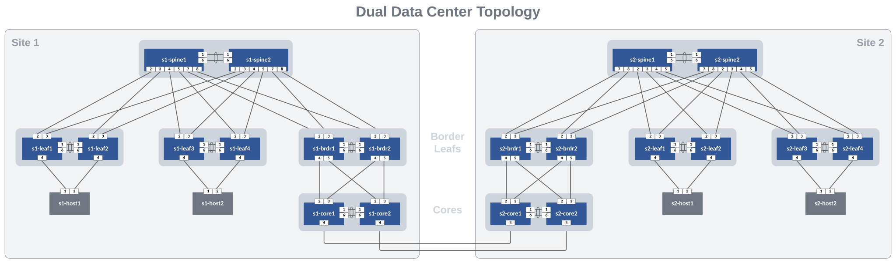

# AVD Lab Guide

## AVD Lab Guide Overview

The AVD Lab Guide is meant to be a follow along guide to deploy a dual data center L2LS fabric design. The data model details can be found [here](avd.md).

- Overview of AVD - Slides
- Ansible Inventories for Site 1 and Site 2
  - Data Models
    - Fabric
    - Services
    - Ports

## Lab Follow Along Steps

- Access the ATD Lab
- Fork and Clone branch to ATD Lab
- Update AVD
- Set `LABPASSPHRASE` environment variable
- Prepare WAN/Hosts - `make preplab` playbook
- Lab Workflow - SITE 1
  - Run & Deploy initial Build of Fabric (most features will be commented out)
    - Basic configs will be created
    - show configs and docs
    - Deploy configs
    - COMMIT  files changes before moving on
  - Add Services (vlan and svis)
    - Uncomment services key/value pairs
    - Run build & deploy
    - Check file diffs
    - Verify configs active on Site 1 devices (watch show mlag)
    - COMMIT changes
  - Add Ports for Hosts
    - Uncomment services key/value pairs
    - Run build & deploy
    - Check file diffs
    - Verify configs active on Site 1 devices (watch show mlag)
    - Verify pings are working between hosts within Site 1
    - COMMIT changes
- Lab Workflow - SITE 2
  - Build & deploy Site 2
- Introduce Core Interfaces to connect the sites together
  - Update data models for core_interfaces (site 1 & 2)
  - Build & Deploy
- Test pinging between sites
