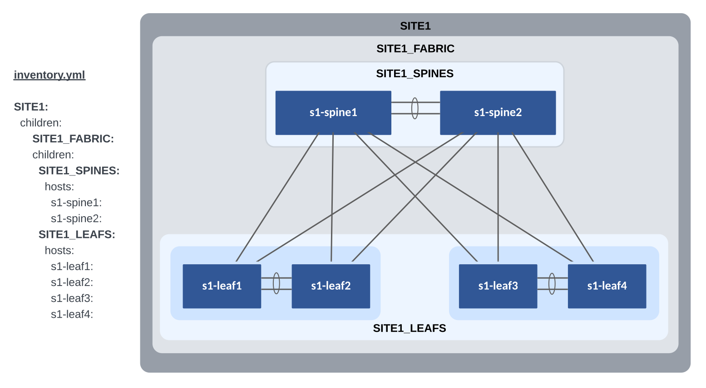

# Arista CI Workshop

This section we will leverage open source tools to build a network CI pipeline for configuration development, deployment, documentation and validation. Enabling us to manage our network environment as code.

This section will cover:

- Arista Validated Designs (AVD) Ansible Collection
- Network Data Models
- Initial Deployment (Day 0 Provisioning)
- Ongoing Operations (Day 2 and Beyond)
- Validation and Troubleshooting
- Enhancing our CI/CD Pipelines with GitHub Actions

Each attendee will receive their own dedicated virtual lab environment with Git, VS Code and Ansible already installed and ready to use.

Attendees will need:

- A laptop
- An account on [GitHub](https://github.com/)
- Familiarity with the concepts and tools covered in the previous [Automation Fundamentals workshop](https://aristanetworks.github.io/avd-workshops/) (Git, VS Code, Jinja/YAML, Ansible)

## Installation Requirements

### ATD Environment

The Lab ATD environment has been pre-installed with Ansible and Git. We still must update AVD and the required modules to the latest version. The following commands will install AVD and needed modules.

``` bash
ansible-galaxy collection install arista.avd arista.cvp --force
export ARISTA_AVD_DIR=$(ansible-galaxy collection list arista.avd --format yaml | head -1 | cut -d: -f1)
pip3 config set global.disable-pip-version-check true
pip3 install -r ${ARISTA_AVD_DIR}/arista/avd/requirements.txt
```

???+ Note

    IMPORTANT: The above steps must be ran each time you start your lab.

### Other Environments

Install AVD and required modules - Installation guide found [here](https://avd.sh/en/stable/docs/installation/collection-installation.html).

## Lab Topology Overview

Throughout this section we will make use of the following dual datacenter topology. Click on the image to zoom in for details.


## Basic EOS Switch Configuration

Basic connectivity between the Ansible controller host and the switches must be established before Ansible can be used to deploy configurations. The following should be configured on all switches:

- Switch Hostname
- IP enabled interface
- Username and Password defined
- Management eAPI enabled

???+ info

    In the ATD environment, vEOS/cEOS virtual switches use `Management0` in the default VRF. When using actual hardware switches, `Management1` is used. The included basic switch configurations may need to be adjusted for your environment.

Below is an example basic configuration file for s1-spine1:

``` shell
--8<--
workshops/assets/examples/s1-spine1.cfg
--8<--
```

## Ansible Inventory

Our lab L2LS topology contains two sites, `Site 1` and `Site 2`. We need to create the Ansible inventory for each site. We have created two separate directories for each site under the `sites` sub-directory in our repo.

``` text
├── sites/
  ├── site_1/
  ├── site_2/
```

The following is a graphical representation of the Ansible inventory groups and naming scheme used for `Site 1` in this example.  This is replicated for `Site 2`.



## AVD Fabric Variables

To apply AVD variables to the nodes in the fabric, we make use of Ansible group_vars. How and where you define the variables is your choice. The group_vars table below is one example of AVD fabric variables.

| group_vars/                | Description                                   |
| -------------------------- | --------------------------------------------- |
| SITE1_FABRIC.yml           | Fabric, Topology, and Device settings         |
| SITE1_SPINES.yml           | Device type for Spines                        |
| SITE1_LEAFS.yml            | Device type for Leafs                         |
| SITE1_NETWORK_SERVICES.yml | VLANs                                         |
| SITE1_NETWORK_PORTS.yml    | Port Profiles and Connected Endpoint settings |

=== "SITE1_FABRIC"
    At the Fabric level (SITE1_FABRIC), the following variables are defined in **group_vars/SITE1_FABRIC.yml**. The fabric name, design type (l2ls), l3spine and leaf node type defaults, interface links, and core interface P2P links are defined at this level. Other variables you must supply include:

    - spanning_tree_mode
    - spanning_tree_priority
    - mlag_peer_ipv4_pool

    The l3spine node will need these additonal variables set.

    - loopback_ipv4_pool
    - mlag_peer_l3_ipv4_pool
    - virtual_router_mac_address

    Variables applied under the node key type (l3spine/leaf) defaults section are inherited to nodes under each type. These variables may be overwritten under the node itself.

    The spine interface used by a particular leaf is defined from the leaf's perspective with a variable called `uplink_switch_interfaces`. For example, s1-leaf1 has a unique variable `uplink_switch_interfaces: [Ethernet2, Ethernet2]` defined. This means that s1-leaf1 is connected to `s1-spine1` Ethernet2 and `s1-spine2` Ethernet2, respectively.

    ``` yaml
    --8<--
    workshops/assets/examples/avd/site_1/group_vars/SITE1_FABRIC.yml
    --8<--
    ```

=== "SITE1_SPINES"
    In an L2LS design, there are two types of spine nodes: `spine` and `l3spine`. In AVD. the node type defines the functionality and the EOS CLI configuration to be generated. For our L2LS topology, we will use node type `l3spine` to include SVI functionality.

    ``` yaml
    --8<--
    workshops/assets/examples/avd/site_1/group_vars/SITE1_SPINES.yml
    --8<--
    ```

=== "SITE1_LEAFS"
    In an L2LS design, we have one type of leaf node: `leaf`. This will provide L2 functionality to the leaf nodes.

    ``` yaml
    --8<--
    workshops/assets/examples/avd/site_1/group_vars/SITE1_LEAFS.yml
    --8<--
    ```

=== "SITE1_NETWORK_SERVICES"
    You add VLANs to the Fabric by updating the **group_vars/SITE1_NETWORK_SERVICES.yml**. Each VLAN will be given a name and a list of tags. The tags filter the VLAN to specific Leaf Pairs. These variables are applied to spine and leaf nodes since they are a part of this nested group.

    ``` yaml
    --8<--
    workshops/assets/examples/avd/site_1/group_vars/SITE1_FABRIC_SERVICES.yml
    --8<--
    ```

=== "SITE1_NETWORK_PORTS"
    Our fabric would not be complete without connecting some devices to it. We define connected endpoints and port profiles in **group_vars/SITE1_NETWORKS_PORTS.yml**. Each endpoint's adapter defines which switch port(s) and port profile to use. In our lab, we have two hosts connected to the `site 1` fabric. The connected endpoints keys are used for logical separation and apply to interface descriptions. These variables are applied to spine and leaf nodes since they are a part of this nested inventory group.

    ``` yaml
    --8<--
    workshops/assets/examples/avd/site_1/group_vars/SITE1_FABRIC_PORTS.yml
    --8<--
    ```


## The Playbooks

## EOS Intended Configurations
