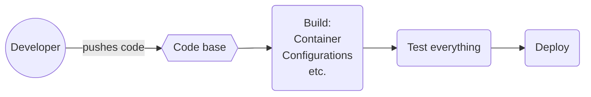

# CI/CD basics

This section will cover the many facets of continuous integration and continuous deployment (CI/CD). First, this post will go over the what and why of CI/CD. We will also explain why someone like a network engineer or operator should care about these concepts. The last portion of this section will review a sample of tools that fit into a CI/CD workflow and walk users through a simple example.

Readers should be familiar with the following concepts.

- [Git](git.md)
- [VS Code](vscode.md)
- [YAML](jinja-yaml.md)

## What

In its simplest form, CI/CD allows development teams to accurately and efficiently deploy new versions of an application. The pipeline will take care of building and testing the new code base. Once all the tests have passed, the new application can either be manually deployed or deployed through the pipeline. Of course, this goes without saying that we should track everything in the pipeline with Git or some version control system.

## Why

That may sounds great but you may be wondering, why do I need a pipeline? As it turns out, delivering new versions of software is hard. Building a pipeline may seem like a big process, but over time, the time savings are incredible compared to the time taken to initially build the pipeline. CI/CD allows developers to have a consistent workflow, automate testing, and deploy with confidence.

## CI/CD for networks

At this point, we have introduced a CI/CD pipeline from a developer's perspective. The beauty of this is that we can leverage developers' workflows in the network. In our case, the application is the network, albeit with a very high service level agreement (SLA).

For example, if we wanted to introduce a change in the network, the steps would be similar to the following.

- User requests a change to the network
- Change control ticket is created
- Review updates with the change control team
- Login to the test environment (if it exists) and test the changes
- Schedule downtime for the change to be implemented
- Login to the production environment to update the network device by device
- Validate the changes are working as expected

This example is not all-encompassing but hopefully gives you an idea of the steps involved; understandably, your environment may differ. This process is long, arduous, and prone to error (many touch points). However, implementing a CI/CD pipeline allows network operators to have a consistent, tested, and automated workflow to deploy updates to the network. In our case, we may be testing device configurations, BGP peering, or network reachability.

## Sea of options

The number of options available to implement a CI/CD pipeline can be daunting. For example, the image below does a great job of showing a subset of tools available in this process. The following section will summarize the various steps in a CI/CD pipeline from a networking perspective.

## CI/CD for Network Engineers

### Source control (Git)

Depending on the enterprises current tooling, your version control system (VCS) may be decided for you. This could be Azure DevOps, Gitlab, GitHub Enterprise, and countless others. Either way, keeping a project within a VCS system is key in this workflow. VCS allows operators to update the source of their network, track changes, and peer review any updates to the network. For an introduction to Git, check out our [Git](git.md) section.

### Editor

This is probably a debate that will never end, which editor to use?

### Creating branches to implement and update or fix

### Testing locally

### Pushing updates

### Automated workflows

### Test in anything but production

### Merge back to main

### Deploy to production

## Sample workflow

This could be as simple as doc creation.
