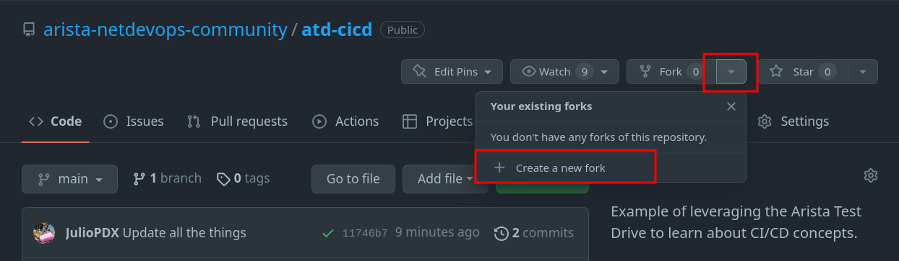
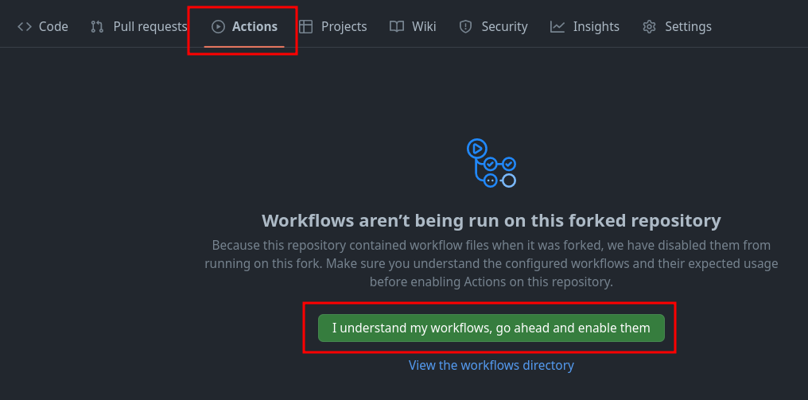

# CI/CD

This section walks you through an example CI/CD pipeline leveraging GitHub Actions, Arista Validated Designs (AVD), and the Arista CloudVision Platform (CVP). In addition, the lab leverages the Arista Test Drive (ATD) solution to give you a pre-built environment to get started quickly. This section assumes readers have completed the [AVD workshop](avd-lab-guide.md) within their ATD environment.

Readers should be familiar with the following concepts.

- [Git](git.md)
- [VS Code](vscode.md)
- [Jinja & YAML](jinja-yaml.md)
- [Ansible](ansible.md)

## The topology

Throughout this section, we will use the following dual data center topology. Click on the image to zoom in for details.


## Getting started

This repository leverages the dual data center (DC) ATD. If you are not leveraging the ATD, you may still leverage this repository for a similar deployment. Please note that some updates may have to be made for the reachability of nodes and CloudVision (CVP) instances. This example was created with Ansible [AVD](https://avd.sh/en/stable/) version `3.8.1`.

### Local installation

If running outside of the ATD interactive developer environment (IDE), you must install the base requirements.

```shell
python3 -m venv venv
source venv/bin/activate
ansible-galaxy collection install arista.avd arista.cvp --force
export ARISTA_AVD_DIR=$(ansible-galaxy collection list arista.avd --format yaml | head -1 | cut -d: -f1)
pip3 install -r ${ARISTA_AVD_DIR}/arista/avd/requirements.txt
```

### ATD programmability IDE installation

You can ensure the appropriate AVD version is installed by running the following command.

```shell
ansible-galaxy collection list
```

If AVD version `3.8.1` or greater is not present, please upgrade to the latest stable version.

```shell
ansible-galaxy collection install arista.avd arista.cvp --force
export ARISTA_AVD_DIR=$(ansible-galaxy collection list arista.avd --format yaml | head -1 | cut -d: -f1)
pip3 config set global.disable-pip-version-check true
pip3 install -r ${ARISTA_AVD_DIR}/arista/avd/requirements.txt
```

## Fork repository

You will be creating your own CI/CD pipeline in this workflow. Log in to your GitHub account and [fork this repository](https://github.com/PacketAnglers/workshops-avd) to get started.

!!! note
    If the repository was forked during the AVD workshop, you can skip this step.




### Enable GitHub actions

1. Go to Actions
2. Click `I understand my workflows, go ahead and enable them`



### Set GitHub secret

You will need to set one secret in your newly forked GitHub repository.

1. Go to `Settings`
2. Click `Secrets and variables`
3. Click `Actions`
4. Click `New repository secret`

   

5. Enter the secret as follows

   - Name: LABPASSPHRASE
   - Secret: Listed in ATD lab topology

    
    

6. Click `Add secret`

!!! note
    Our workflow uses this secret to authenticate with our CVP instance.

## Configure global Git settings and sync

1. From the IDE terminal, run the following:

    ```shell
    git config --global user.name "FirstName LastName"
    git config --global user.email "name@example.com"
    git add .
    git commit -m "Syncing with remote"
    git push
    ```

!!! note
    If the Git `user.name` and `user.email` are set, they may be skipped. You can check this by running the `git config --list` command.

## Create a new branch

In a moment, we will be deploying changes to our environment. In reality, updates to a code repository would be done from a development or feature branch. We will follow this same workflow.

!!! note
    This example will use the branch name `dc-updates`. If you use a different branch name, update the upcoming examples appropriately.

```shell
git checkout -b dc-updates
```

## Update local CVP variables

Every user will get a unique CVP instance deployed. There are two updates required.

1. Add the `ansible_host` variable under the `cvp` host in the `/home/coder/project/labfiles/workshops-avd/sites/site_1/inventory.yml` file.

    ```yaml
    ---
    SITE1:
      children:
        CVP:
          hosts:
              cvp:
                ansible_host: <atd-topo12345.topo.testdrive.arista.com>
       ...
    ```

2. Add the `ansible_host` variable under the `cvp` host in the `/home/coder/project/labfiles/workshops-avd/sites/site_2/inventory.yml` file.

    ```yaml
    ---
    SITE2:
      children:
        CVP:
          hosts:
              cvp:
                ansible_host: <atd-topo12345.topo.testdrive.arista.com>
       ...
    ```

!!! note
    These will be the same value. Make sure to remove any prefix like `https://` or anything after `.com`

## Commit changes and link ATD IDE to GitHub

You can run the following commands from the terminal or VS Code interface.

```shell
git add .
git commit -m "Updating host variables"
git push --set-upstream origin dc-updates
```

!!! note
    You will get a notification to sign in to GitHub. Follow these prompts.

## GitHub Actions

GitHub Actions is a CI/CD platform within GitHub. We can leverage GitHub Actions to create automated workflows within our repository. These workflows can be as simple as notifying appropriate reviewers of a change and automating the entire release of an application or network infrastructure.

### Workflow file

GitHub actions are defined within our code repository's `.github/workflows` directory.

```yaml
# dev.yml
name: Test the upcoming changes

on:
  push:
    branches-ignore:
      - main
...
```

At the highest level of our workflow file, we set the `name` of the workflow. This version of our workflow file represents any pushes that do not go to the main branch. For example, we would like our test or development workflow to start whenever we push or change any branches ***not*** named main. We can control this by setting the `on.push.branches-ignore` variable to main.

```yaml hl_lines="7-12"
...
on:
  push:
    branches-ignore:
      - main

jobs:
  dev:
    env:
      LABPASSPHRASE: ${{ secrets.LABPASSPHRASE }}
    timeout-minutes: 15
    runs-on: ubuntu-latest
...
```

In the next portion of the workflow file, we define a dictionary of `jobs`. For this example, we will only use one job with multiple steps. We set the ATD credential as an environment variable that will be available for our future steps. The `timeout-minutes` variable is optional and only included to ensure we remove any long-running workflows. This workflow should come nowhere near the 15-minute mark. Any more than that, and it should signal to us that there is a problem in the workflow. We can see the `runs-on` key at the end of this code block. This workflow uses the `ubuntu-latest` flavor, but other options are available. For example, we can use a Windows, Ubuntu, or macOS runner.

```yaml hl_lines="8-13"
...
jobs:
  dev:
    env:
      LABPASSPHRASE: ${{ secrets.LABPASSPHRASE }}
    timeout-minutes: 15
    runs-on: ubuntu-latest
    steps:
      - name: Hi
        run: echo "Hello World!"

      - name: Checkout
        uses: actions/checkout@v3
...
```

Now that we have defined our `dev` job, we must define what `steps` will run within this workflow. For this portion, we have the first and second steps in the workflow. he initial step, "Hi" is only used to validate an operational workflow and is not required. Next, the `actions/checkout` action will check out your repository to make the repository accessible in the workflow. Future workflow steps will then be able to use the relevant repository information to run tasks like building a new application or deploying the latest state of a network.

#### pre-commit

To get started with pre-commit, run the following commands in your ATD IDE terminal.

```shell
pip3 install pre-commit
pre-commit install
```

We will leverage pre-commit in our local development workflow and within the pipeline. pre-commit works by running automated checks on Git repositories manually or whenever a git commit is run. For example, if we wanted all of our YAML files to have a similar structure or follow specific guidelines, we could use a pre-commit "check-yaml" hook. Please note this is just a sample of what pre-commit can do. For a list of hooks, check out their official [list](https://pre-commit.com/hooks.html). The code block below references the pre-commit configuration file used in our repository.

```yaml
# .pre-commit-config.yaml
# See https://pre-commit.com for more information
# See https://pre-commit.com/hooks.html for more hooks
repos:
  - repo: https://github.com/pre-commit/pre-commit-hooks
    rev: v4.4.0
    hooks:
      - id: trailing-whitespace
        files: sites/site_1/group_vars/|sites/site_2/group_vars/

      - id: end-of-file-fixer
        exclude_types: [svg, json]
        files: sites/site_1/group_vars/|sites/site_2/group_vars/

      - id: check-yaml
        files: sites/site_1/group_vars/|sites/site_2/group_vars/
```

In pre-commit, we define our jobs under a `repos` key. This first repo step points to the built-in hooks provided by the pre-commit team. Please note, you can use hooks from other organizations. In our case, the checks are fairly simplistic. The first hook checks to ensure our files have no trailing whitespace. The next hook, `end-of-file-fixer`, ensures every file is empty or ends with one newline. Next, the check YAML hook validates any YAML file in our repository can be loaded as valid YAML syntax. Below is our workflow example leveraging the pre-commit action. This action will read the `.pre-commit-config.yaml` file in the root of our repository. The `files` key is used to only check files within specific directories. Finally, the setup Python action above the pre-commit step installs Python dependencies in this workflow.

```yaml hl_lines="9-13"
...
    steps:
      - name: Hi
        run: echo "Hello World!"

      - name: Checkout
        uses: actions/checkout@v3

      - name: Setup Python
        uses: actions/setup-python@v3

      - name: Run pre-commit on files
        uses: pre-commit/action@v3.0.0
...
```

##### pre-commit example

We can look at the benefits of pre-commit by introducing three errors in a group_vars file. This example will use the `sites/site_1/group_vars/SITE1_FABRIC_SERVICES.yml` file. Under VLAN 20, we can add extra whitespace after any entry, extra newlines, and move the `s1-spine2` key under the `s1-spine1` key.

```yaml
          20:
            name: 'Twenty'
            tags: [ "20" ]
            enabled: true
            ip_virtual_router_addresses:
              - 10.20.20.1
            nodes:
              s1-spine1:
                ip_address: 10.20.20.2/24
                s1-spine2: # <- Should not be nested under s1-spine1
                ip_address: 10.20.20.3/24 # <- extra whitespace
# <- Newline
# <- Newline
```

We can run pre-commit manually by running the `pre-commit run -a` command.

```shell
➜  workshops-avd git:(main) ✗ pre-commit run -a
trim trailing whitespace.................................................Failed
- hook id: trailing-whitespace
- exit code: 1
- files were modified by this hook

Fixing sites/site_1/group_vars/SITE1_FABRIC_SERVICES.yml

fix end of files.........................................................Failed
- hook id: end-of-file-fixer
- exit code: 1
- files were modified by this hook

Fixing sites/site_1/group_vars/SITE1_FABRIC_SERVICES.yml

check yaml...............................................................Failed
- hook id: check-yaml
- exit code: 1

while constructing a mapping
  in "sites/site_1/group_vars/SITE1_FABRIC_SERVICES.yml", line 26, column 17
found duplicate key "ip_address" with value "10.20.20.3/24" (original value: "10.20.20.2/24")
  in "sites/site_1/group_vars/SITE1_FABRIC_SERVICES.yml", line 28, column 17

To suppress this check see:
    http://yaml.readthedocs.io/en/latest/api.html#duplicate-keys

➜  workshops-avd git:(main) ✗
```

We can see all three failures. pre-commit hooks will try and fix errors if possible. However, pre-commit does not assume what our intent is with the YAML file, that fix is up to us. If you correct the indentation in the file and rerun pre-commit, you will see all passes.

```yaml
          20:
            name: 'Twenty'
            tags: [ "20" ]
            enabled: true
            ip_virtual_router_addresses:
              - 10.20.20.1
            nodes:
              s1-spine1:
                ip_address: 10.20.20.2/24
              s1-spine2: # <- Indentation fixed
                ip_address: 10.20.20.3/24 # <- No extra space
# <- One newline
```

```shell
➜  workshops-avd git:(main) ✗ pre-commit run -a
trim trailing whitespace.................................................Passed
fix end of files.........................................................Passed
check yaml...............................................................Passed
➜  workshops-avd git:(main)
```

#### Check file changes to speed up the pipeline

Currently, our workflow will build and deploy configurations for both sites. This is true even if we only have changes relevant to one site. We can use a path filter to check if changes within specific directories have been modified, signaling that a new build and deployment are required. Please take note of the `id` key. This will be referenced in our upcoming workflow steps leveraging Docker Compose.

```yaml
...
      - name: Run pre-commit on files
        uses: pre-commit/action@v3.0.0

      - name: Check paths for sites/site_1
        uses: dorny/paths-filter@v2
        id: filter-site1
        with:
          filters: |
            workflows:
              - 'sites/site_1/**'

      - name: Check paths for sites/site_2
        uses: dorny/paths-filter@v2
        id: filter-site2
        with:
          filters: |
            workflows:
              - 'sites/site_2/**'
...
```

#### Containers and Docker Compose

The final steps in our workflow leverage containers and Docker Compose. Containers are a great way to create environments that can be shared across team members or, in our case, the CI/CD workflow. The container is already made and hosted on Docker Hub. You can think of this container as the runner for our AVD workflows. If this container was not leveraged in the workflow, we would have to install all requirements during each pipeline run, possibly increasing the pipeline's completion time.

```docker
# Dockerfile
FROM python:3.9.16-slim

# Install dependencies:
COPY requirements.txt .
RUN pip3 install -r requirements.txt
RUN ansible-galaxy collection install arista.avd arista.cvp community.general --force
WORKDIR /app
```

The code block above is the Dockerfile used to build the runner in this workflow. We start with a base container of `python:3.9.16-slim`. We then copy any additional Python requirements. The last few steps install the requirements with pip and Ansible Galaxy.

Docker compose defines the deployment of our AVD runner in the `docker-compose.yml` file at the root of our repository. This is optional but allows for a cleaner container definition instead of using a long-winded `docker run` command.

```yaml
# docker-compose.yml
---
version: '3.3'
services:
  atd-cicd:
    container_name: atd-cicd
    volumes:
      - '.:/app'
    image: juliopdx/atd-cicd:l2ls
    environment:
      - LABPASSPHRASE=$LABPASSPHRASE
```

The `version` key associates this Docker Compose file with a specific version of the Docker API. We then define a list of `services` (containers). Within the `atd-cicd` object, we define the container name and volume (files) to pass along to the container. The `image` key points to the public location of the container. Docker Compose will look at Docker Hub first by default for a particular container image. The last key of `environment` passes an environment variable in our workflow to the container. This is the secrets variable we set within our actions and in the GitHub Actions file. The code block below lists the final steps in our workflow with Docker Compose and our container. The commands in our steps should be familiar with the make commands we used in the AVD workshop.

```yaml
...
      - name: Start containers
        run: docker-compose -f "docker-compose.yml" up -d --build

      - name: Test configuration for site1
        run: docker-compose run atd-cicd make build-site-1
        if: steps.filter-site1.outputs.workflows == 'true'

      - name: Test configuration for site2
        run: docker-compose run atd-cicd make build-site-2
        if: steps.filter-site2.outputs.workflows == 'true'

      - name: Stop containers
        if: always()
        run: docker-compose -f "docker-compose.yml" down
```

The test configuration steps have the conditional key of `if`. This maps to each path filter check step we used earlier. For example, the first path check has an `id` of `filter-site1`. We can reference the `id` in our workflow as `steps.filter-site1.outputs.workflows`. If this is set to `true`, a change was registered in our check and the test build step for site 1 will run.

At this point, make sure both workflows within the `.github/workflows` directory are ***not*** commented out. An example of the `dev.yml` file is below.

??? ".github/workflows/dev.yml"
    ```yaml
    name: Test the upcoming changes

    on:
      push:
        branches-ignore:
          - main

    jobs:
      dev:
        env:
          LABPASSPHRASE: ${{ secrets.LABPASSPHRASE }}
        timeout-minutes: 15
        runs-on: ubuntu-latest
        steps:
          - name: Hi
            run: echo "Hello World!"

          - name: Checkout
            uses: actions/checkout@v3

          - name: Setup Python
            uses: actions/setup-python@v3

          - name: Run pre-commit on files
            uses: pre-commit/action@v3.0.0

          - name: Check paths for sites/site_1
            uses: dorny/paths-filter@v2
            id: filter-site1
            with:
              filters: |
                workflows:
                  - 'sites/site_1/**'

          - name: Check paths for sites/site_2
            uses: dorny/paths-filter@v2
            id: filter-site2
            with:
              filters: |
                workflows:
                  - 'sites/site_2/**'

          - name: Start containers
            run: docker-compose -f "docker-compose.yml" up -d

          - name: Test configuration for site1
            run: docker-compose run atd-cicd make build-site-1
            if: steps.filter-site1.outputs.workflows == 'true'

          - name: Test configuration for site2
            run: docker-compose run atd-cicd make build-site-2
            if: steps.filter-site2.outputs.workflows == 'true'

          - name: Stop containers
            if: always()
            run: docker-compose -f "docker-compose.yml" down
    ```

## Day-2 ops - New service (VLAN)

This example workflow will add two new VLANs to our sites—one for sites 1 and 2. Site 1 will add VLAN 25, and site 2 will add VLAN 45. An example of the updated group_vars is below. The previous workshop modified the configuration of our devices directly through eAPI. This example will leverage GitHub actions with CloudVision to update our nodes. The provisioning with CVP will also create a new container topology and configlet assignment per device. For starters, we can update site 1.

??? "sites/site_1/group_vars/SITE1_FABRIC_SERVICES.yml"
    ```yaml
    ---
    tenants:
      MY_FABRIC:
        vrfs:
          default:
            svis:
              10:
                name: 'Ten'
                tags: [ "10" ]
                enabled: true
                ip_virtual_router_addresses:
                  - 10.10.10.1
                nodes:
                  s1-spine1:
                    ip_address: 10.10.10.2/24
                  s1-spine2:
                    ip_address: 10.10.10.3/24
              20:
                name: 'Twenty'
                tags: [ "20" ]
                enabled: true
                ip_virtual_router_addresses:
                  - 10.20.20.1
                nodes:
                  s1-spine1:
                    ip_address: 10.20.20.2/24
                  s1-spine2:
                    ip_address: 10.20.20.3/24
              25:
                name: 'Twenty-five'
                tags: [ "25" ]
                enabled: true
                ip_virtual_router_addresses:
                  - 10.25.25.1
                nodes:
                  s1-spine1:
                    ip_address: 10.25.25.2/24
                  s1-spine2:
                    ip_address: 10.25.25.3/24

    ```

### Build the updates locally (optional)

The pipeline will run the build and deploy steps for us with these relevant changes. We can also run the build steps locally to see all our pending updates.

```shell
make build-site-1
```

Feel free to check out the changes made to your local files. Please make sure the GitHub workflows are uncommented. We can now push all of our changes and submit a pull request.

!!! note
    The GitHub workflows are located in the `atd-cicd/.github/workflows` directory.

```shell
git add .
git commit -m "updating VLANs for site 1"
git push
```

### Viewing actions

If you navigate back to your GitHub repository, you should see an action executing.

1. Click `Actions`
2. Click on the latest action


Since this is a development branch, we are only testing for valid variable files so that AVD can successfully build our configurations. We can run one more example before deploying to production. You may notice the test configuration step was only initiated for site 1 and was skipped for site 2 (no changes). You can finish this example by updating the site 2 fabric services file.

??? "sites/site_2/group_vars/SITE2_FABRIC_SERVICES.yml"
    ```yaml
    ---
    tenants:
      MY_FABRIC:
        vrfs:
          default:
            svis:
              30:
                name: 'Thirty'
                tags: [ "30" ]
                enabled: true
                ip_virtual_router_addresses:
                  - 10.30.30.1
                nodes:
                  s2-spine1:
                    ip_address: 10.30.30.2/24
                  s2-spine2:
                    ip_address: 10.30.30.3/24
              40:
                name: 'Forty'
                tags: [ "40" ]
                enabled: true
                ip_virtual_router_addresses:
                  - 10.40.40.1
                nodes:
                  s2-spine1:
                    ip_address: 10.40.40.2/24
                  s2-spine2:
                    ip_address: 10.40.40.3/24
              45:
                name: 'Forty-five'
                tags: [ "45" ]
                enabled: true
                ip_virtual_router_addresses:
                  - 10.45.45.1
                nodes:
                  s2-spine1:
                    ip_address: 10.45.45.2/24
                  s2-spine2:
                    ip_address: 10.45.45.3/24

    ```

```shell
make build-site-2
git add .
git commit -m "updating VLANs for site 2"
git push
```

Once complete, the GitHub actions will show changes on sites 1 and 2.


## Creating a pull request to deploy updates (main branch)

We have activated our GitHub workflows and tested our configurations. We are now ready to create a pull request.

In your GitHub repository, you should see a tab for Pull requests.

1. Click on `Pull requests`
2. Click on `New pull request`
3. Change the base repository to be your fork
4. Change the compare repository to `dc-updates`
5. Click `Create pull request`


Add a title and enough of a summary to get the point across to other team members.


Once this is complete, click `Create pull request`. Since all checks have passed, we can merge our new pull request. If you have multiple options on the type of merge, select `squash and merge`.


At this point, this will kick off our second workflow against the main branch. This workflow will build and deploy our updates with CVP. If you go to the "Provisioning" tab of CVP, you should be able to see tasks and pending changes. This workflow will automatically run any pending tasks for us. We can optionally connect to one of the spines at either site to see the new VLANs.


```text
s1-spine1#show vlan
VLAN  Name                             Status    Ports
----- -------------------------------- --------- -------------------------------
1     default                          active
10    Ten                              active    Cpu, Po1, Po2
20    Twenty                           active    Cpu, Po1, Po4
25    Twenty-five                      active    Cpu, Po1
4093  LEAF_PEER_L3                     active    Cpu, Po1
4094  MLAG_PEER                        active    Cpu, Po1

s1-spine1#
################################################################################
s2-spine1#show vlan
VLAN  Name                             Status    Ports
----- -------------------------------- --------- -------------------------------
1     default                          active
30    Thirty                           active    Cpu, Po1, Po2
40    Forty                            active    Cpu, Po1, Po4
45    Forty-five                       active    Cpu, Po1
4093  LEAF_PEER_L3                     active    Cpu, Po1
4094  MLAG_PEER                        active    Cpu, Po1

s2-spine1#
```

## Summary

At this point, this will kick off our second workflow against the main branch. This workflow will build and deploy our updates with CVP. If you go to the "Provisioning" tab of CVP, you should be able to see tasks and pending changes. This workflow will automatically run any pending tasks for us. We can optionally connect to one of the spines at either site to see the new VLANs.

!!! note
    If your topology shuts down or time elapses, you must install the requirements, git configuration, and GitHub authentication.
