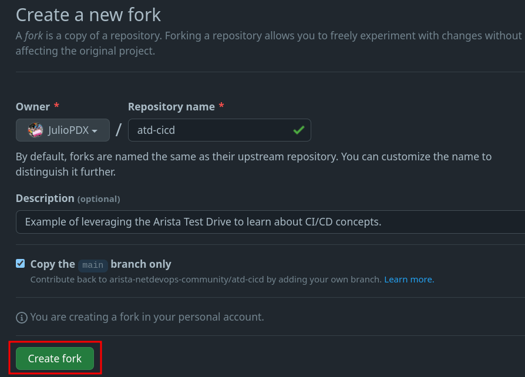
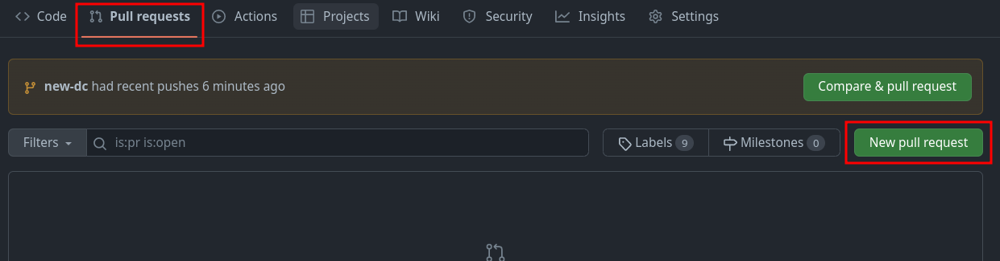

# CI/CD

This section walks you through an example CI/CD pipeline leveraging GitHub Actions, Arista Validated Designs (AVD), and the Arista CloudVision Platform (CVP). The lab leverages the Arista Test Drive (ATD) solution to give you a pre-built environment to get started quickly. This section assumes readers have completed the [AVD workshop](avd-lab-guide.md) within their ATD environment.

Readers should be familiar with the following concepts.

- [Git](git.md)
- [VS Code](vscode.md)
- [Jinja & YAML](jinja-yaml.md)
- [Ansible](ansible.md)

## The topology

Throughout this section we will make use of the following dual datacenter topology. Click on the image to zoom in for details.


## Getting started

This repository leverages the dual data center (DC) ATD. If you are not leveraging the ATD, you may still leverage this repository for a similar deployment. Please note some updates may have to be made for the reachability of nodes and CloudVision (CVP) instances. This example was created with Ansible [AVD](https://avd.sh/en/stable/) version `3.8.1`.

### Local installation

You must install the base requirements if running outside of the ATD interactive developer environment (IDE).

```shell
python3 -m venv venv
source venv/bin/activate
ansible-galaxy collection install arista.avd arista.cvp --force
export ARISTA_AVD_DIR=$(ansible-galaxy collection list arista.avd --format yaml | head -1 | cut -d: -f1)
pip3 install -r ${ARISTA_AVD_DIR}/arista/avd/requirements.txt
```

### ATD programmability IDE installation

You can ensure the appropriate AVD version is installed by running the following command.

```shell
ansible-galaxy collection list
```

If AVD version `3.8.1` or greater is not present, please upgrade to the latest stable version.

```shell
ansible-galaxy collection install arista.avd arista.cvp --force
export ARISTA_AVD_DIR=$(ansible-galaxy collection list arista.avd --format yaml | head -1 | cut -d: -f1)
pip3 config set global.disable-pip-version-check true
pip3 install -r ${ARISTA_AVD_DIR}/arista/avd/requirements.txt
```

## Fork repository

You will be creating your own CI/CD pipeline in this workflow. Log in to your GitHub account and [fork this repository](https://github.com/PacketAnglers/workshops-avd) to get started.




### Enable GitHub actions

1. Go to Actions
2. Click `I understand my workflows, go ahead and enable them`


### Set GitHub secret

You will need to set one secret in your newly forked GitHub repository.

1. Go to `Settings`
2. Click `Secrets and variables`
3. Click `Actions`
4. Click `New repository secret`

   

5. Enter the secret as follows

   - Name: LABPASSPHRASE
   - Secret: Listed in ATD lab topology

    
    

6. Click `Add secret`

!!! note
    Our workflow uses this secret to authenticate with our CVP instance.

## Configure global Git settings

1. From the IDE terminal, run the following

    ```shell
    git config --global user.name "FirstName LastName"
    git config --global user.email "name@example.com"
    ```

!!! note
    If the Git `user.name` and `user.email` are set, they may be skipped. You can check this by running the `git config --list` command.

## Create new branch

In a moment, we will be deploying changes to our environment. In reality, updates to a code repository would be done from a development or feature branch. We will follow this same workflow.

!!! note
    This example will use the branch name of `dc-updates`, if you use your own naming scheme, make sure to make the appropriate updates.

```shell
git checkout -b dc-updates
```

## Update local CVP variables

Every user will get a unique CVP instance deployed. There are two updates required.

1. Add the `ansible_host` variable under the `cvp` host in the `/home/coder/project/labfiles/workshops-avd/sites/site_1/inventory.yml` file.

    ```yaml
    ---
    SITE1:
      children:
        CVP:
          hosts:
              cvp:
                ansible_host: <atd-topo12345.topo.testdrive.arista.com>
       ...
    ```

2. Add the `ansible_host` variable under the `cvp` host in the `/home/coder/project/labfiles/workshops-avd/sites/site_2/inventory.yml` file.

    ```yaml
    ---
    SITE2:
      children:
        CVP:
          hosts:
              cvp:
                ansible_host: <atd-topo12345.topo.testdrive.arista.com>
       ...
    ```

!!! note
    These will be the same value. Make sure to remove any prefix like `https://` or anything after `.com`

## Commit changes and link ATD IDE to GitHub

We have two changes in our `hosts.yml` files for production and development environments. The following can be executed from the terminal or GUI interface.

```shell
git add .
git commit -m "Updating host variables"
git push --set-upstream origin dc-updates
```

!!! note
    You will get a notification to sign in to GitHub. Follow these prompts.

## GitHub Actions

GitHub Actions is a CI/CD platform within GitHub. We can leverage GitHub Actions to create automated workflows within our repository. These workflows can be as simple as notifying appropriate reviewers of a change and automating the entire release of an application or network infrastructure.

### Workflow file

GitHub actions are defined withing the `.github/workflows` directory of our code repository.

```yaml
# dev.yml
name: Test the upcoming changes

on:
  push:
    branches-ignore:
      - main
...
```

At the highest level of our workflow file, we set the `name` of the workflow. This version of our workflow file represents any pushes that do not go to the main branch. We would like our test or development workflow to start whenever we make any pushes or changes to any branches not named main. We can control this by setting the `on.push.branches-ignore` variable to main.

```yaml hl_lines="7-12"
...
on:
  push:
    branches-ignore:
      - main

jobs:
  dev:
    env:
      LABPASSPHRASE: ${{ secrets.LABPASSPHRASE }}
    timeout-minutes: 15
    runs-on: ubuntu-latest
...
```

In the next portion of the workflow file we define a dictionary of `jobs`. For this example we will only use one job with multiple steps. We set the ATD credential as an environment variable that will be available for our future steps. The `timeout-minutes` variable is optional and is only included to make sure we remove and long-running workflows. In reality, this workflow should come nowhere near the 15 minute mark. Any more than that and it should signal to us that there is a problem in the workflow. At the end of this portion we can see the `runs-on` key. This workflow uses the `ubuntu-latest` flavor but other options are available. For example, we can use a Windows, Ubuntu, or macOS runner.

```yaml hl_lines="8-13"
...
jobs:
  dev:
    env:
      LABPASSPHRASE: ${{ secrets.LABPASSPHRASE }}
    timeout-minutes: 15
    runs-on: ubuntu-latest
    steps:
      - name: Hi
        run: echo "Hello World!"

      - name: Checkout
        uses: actions/checkout@v3
...
```

Now that we have defined our `dev` job, we need to define what `steps` will run within this workflow. For this portion we have the first and second step in the workflow. The initial step named "Hi" is only used to validate a working workflow and is not required. The `actions/checkout` action will check-out your repository to make the repository accessible in the workflow. Future workflow steps will then be able to use the relevant repository information to run tasks like building a new application or deploying the new state of a network.

#### pre-commit

We will leverage pre-commit in our local development workflow and within the pipeline. pre-commit works by running automated checks on Git repositories manually or whenever a git commit is ran. For example, if we wanted all of our YAML files to have a similar structure or follow certain guidelines, we could use a pre-commit check YAML hook. Please note, this is just a sample of what pre-commit can do. For a list of hooks, check out their official [list](https://pre-commit.com/hooks.html). The code block below is a reference of the pre-commit configuration file used in our repository.

```yaml
# .pre-commit-config.yaml
# See https://pre-commit.com for more information
# See https://pre-commit.com/hooks.html for more hooks
repos:
  - repo: https://github.com/pre-commit/pre-commit-hooks
    rev: v4.4.0
    hooks:
      - id: trailing-whitespace
      - id: end-of-file-fixer
        exclude_types: [svg, json]
      - id: check-yaml
```

In pre-commit we define our jobs under a `repos` key. This first repo step points to the built-in hooks provided by the pre-commit team. Please note, you can use hooks from other organizations. In our case, our checks are fairly simplistic. The first hook checks to make sure our files don't have any trailing whitespace. The next hook, `end-of-file-fixer`,ensures every file is empty or ends with one newline. The check YAML hook validates any YAML file in our repository can be loaded as valid YAML syntax. Below is our workflow example leveraging the pre-commit action. This action will read the `.pre-commit-config.yaml` file in the root of our repository. The setup Python action above it is only used to make sure we have a stable Python environment in this workflow.

```yaml hl_lines="9-10"
...
    steps:
      - name: Hi
        run: echo "Hello World!"

      - name: Checkout
        uses: actions/checkout@v3

      - name: Setup Python
        uses: actions/setup-python@v3

      - name: Run pre-commit on files
        uses: pre-commit/action@v3.0.0
...
```

#### Containers and Docker Compose

The final steps in our workflow leverage containers and Docker Compose. Containers are a great way to create environments that can be shared across team members or in our case the CI/CD workflow. The container is already created and hosted on Docker Hub. You can think of this container as the runner for our AVD workflows. If this container was not leveraged in the workflow, we would have to install all requirements during each run of the pipeline, possibly increasing the amount of time it will take to complete.

```docker
# Dockerfile
FROM python:3.9.16-slim

# Install dependencies:
COPY requirements.txt .
RUN pip3 install -r requirements.txt
RUN ansible-galaxy collection install arista.avd arista.cvp community.general --force
WORKDIR /app
```

The code block above is the Dockerfile that was used to build the runner in this workflow. We start with a base container of `python:3.9.16-slim`, we then copy any additional python requirements. The last few steps install the requirements with pip and Ansible Galaxy.

Docker compose is used to define the deployment of our AVD runner in the `docker-compose.yml` file at the root of our repository. This is optional but allows for a cleaner definition of our container instead of using a long winded `docker run` command.

```yaml
# docker-compose.yml
---
version: '3.3'
services:
  atd-cicd:
    container_name: atd-cicd
    volumes:
      - '.:/app'
    image: juliopdx/atd-cicd
    environment:
      - LABPASSPHRASE=$LABPASSPHRASE
```

The `version` key is used to associate this Docker Compose file with a specific version of the Docker API. We then define a list of services (containers). Within the `atd-cicd` object, we define the container name and a volume or files to pass along to the container. The image key points to the public location of the container. Docker Compose will look at Docker Hub first by default for a particular container image. The last key passes an environment variable in our workflow to the container. You may recall this is the secrets variable we set within our actions and in the GitHub Actions file. The code block below lists the final steps in our workflow with Docker Compose and our container. The commands in our steps should be familiar with the make commands we used in the AVD workshop.

```yaml
...
      - name: Run pre-commit on files
        uses: pre-commit/action@v3.0.0

      - name: Start containers
        run: docker-compose -f "docker-compose.yml" up -d --build

      - name: Test configuration build
        run: docker-compose run atd-cicd make build-site-1 build-site-2

      - name: Stop containers
        if: always()
        run: docker-compose -f "docker-compose.yml" down
```

## Enable GitHub actions workflows

GitHub actions allow us to automate almost every element of our repository. We can use them to check syntax, linting, unit testing, etc. In our case, we want to use GitHub actions to test new changes to our infrastructure and then deploy those changes. In this example, we simulate that Network Admins cannot manually change the nodes. Admins must execute changes from the pipeline.

In this repository, we have two workflow files located in our `.github/workflows` directory. Both workflows are identical but differ slightly in whether changes will be deployed in our development or production environment. Below is an example of the development workflow.

1. In your IDE, ***uncomment*** both workflows. A shortcut is to highlight the workflow and type `Ctrl + /` or `Cmd + /` on Mac.
2. The files are located in the following locations.

- `workshops-avd/.github/workflows/dev.yml`
- `workshops-avd/.github/workflows/prod.yml`

```yaml
name: Test the upcoming changes

on:
  push:
    branches-ignore:
      - main

jobs:
  dev:
    env:
      LABPASSPHRASE: ${{ secrets.LABPASSPHRASE }}
    timeout-minutes: 15
    runs-on: ubuntu-latest
    steps:
      - name: Hi
        run: echo "Hello World!"

      - name: Checkout
        uses: actions/checkout@v3

      - name: Setup Python
        uses: actions/setup-python@v3

      - name: Run pre-commit on files
        uses: pre-commit/action@v3.0.0

      - name: Start containers
        run: docker-compose -f "docker-compose.yml" up -d --build

      - name: Test configuration build
        run: docker-compose run atd-cicd make build-site-1 build-site-2

      - name: Stop containers
        if: always()
        run: docker-compose -f "docker-compose.yml" down

```

<!-- This workflow is relatively short but represents some interesting options. For starters, we set `branches-ignore` to `main`. Since we are testing our feature or development branches, we don't want this to run on `main`, representing our production environment. We set two environment variables, one to specify if this is `dev` or `prod`. We then pass along our `PASS` variable, which represents the credentials to connect to our CVP instance. -->

### The steps

The initial `checkout` step makes the repository available to our workflow. We then use Docker Compose to stand up an AVD runner container. This container has every requirement preinstalled. If we did not have this container available, we would have to run through the exact same steps you ran to prepare your environment in this workflow. The `atd-cicd` container allows us to speed up our workflow. Below is an example of the `docker-compose.yml` file.

```yaml
---
version: '3.3'
services:
  atd-cicd:
    container_name: atd-cicd
    volumes:
      - '.:/app'
    image: juliopdx/atd-cicd
    environment:
      - LABPASSPHRASE=$LABPASSPHRASE
```

## Day-2 operations - New VLAN

At the moment, this example deployment is using OSPF for the underlay. We want to migrate from OSPF to BGP. We have to make two minor updates to our group variables for development and production. In the `atd-inventory/dev/group_vars/ATD_FABRIC_DEV.yml` file, we have the variable `underlay_routing_protocol` set to OSPF. We can ***comment*** this out and leverage the default underlay of BGP used in AVD DC deployments.

```yaml
# underlay_routing_protocol: OSPF
```

Perform the same for the `atd-inventory/prod/group_vars/ATD_FABRIC_PROD.yml` file.

At this point, we can build the intended configurations for both environments. The first command defaults to the `dev` inventory, and the second has to be specified on the command line.

```shell
# Dev
ansible-playbook playbooks/atd-fabric-build.yml
# Prod
ansible-playbook playbooks/atd-fabric-build.yml -i atd-inventory/prod/hosts.yml
```

!!! note
    You don't have to specify the inventory when interacting with the development environment because this is the default inventory in our `ansible.cfg` file.

```apache
[defaults]
inventory =./atd-inventory/dev/hosts.yml
```

Feel free to check out the changes made to your local files. Please make sure the GitHub workflows are uncommented. We can now push all of our changes and submit a pull request.

!!! note
    The GitHub workflows are located in the `atd-cicd/.github/workflows` directory.

```shell
git add .
git commit -m "Migrating from OSPF to BGP underlay"
git push
```

## Viewing actions

If you navigate back to your GitHub repository, you should see an action executing.

1. Click `Actions`
2. Click on the latest action

As this is executing, on your CVP instance, you should see new containers and tasks that will be executed.


## Creating a pull request to deploy main (production)

We have activated our GitHub workflows, tested our configurations in our development environment, and pushed those changes to our nodes. We are now ready to create a pull request.

In your GitHub repository, you should see a tab for Pull requests.

1. Click on `Pull requests`
2. Click on `New pull request`
3. Change the base repository to be your fork
4. Change the compare repository to `new-dc`
5. Click `Create pull request`




Add a title and enough of a summary to get the point across to other team members.


Once this is complete, click `Create pull request`. Since all checks have passed, we can merge our new pull request.


At this point, this will kick off our second workflow against the main branch. This is our production instance. If you go back to `Actions`, you can see this executing. Alternatively, you can see the updates running on CVP.


## Summary and bonus

Congratulations, you have successfully deployed a CI/CD pipeline with GitHub Actions. Feel free to make additional changes or extend the testing pieces.

!!! note
    If your topology shut down or time elapsed, you must run through the requirement installations and GitHub authentication on the next `git push`.
