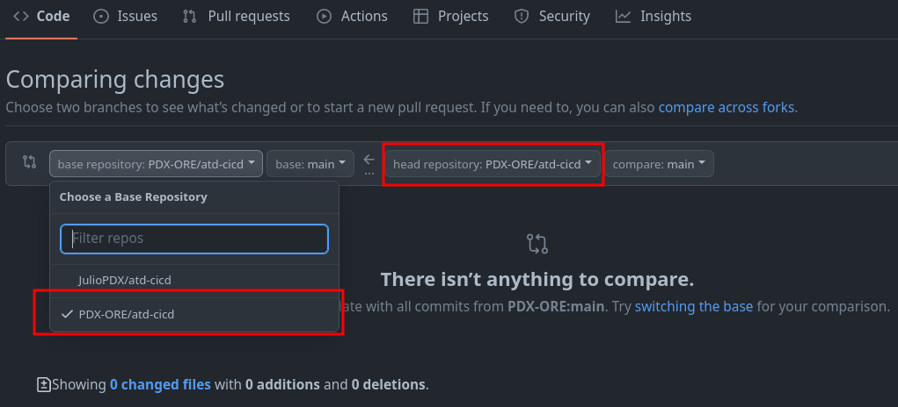
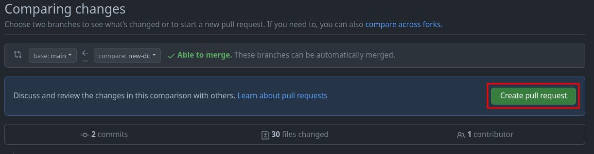

# CI/CD

This section walks you through an example CI/CD pipeline leveraging GitHub Actions, Arista Validated Designs (AVD), and Arista CloudVision Platform (CVP). The lab leverages the Arista Test Drive (ATD) solution to give you a pre-built environment to get started quickly.

Readers should be familiar with the following concepts.

- [Git](git.md)
- [VS Code](vscode.md)
- [Jinja & YAML](jinja-yaml.md)
- [Ansible](ansible.md)

## The topology

The dual data center ATD is deployed by default with many devices. The topology allows users to run examples like data center interconnect. In our case, we only require a subset of nodes. Devices from site 1 (s1) will act as our development infrastructure, and devices in site 2 (s2) will be our production infrastructure. The diagram below exemplifies what we hope to accomplish at the end of this workflow.


## Getting started

This repository leverages the dual data center (DC) ATD. If you are not leveraging the ATD, you may still leverage this repository for a similar deployment. Please note some updates may have to be made for the reachability of nodes and CloudVision (CVP) instances. This example was created with Ansible [AVD](https://avd.sh/en/stable/) version `3.8.1`.

### Local installation

You must install the base requirements if running outside of the ATD interactive developer environment (IDE).

```shell
python3 -m venv venv
source venv/bin/activate
ansible-galaxy collection install arista.avd --force
export ARISTA_AVD_DIR=$(ansible-galaxy collection list arista.avd --format yaml | head -1 | cut -d: -f1)
pip3 install -r ${ARISTA_AVD_DIR}/arista/avd/requirements.txt
```

### ATD programmability IDE installation

You can ensure the appropriate AVD version is installed by running the following command.

```shell
ansible-galaxy collection list
```

If AVD version `3.8.1` or greater is not present, please upgrade to the latest stable version.

```shell
ansible-galaxy collection install arista.avd --force
export ARISTA_AVD_DIR=$(ansible-galaxy collection list arista.avd --format yaml | head -1 | cut -d: -f1)
pip3 config set global.disable-pip-version-check true
pip3 install -r ${ARISTA_AVD_DIR}/arista/avd/requirements.txt
```

## Fork repository

You will be creating your own CI/CD pipeline in this workflow. Log in to your GitHub account and [fork this repository](https://github.com/arista-netdevops-community/atd-cicd) to get started.


### Enable GitHub actions

1. Go to Actions
2. Click `I understand my workflows, go ahead and enable them`


### Set GitHub secret

You will need to set one secret in your newly forked GitHub repository.

1. Go to `Settings`
2. Click `Secrets and variables`
3. Click `Actions`
4. Click `New repository secret`

   

5. Enter the secret as follows

   - Name: PASS
   - Secret: Listed in ATD lab topology

    
    

6. Click `Add secret`

!!! note
    Our workflow uses this secret to authenticate with our CVP instance.

## Clone forked repository to ATD IDE

1. Click `Code`
2. Copy the HTTPS link

3. From the IDE terminal, run the following

    ```shell
    cd labfiles
    git clone <your copied URL>
    cd atd-cicd
    git config --global user.name "FirstName LastName"
    git config --global user.email "name@example.com"
    ```

!!! note
    If the Git `user.name` and `user.email` are set, they may be skipped. You can check this by running the `git config --list` command.

## Environment variables

This repository relies on one environment variable to be set, our login credentials. From the ATD IDE, run the following command.

```shell
export PASS=<some password in local ATD>
```

!!! note
    The value of `PASS` is the same secret used earlier. For example, `export PASS=arista1234`.

## Create new branch

In a moment, we will be deploying changes to our environments. In reality, updates to a code repository would be done from a development or feature branch. We will follow this same workflow.

!!! note
    This example will use the branch name of `new-dc`, if you use your own naming scheme, make sure to make the appropriate updates.

```shell
git checkout -b new-dc
```

## Update local CVP variables

Every user will get a unique CVP instance deployed. There are two updates required.

1. Update the `ansible_host` variable under `cv_atd1` in the `atd-inventory/dev/hosts.yml` file

    ```yaml
    ...
        cv_atd1:
          ansible_host: <atd-topo12345.topo.testdrive.arista.com>
          cv_collection: v3
          execute_tasks: true
    ...
    ```

2. Update the `ansible_host` variable under `cv_atd1` in the `atd-inventory/prod/hosts.yml` file

    ```yaml
    ...
        cv_atd1:
          ansible_host: <atd-topo12345.topo.testdrive.arista.com>
          cv_collection: v3
          execute_tasks: true
    ...
    ```

!!! note
    These will be the same value. Make sure to remove any prefix like `https://` or anything after `.com`

## Commit changes and link ATD IDE to GitHub

We have two changes in our `hosts.yml` files for production and development environments. The following can be executed from the terminal or GUI interface.

```shell
git add .
git commit -m "Updating host variables"
git push --set-upstream origin new-dc
```

!!! note
    You will get a notification to sign in to GitHub. Follow these prompts.

## Enable GitHub actions workflows

GitHub actions allow us to automate almost every element of our repository. We can use them to check syntax, linting, unit testing, etc. In our case, we want to use GitHub actions to test new changes to our infrastructure and then deploy those changes. In this example, we simulate that Network Admins cannot manually change the nodes. Admins must execute changes from the pipeline.

In this repository, we have two workflow files located in our `.github/workflows` directory. Both workflows are identical but differ slightly in whether changes will be deployed in our development or production environment. Below is an example of the development workflow. In your IDE, ***uncomment*** both workflows. A shortcut is to highlight the workflow and type `CTRL + /`.

```yaml
name: Test the dev network

on:
  push:
    branches-ignore:
      - main

jobs:
  test-deploy-dev:
    env:
      net: dev
      PASS: ${{ secrets.PASS }}
    timeout-minutes: 15
    runs-on: ubuntu-latest
    steps:
      - name: Hi
        run: echo "Hello World!"

      - name: Checkout
        uses: actions/checkout@v3

      - name: yaml-lint
        uses: ibiqlik/action-yamllint@v3
        with:
          file_or_dir: atd-inventory/dev/group_vars/ atd-inventory/dev/host_vars/
          config_file: .yamllint.yml

      - name: Start containers
        run: docker-compose -f "docker-compose.yml" up -d --build

      - name: Test with Batfish
        run: docker-compose run atd-cicd python3 batfish-test.py

      - name: Push configurations to dev
        run: docker-compose run atd-cicd ansible-playbook playbooks/atd-fabric-provision.yml

      - name: Stop containers
        if: always()
        run: docker-compose -f "docker-compose.yml" down
```

This workflow is relatively short but represents some interesting options. For starters, we set `branches-ignore` to `main`. Since we are testing our feature or development branches, we don't want this to run on `main`, representing our production environment. We set two environment variables, one to specify if this is `dev` or `prod`. We then pass along our `PASS` variable, which represents the credentials to connect to our CVP instance.

### The steps

The initial `checkout` step makes the repository available to our workflow. We then use Docker Compose to stand up two containers. One to run the Batfish service and a small container with all pre-installed requirements. The second container interacts with the running Batfish service and our CVP instance. If we did not have the second container available, we would have to run through the exact steps you ran to prepare your environment in this workflow. The second container allows us to speed up our workflow. Below is an example of the `docker-compose.yml` file.

```yaml
---
version: '3.3'
services:
  batfish:
    container_name: batfish
    volumes:
      - '.:/data'
    ports:
      - '9997:9997'
      - '9996:9996'
    image: batfish/batfish

  atd-cicd:
    container_name: atd-cicd
    volumes:
      - '.:/app'
    image: juliopdx/atd-cicd
    environment:
      - PASS=$PASS
      - net=$net
```

### A note on Batfish

In case you need to become more familiar with Batfish. It's an open-source tool from [Intentionet](https://www.intentionet.com/). The idea is operators can create their configurations in whatever workflows fit their environment. The configurations can then be sent to the Batfish service for analysis. The checks are all performed offline without connecting to our network devices. For example, we could check things like compatible BGP and OSPF neighbors. The checks are far more extensive than these, and we encourage you to check out their documentation. The diagram below helps illustrate this idea.


In the Docker Compose file mentioned earlier, we use this Batfish service in our workflow. We then use the `pybatfish` Python package as our connector into this service to run any checks or ask the service questions about the network. Once these checks pass, we configure the infrastructure using the `eos_config_deploy_cvp` role within the AVD collection.

## Migrate from OSPF to BGP underlay

At the moment, this example deployment is using OSPF for the underlay. We want to migrate from OSPF to BGP. We have to make two minor updates to our group variables for development and production. In the `atd-inventory/dev/group_vars/ATD_FABRIC_DEV.yml` file, we have the variable `underlay_routing_protocol` set to OSPF. We can ***comment*** this out and leverage the default underlay of BGP used in AVD DC deployments.

```yaml
# underlay_routing_protocol: OSPF
```

Perform the same for the `atd-inventory/prod/group_vars/ATD_FABRIC_PROD.yml` file.

At this point, we can build the intended configurations for both environments. The first command defaults to the `dev` inventory, and the second has to be specified on the command line.

```shell
# Dev
ansible-playbook playbooks/atd-fabric-build.yml
# Prod
ansible-playbook playbooks/atd-fabric-build.yml -i atd-inventory/prod/hosts.yml
```

!!! note
    You don't have to specify the inventory when interacting with the development environment because this is the default inventory in our `ansible.cfg file.

```apache
[defaults]
inventory =./atd-inventory/dev/hosts.yml
```

Feel free to check out the changes made to your local files. Please make sure the GitHub workflows are uncommented. We can now push all of our changes and submit a pull request.

```shell
git add .
git commit -m "Migrating from OSPF to BGP underlay"
git push
```

## Viewing actions

If you navigate back to your GitHub repository, you should see an action executing.

1. Click `Actions`
2. Click on the latest action

As this is executing, on your CVP instance, you should see new containers and tasks that will be executed.


## Creating a pull request to deploy main (production)

We have activated our GitHub workflows, tested our configurations in our development environment, and pushed those changes to our nodes. We are now ready to create a pull request.

In your GitHub repository, you should see a tab for Pull requests.

1. Click on `Pull requests`
2. Click on `New pull request`
3. Change the base repository to be your fork
4. Change the compare repository to `new-dc`
5. Click `Create pull request`






Add a title and enough of a summary to get the point across to other team members.


Once this is complete, click `Create pull request`. Since all checks have passed, we can merge our new pull request.


At this point, this will kick off our second workflow against the main branch. This is our production instance. If you go back to `Actions`, you can see this executing. Alternatively, you can see the updates running on CVP.


## Summary and bonus

Congratulations, you have successfully deployed a development and production instance. Feel free to make additional changes or extend the testing pieces.

!!! note
    If your topology shut down or time elapsed, you must run through the requirement installations and GitHub authentication on the next `git push`.

### Simple test with hosts (optional)

In reality, AVD does not manage hosts. In this topology, hosts are just cEOS nodes. We have a playbook that will configure host1 from each environment. Again, to cut down on the number of devices for this example, the two hosts will be configured with two VRFs to send traffic across the network. An example of the configuration and execution command is below.

<!-- TODO add mermaid diagram with s1-host1 and two VRFs -->

```text
vrf instance BLUE
!
vrf instance RED
!
no ip routing vrf BLUE
no ip routing vrf RED
!
interface Ethernet1
   no switchport
   vrf BLUE
   ip address 10.10.10.1/24
!
interface Ethernet2
   no switchport
   vrf RED
   ip address 10.10.10.2/24
!
```

From the ATD IDE, execute the following playbook.

```shell
ansible-playbook playbooks/atd-host-provision.yml
```

Once these tasks complete in CVP, you can connect to either `s1-host1` or `s2-host1` and test reachability.

```text
s1-host1# ping vrf BLUE 10.10.10.2
PING 10.10.10.2 (10.10.10.2) 72(100) bytes of data.
80 bytes from 10.10.10.2: icmp_seq=1 ttl=64 time=31.0 ms
80 bytes from 10.10.10.2: icmp_seq=2 ttl=64 time=26.6 ms
80 bytes from 10.10.10.2: icmp_seq=3 ttl=64 time=18.8 ms
80 bytes from 10.10.10.2: icmp_seq=4 ttl=64 time=11.1 ms
80 bytes from 10.10.10.2: icmp_seq=5 ttl=64 time=10.8 ms

--- 10.10.10.2 ping statistics ---
5 packets transmitted, 5 received, 0% packet loss, time 57ms
rtt min/avg/max/mdev = 10.898/19.729/31.089/8.114 ms, pipe 4, ipg/ewma 14.488/24.842 ms
s1-host1#
```

```text
s1-host1#show interfaces | include Ethernet|Hardware
Ethernet1 is up, line protocol is up (connected)
  Hardware is Ethernet, address is 02d2.56bf.117c (bia 02d2.56bf.117c)
Ethernet2 is up, line protocol is up (connected)
  Hardware is Ethernet, address is 9e60.6f70.7324 (bia 9e60.6f70.7324)
```

In this case, we can see Ethernet1 has a MAC address that ends with `117c`, and Ethernet2 has a MAC address that ends with `7324`. We can check where those MAC addresses were seen from the perspective of `s1-leaf1`.

```text
s1-leaf1#show mac address-table
          Mac Address Table
------------------------------------------------------------------

Vlan    Mac Address       Type        Ports      Moves   Last Move
----    -----------       ----        -----      -----   ---------
 110    02d2.56bf.117c    DYNAMIC     Et4        1       0:07:02 ago
 110    9e60.6f70.7324    DYNAMIC     Vx1        1       0:07:02 ago
1199    001c.73c0.c613    DYNAMIC     Vx1        1       0:56:15 ago
Total Mac Addresses for this criterion: 3

          Multicast Mac Address Table
------------------------------------------------------------------

Vlan    Mac Address       Type        Ports
----    -----------       ----        -----
Total Mac Addresses for this criterion: 0
s1-leaf1#
```

We can see the MAC ending in `117c` is connected to Ethernet 4 and the MAC ending in `7324` was seen on the VXLAN interface. We have successfully communicated through the fabric. Thank you for following along with this example. If you have any feedback or would like to report an issue/error, please open an issue on the main GitHub repository.
