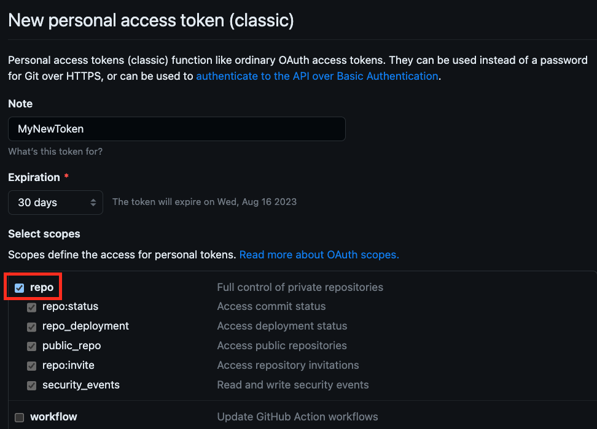

# **Getting started with Git**

{: style="width:200px"}
{: style="width:200px"}

## **Introduction**

In this section, we will explore a brief introduction of Git. We will cover the installation and basic commands used with Git. Git is the most commonly used version control system. Git tracks changes to files allowing you to revert to specific versions. File changes are tracked by storing snapshots (commits) of the files over time. In the image below, the content of files A, B, and C change over time. Git allows you to roll back to any previous commit.

{: style="width:800px"}

Git makes collaboration effortless by allowing multiple people to merge their changes into one source. Whether you work solo or as part of a team, Git will be useful for you.

Basic Git commands we will be working with:

- git config
- git status
- git init
- git add
- git commit
- git log
- git branch
- git clone
- git merge
- git switch
- git diff
- git restore

## **Installation & setup**

### **Installation**

???+ note
    Git has been pre-installed in your ATD Lab environment. If you need to install and configure Git on another system, follow the instructions at the links above.

Download Git - [https://git-scm.com/downloads](https://git-scm.com/downloads)

Configuration - [https://git-scm.com/book/en/v2/Getting-Started-Installing-Git](https://git-scm.com/book/en/v2/Getting-Started-Installing-Git)

### **Setup**

When setting up Git for the first time, you must configure your Identity with a name and email address. This is used to add your signature to commits. Additionally, set the default branch name to `main`.

Run the following commands from the Terminal in your ATD Lab Programmability IDE.

``` bash
# Set your username:
git config --global user.name "FirstName LastName"
```

```bash
# Set your email address:
git config --global user.email "name@example.com"
```

```bash
# Set default branch name to `main`
git config --global init.defaultbranch main
```

#### Programmability IDE (VS Code)

{: style="width:1000px"}

Verify your configuration:

``` bash
git config --global --list
```

### **Download Sample Files**

We have provided some sample configuration files to begin working with Git. From the Programmability IDE, run the following two commands to download sample files and change your working directory.

``` bash
bash -c "$(curl https://raw.githubusercontent.com/aristanetworks/ci-workshops-fundamentals/main/get-sample-files.sh)"
cd /home/coder/project/labfiles/samplefiles
```

## **Git**

### **Git - command line basics**

#### Initialize the directory as a Git repository

Next, we initialize the current directory `/home/coder/project/labfiles/samplefiles/` as a repository (repo).

``` bash
git init
```

Notice your CLI prompt changed.

The directory is now initialized as a Git repository, and the following hidden sub-directory `/home/coder/project/labfiles/samplefiles/.git/` was created. It holds version control information for your repository.

&nbsp;&nbsp;&nbsp;&nbsp;&nbsp;&nbsp; **Congratulations!!!** You have created your first repository.

#### Git Repository Status

Check the current status of your repo.

``` bash
git status
```

Since this is a brand new repo, you should see output similar to the following, indicating there are untracked files.

``` bash
On branch main

No commits yet

Untracked files:
  (use "git add <file>..." to include in what will be committed)
        leaf1.cfg
        leaf2.cfg
        leaf3.cfg
        leaf4.cfg
        spine1.cfg
        spine2.cfg

nothing added to commit but untracked files present (use "git add" to track)
```

### **Stage your changes**

When you want to track files, you first need to stage them. The above output gives you a clue about the command needed to stage the changes. You can specify individual files or add all files with a wildcard period `.`

To stage all file changes:

``` bash
git add .
```

Then recheck the status to see what is staged and ready to be committed.

``` bash
git status
```

Output:

``` bash
On branch main

No commits yet

Changes to be committed:
  (use "git rm --cached <file>..." to unstage)
        new file:   leaf1.cfg
        new file:   leaf2.cfg
        new file:   leaf3.cfg
        new file:   leaf4.cfg
        new file:   spine1.cfg
        new file:   spine2.cfg
```

All the files are staged and ready to be committed to the `main` branch.

### **Commit your changes**

Now you can commit your staged changes with a comment:

???+ note
    Use a comment reflecting the changes made so you can reference this commit in the future. Commit messages will show up in the log.

``` bash
git commit -m "Initial Commit"
```

Output:

``` bash
[main (root-commit) 45eeb6d] Initial Commit
 6 files changed, 832 insertions(+)
 create mode 100644 leaf1.cfg
 create mode 100644 leaf2.cfg
 create mode 100644 leaf3.cfg
 create mode 100644 leaf4.cfg
 create mode 100644 spine1.cfg
 create mode 100644 spine2.cfg
```

Now these files are committed to your local repository.

Check the status one more time.

``` bash
On branch main
nothing to commit, working tree clean
```

You have successfully stamped history in your repo. Check the log to see what is there.

``` bash
git log
```

???+ note
    Press `q` to quit viewing the log.

### **Create a branch**

Creating a branch allows you to make a new copy of your files without affecting the files in the `main` branch. For example, if you wanted to update the hostnames on your switches, you might create a new branch called `update-hostnames`.

{: style="width:500px"}

Verify the current branch:

``` bash
git branch
```

Create a new branch:

``` bash
git branch update-hostnames
```

Switch to this new branch:

``` bash
git switch update-hostnames
```

Using the IDE, open each switch config file and update the hostname by removing the prefix `s1-`. Changes are auto-saved.

**Example: spine1.cfg** - change hostname from `s1-spine1` to `spine1`.

Let's verify the changes (diffs) we are about to commit to ensure they are correct.

``` bash
git diff
```

Stage and commit the changes to the new branch `update-hostnames`.

``` bash
git add .
git commit -m "updated hostname on each switch"
```

### **Merge branch**

Now that we are satisfied with our hostname changes, we can merge the `update-hostnames` branch into `main`.

{: style="width:500px"}

First, switch back to the `main` branch and notice the hostnames return to the original name. Why did that happen? Remember, we never modified the original copy `main` branch. This is a different version of the file. Once we merge the `update-hostnames` branch into `main`, both copies will be identical.

``` bash
git switch main
```

Execute the merge operation:

``` bash
git merge update-hostnames
```

Verify the updated hostnames in each file.

Now that your changes are merged, you can safely delete the `update-hostnames` branch.

``` bash
git branch -d update-hostnames
```

## **GitHub**

{: style="width:100px"}
{: style="width:100px"}

Before proceeding further, make sure you are logged into your GitHub account.

If you do not have a GitHub account, you can create one **[here](https://github.com/join)**.

???+ note
    In the ATD Lab, you will authenticate to GitHub using an eight-digit access code. On other systems, you will need a Personal Access Token. **You may skip the next step if you work in the Arista-provided ATD Lab IDE**. Detailed instructions for creating a Personal Access Token can be found [here](https://docs.github.com/en/enterprise-server@3.4/authentication/keeping-your-account-and-data-secure/creating-a-personal-access-token).

### **Create a GitHub personal access token**

<details>
    <summary>When not using the ATD lab IDE, generate a GitHub personal access token (click to expand)</summary>

Under normal circumstances (does not apply to the ATD lab IDE) to push your local repo to GitHub, you will need a Personal Access Token. From your **GitHub** account, click through the following path to generate a new personal access token.  **Profile --> Settings --> Developer Settings --> Personal Access Tokens --> Tokens (classic) --> Generate new token (classic)**

- Give the token a meaningful name by setting the **Note**: `MyNewToken`
- Set the **Expiration**: 30 days (default)

Select the scopes to grant to this token. To use your token to access repositories from the command line, select `repo`. A token with no assigned scopes can only access public information.

Click `Generate token` at the bottom of the page.  **Copy and save the token in a secure place. YOU WILL NOT BE ABLE TO SEE THE TOKEN AGAIN**.

{: style="width:500px"}

</details>

### **Fork a repository**

A fork is a copy of another repository that you can manage. Forks let you make changes to a project without affecting the original repository. You can fetch updates from or submit changes to the original repository with a pull request.

Fork the example **[Arista CI Fundamentals](https://github.com/aristanetworks/ci-workshops-fundamentals)** repository to make your copy.

#### Steps to Fork the example repository

1. From GitHub.com, navigate to the **[Arista CI Fundamentals](https://github.com/aristanetworks/ci-workshops-fundamentals)** repository.
2. In the top-right corner of the page, click Fork.
{: style="width:800px"}
3. Select an owner.
4. Set repository name. By default, forks are named the same as their upstream repository.
5. Optionally, add a description of your fork.
6. Click `Create fork` button at the bottom

You should now see your repository **`username/ci-workshops-fundamentals`** forked from **`aristanetworks/ci-workshops-fundamentals`**.

**Next up...** Clone this forked repository to your local host machine.

### **Clone forked repo to local host**

Cloning a repository allows us to make a local copy of a project on GitHub. In the previous step, you forked a repository to your local GitHub account. Navigate to your forked repo in GitHub. From there, click on the green code button and copy the URL of the forked repository.

{: style="width:400px"}

Clone this repository to your local machine.

Before cloning, change your current directory to `/home/coder/project/labfiles/`.

``` bash
cd /home/coder/project/labfiles
```

Clone the repo.

``` bash
# replace this URL with your forked repo
git clone https://github.com/xxxxxxx/ci-workshops-fundamentals.git
```

Now change into the new cloned directory.

``` bash
cd ci-workshops-fundamentals
```

Verify the location of the remote copy. This should be your local GitHub account.

``` bash
git remote -v
```

Output:

``` text
origin  https://github.com/xxxxxxx/ci-workshops-fundamentals.git (fetch)
origin  https://github.com/xxxxxxx/ci-workshops-fundamentals.git (push)
```

In the next step, let's add VLAN 40 to the data model in `avd/vlans.yml`. First, create a new branch called `add-vlan-40`.

### **Create and switch to a new branch**

``` bash
git branch add-vlan-40
git switch add-vlan-40
```

Using the Programmability IDE, update the file `ci-workshops-fundamentals/avd/vlans.yml` with VLAN 40 information.

??? eos-config annotate "Updated vlans.yml"
    ``` yaml
    ---
    vlans:
      - 10:
        name: Ten
      - 20:
        name: Twenty
      - 30:
        name: Thirty
      - 40:
        name: Forty
    ```

Now, stage and commit these changes to the new branch.

``` bash
git add .
git commit -m "added vlan 40"
```

### **Push Changes to GitHub**

Now push the updated branch to your remote fork on GitHub.

``` bash
# push new branch to remote repo on GitHub
git push --set-upstream origin add-vlan-40
```

???+ note
    If this is your first push from the Lab environment, you will be prompted to authenticate to GitHub. Follow the `Copy & Continue to GitHub` prompts by entering the eight-digit authentication code. Additional pushes to GitHub will cache your credentials.

Once authenticated, your new branch and updated file will exist on GitHub.

Output:

``` text hl_lines="13-14"
Enumerating objects: 7, done.
Counting objects: 100% (7/7), done.
Delta compression using up to 16 threads
Compressing objects: 100% (3/3), done.
Writing objects: 100% (4/4), 352 bytes | 352.00 KiB/s, done.
Total 4 (delta 1), reused 0 (delta 0), pack-reused 0
remote: Resolving deltas: 100% (1/1), completed with 1 local object.
remote:
remote: Create a pull request for 'add-vlan-40' on GitHub by visiting:
remote:      https://github.com/xxxxxxxx/ci-workshops-fundamentals/pull/new/add-vlan-40
remote:
To https://github.com/xxxxxxxx/ci-workshops-fundamentals.git
 * [new branch]      add-vlan-40 -> add-vlan-40
Branch 'add-vlan-40' set up to track remote branch 'add-vlan-40' from 'origin'.
```

You should now see the new branch `add-vlan-40` and commit messages in GitHub.

The next step is to merge the `add-vlan-40` branch into the `main` branch. A Pull Request is used to do this.

### **Pull request**

A Pull Request in Git allows a contributor (you) to ask a maintainer (owner) of the origin repository to review code changes you wish to merge into a project. Once a pull request is opened, you can discuss and review the potential changes with collaborators and add follow-up commits before your changes are merged into the `main` branch.

Once all changes have been agreed upon, the maintainer of the original repo will merge your changes. At this point, your code changes are visible in the origin project repo.

#### Steps to Initiate a Pull Request

1. On GitHub.com, navigate to the main page of your forked repository.
2. In the "Branch" menu, choose the branch that contains your commits.
3. Above the list of files, click the Contribute drop-down and click Open pull request.
{: style="width:750px"}
4. Verify the `base repository:` is set to **`aristanetworks/ci-workshops-fundamentals`** and `base:` is set to **`main`**. Set the `head repository:` to your forked repo and `compare:` to the **`add-vlan-40`** branch.
{: style="width:750px"}
5. Add a title and description for your pull request.
6. Click Create pull request.

This will generate a Pull Request on the main project repository **`aristanetworks/ci-workshops-fundamentals`**. The owner/maintainer can merge the pull request once all changes are satisfied.

???+ note
    During the workshop the PR is not normally merged to prevent having to reset the repo before the next workshop. The `Cleanup` section below is the normal course of action.

### **Cleanup** *(optional)*

After your Pull Request is merged, you may cleanup your old branch and sync your fork.

1. Delete your branch on GitHub and your local host.
2. Sync your Forked repo (below)
3. Pull the updates into `main` branch on your local host. `git pull`

{: style="width:750px"}
