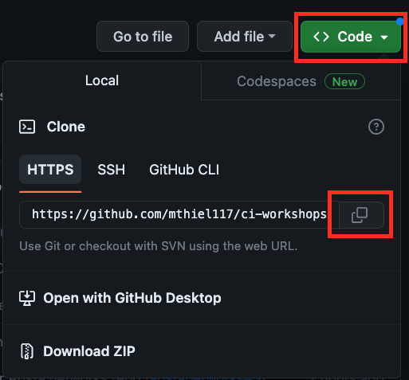
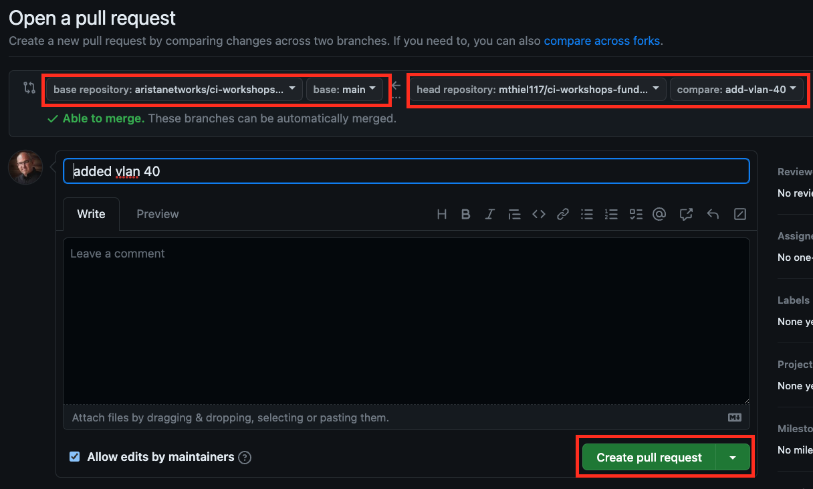

# Getting started with Git

{: style="width:200px"}
{: style="width:200px"}

## Introduction

In this section we will explore a brief introduction of Git. We will cover the installation and basic commands used with Git. Git is the most commonly used version control system. Git tracks changes to files allowing you to revert to specific versions. File changes are tracked by storing snapshots (commits) of the files over time. In the image below, the content of files A, B, and C change over time. Git allows you to roll back to any previous commit.

{: style="width:800px"}

Git makes collaboration easy by allowing multiple people to merge their changes into one source. Regardless of whether you work solo or as part of a team, Git will be useful for you.

Here is a summary of the basic commands will be working with:

- git config
- git status
- git init
- git add
- git commit
- git log
- git branch
- git switch
- git diff
- git restore

## Installation & setup

### Installation

???+ note
    Git has been pre-installed in your ATD Lab environment. If you need to install and configure Git on another system, follow the instructions at the links above.

Download Git - [https://git-scm.com/downloads](https://git-scm.com/downloads)

Configuration - [https://git-scm.com/book/en/v2/Getting-Started-Installing-Git](https://git-scm.com/book/en/v2/Getting-Started-Installing-Git)

### Setup

When setting up Git for the first time you need to configure your Identity with a name and email address. This is used to add your signature to commits. Additonally, set the default branch name to `main`.

From the Terminal in your ATD Lab Progammability IDE running the following commands.

``` bash
# Set your username:
git config --global user.name "FirstName LastName"

# Set your email address:
git config --global user.email "name@example.com"

# Set default branch name to `main`
git config --global init.defaultBranch main
```

#### Progammability IDE (VS Code)

{: style="width:1000px"}

Verify your configuration:

``` bash
git config --global --list
```

### Download Sample Files

We have provided some sample configuration files to begin working with Git. From the Programmability IDE, run the following 2 commands to download sample files and change your working directory.

``` bash
bash -c "$(curl http://www.packetanglers.com/get-sample-files.sh)"
cd /home/coder/project/labfiles/samplefiles
```

## Git

### Git - command line basics

#### Initialize directory as a Git repository

Next we initialize the current directory `/home/coder/project/labfiles/samplefiles/` as a repository (repo).

``` bash
git init
```

Notice your cli prompt changed.

The directory is now initialized as a Git repository and the following hidden sub-directory `/home/coder/project/labfiles/samplefiles/.git/` was created. It holds version control information for your repository.

&nbsp;&nbsp;&nbsp;&nbsp;&nbsp;&nbsp; **Congratulations!!!** You have created your first repository.

#### Git Repository Status

Check the current status of your repo.

``` bash
git status
```

Since this is a brand new repo you should see output similar to the following, indicating there are Untracked files.

``` bash
On branch main

No commits yet

Untracked files:
  (use "git add <file>..." to include in what will be committed)
        leaf1.cfg
        leaf2.cfg
        leaf3.cfg
        leaf4.cfg
        spine1.cfg
        spine2.cfg

nothing added to commit but untracked files present (use "git add" to track)
```

### Stage your changes

When you want to track files, you first need to stage them. The above output gives you a clue as to the command needed to stage the changes. You can specify individual files or add all files with a wildcard period `.`

To stage all file changes:

``` bash
git add .
```

Then check the status again to see what is staged and ready to be committed.

``` bash
git status
```

Output:

``` bash
On branch main

No commits yet

Changes to be committed:
  (use "git rm --cached <file>..." to unstage)
        new file:   leaf1.cfg
        new file:   leaf2.cfg
        new file:   leaf3.cfg
        new file:   leaf4.cfg
        new file:   spine1.cfg
        new file:   spine2.cfg
```

Now all of the files are staged and ready to be committed to the `main` branch.

### Commit your changes

Now you can commit your staged changes with a comment:

???+ note
    Use a comment that will reflect the changes made so you can reference back to this commit in the future. Commit messages will show up in the log.

``` bash
git commit -m "Initial Commit"
```

Output:

``` bash
[main (root-commit) 45eeb6d] Initial Commit
 6 files changed, 832 insertions(+)
 create mode 100644 leaf1.cfg
 create mode 100644 leaf2.cfg
 create mode 100644 leaf3.cfg
 create mode 100644 leaf4.cfg
 create mode 100644 spine1.cfg
 create mode 100644 spine2.cfg
```

Now these files are committed to your local repository.

Check status one more time.

``` bash
On branch main
nothing to commit, working tree clean
```

You have successfuly made your first historical marker in your repo.  Check the log to see what is there.

``` bash
git log
```

???+ note
    Press `q` to quit from viewing the log.

### Create a branch

Creating a branch allows you to make a new copy of your files without affecting the files in the `main` branch. For example, if you wanted to update the hostnames on your switches, you might create a new branch called, `update-hostnames`.

{: style="width:500px"}

Verify the current branch:

``` bash
git branch
```

Create a new branch:

``` bash
git branch update-hostnames
```

Switch to this new branch:

``` bash
git switch update-hostnames
```

Using the IDE, open each switch config file and update the hostname.  Changes are auto-saved. Then stage and commit the changes to the new branch `update-hostnames`.

``` bash
git add .
git commit -m "updated hostname on each switch"
```

### Merge branch

Now that we are satisfied with our hostnames changes we can merge branch `update-hostnames` into `main`.

First, switch back to the `main` branch and notice the hostnames go back to the original name.

``` bash
git switch main
```

Execute the merge operation:

``` bash
git merge update-hostnames
```

Now that your changes are merged, you can delete the `update-hostnames` branch.

``` bash
git branch -d update-hostnames
```

## GitHub

Before proceeding further, make sure you are logged into your active GitHub account.

If you do not have a GitHub account, you can create one **[here](https://github.com/join)**.

???+ note
    In the ATD Lab, you will authenticate to GitHub using an 8 digit access code.  On other systems you will need a Personal Access Token. You may skip the next step if you are working in the ATD Lab IDE.

### Create a GitHub personal access token

To push your local repo to GitHUb you will need a Personal Access Token. From your **GitHub** account, click through the following path to generate a new personal access token.  **Profile --> Settings --> Developer Settings --> Personal Access Tokens --> Tokens (classic) --> Generate new token (classic)**

- Give the token a meaningful name by setting the **Note**: `MyNewToken`
- Set the **Expiration**: 30 days (default)

Select the scopes to grant to this token. To use your token to access repositories from the command line, select `repo`. A token with no assigned scopes can only access public information.

The click `Generate token` at the bottom of the page.  **Copy and save the token in a secure place. YOU WILL NOT BE ABLE TO SEE THE TOKEN AGAIN**.

{: style="width:500px"}

???+ note
    Detailed instructions for creating a Personal Access Token can be found [here](https://docs.github.com/en/enterprise-server@3.4/authentication/keeping-your-account-and-data-secure/creating-a-personal-access-token).

### Fork a repository

A fork is a copy of another repository that you can manage. Forks let you make changes to a project without affecting the original repository. You can fetch updates from or submit changes to the original repository with a pull request.

Fork the example [repository](https://github.com/PacketAnglers/workshops) to make your own copy. Then you can modify your copy of the original repository.

#### Steps to Fork the example repository

1. From GitHub.com, navigate to the [Packet Anglers workshop](https://github.com/PacketAnglers/workshops) repository.
2. In the top-right corner of the page, click Fork.
{: style="width:800px"}
3. Select an owner.
4. Set repository name. By default, forks are named the same as their upstream repository.
5. Optionally, add a description of your fork.
6. Click `Create fork` button at the bottom

Next up... Clone this forked repository to your local host machine.

### Clone forked repo to local host

Cloning a repository allows us to make a local copy of a project that resides on GitHub. In the previous step, you forked a repo to your local GitHub account. Navigate to the forked repository in GitHub. From there, click on the green code button to get the URL of the forked repository.

{: style="width:400px"}

Clone this repository into the current directory of your local machine. In the ATD Lab your current directory needs to be `/home/coder/project/labfiles/`.

``` bash
# replace with the URL from your forked repo
git clone https://github.com/xxxxxxx/workshops.git
```

Now change into the new cloned directory.

``` bash
cd workshops
```

Verify where the remote copy of this clones lives.

``` bash
git remote -v
```

### Push/Pull Changes to GitHub

Once you modify the files in your new branch, you can stage & commit the changes and push them to the remote fork on GitHub.

``` bash
# stage all the changes
git add .

# commit them
git commit -m "updated content with new feature"

# push new branch to remote repo on GitHub
git push --set-upstream origin update-hostnames
```

Output:

``` text
Enumerating objects: 7, done.
Counting objects: 100% (7/7), done.
Delta compression using up to 16 threads
Compressing objects: 100% (3/3), done.
Writing objects: 100% (4/4), 348 bytes | 348.00 KiB/s, done.
Total 4 (delta 2), reused 1 (delta 0), pack-reused 0
remote: Resolving deltas: 100% (2/2), completed with 2 local objects.
remote:
remote: Create a pull request for 'update-hostnames' on GitHub by visiting:
remote:      https://github.com/mthiel117/workshops/pull/new/update-hostnames
remote:
To https://github.com/mthiel117/workshops.git
 * [new branch]      update-hostnames -> update-hostnames
Branch 'update-hostnames' set up to track remote branch 'update-hostnames' from 'origin'.
```

You should now see the new branch `update-hostnames` and commit messages in GitHub.

{: style="width:800px"}

The next step is to merge the `update-hostnames` branch into the `main` branch.  A Pull Request is used to do this.

### Pull request

A Pull Request in Git allows a contributor (you) to ask a maintainer (owner) of origin repository to review code changes you wish to merge into a project. Once a pull request is opened, you can discuss and review the potential changes with collaborators and add follow-up commits before your changes are merged into the `main` branch.

Once all changes have been agreed upon, the maintainer of the original repo will merge your changes. At this point, your code changes are visible in the origin project repo.

#### Steps to initiate a Pull Request

1. On GitHub.com, navigate to the main page of the repository.
2. In the "Branch" menu, choose the branch that contains your commits.
3. Above the list of files, click the Contribute drop-down and click Open pull request.
{: style="width:800px"}
4. Use the base branch dropdown menu to select the branch you'd like to merge your changes into, then use the compare branch drop-down menu to choose the topic branch you made your changes in.
{: style="width:800px"}
5. Type a title and description for your pull request.
6. To create a pull request that is ready for review, click Create Pull Request. To create a draft pull request, use the drop-down and select Create Draft Pull Request, then click Draft Pull Request.

This will generate a Pull Request on the main project repository. The owner/maintainer can then merge the pull request once all changes are satisfied.
