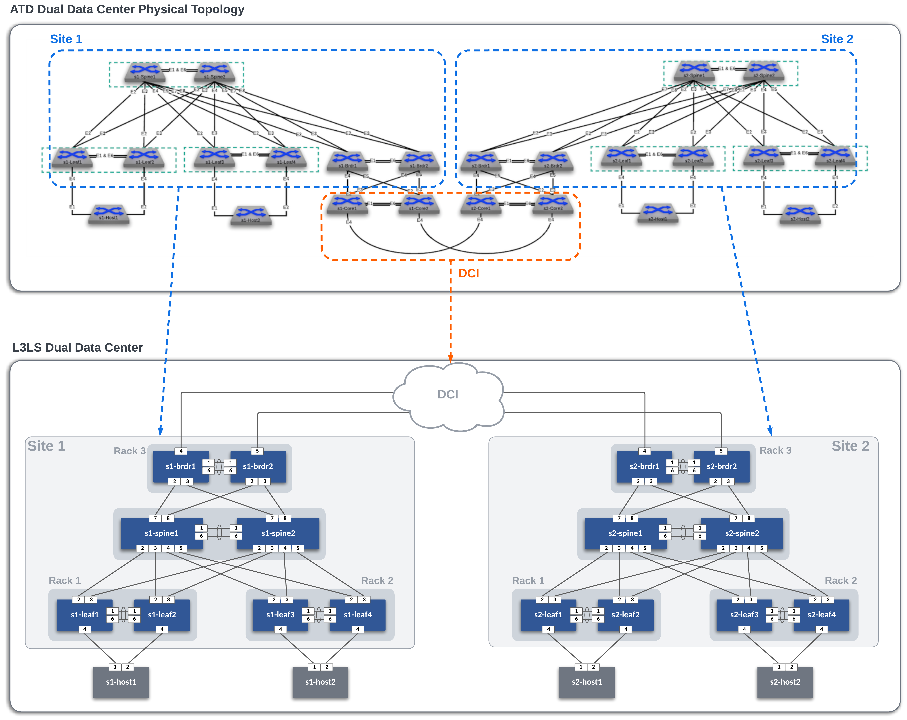
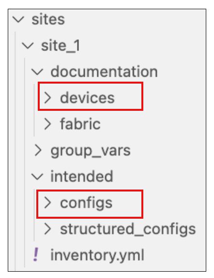
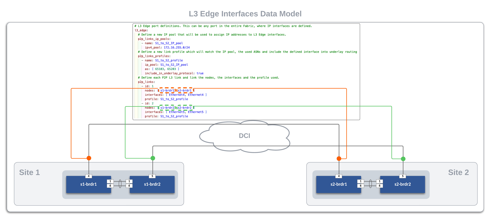
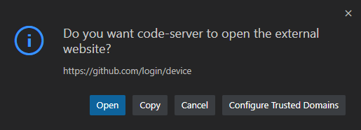
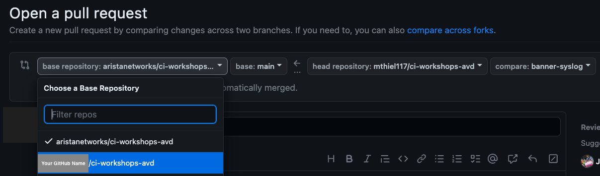

# **Initial Deployment - Day 0**

## AVD Lab Guide Overview

The AVD Lab Guide is a follow-along set of instructions to deploy a dual data center L3LS EVPN VXLAN fabric design. The data model overview and details can be found [here](overview.md). In the following steps, we will explore updating the data models to add services, ports, and DCI links to our fabrics and test traffic between sites.

In this example, the ATD lab is used to create the L3LS Dual Data Center topology below. The DCI Network cloud (orange area) is pre-provisioned and is comprised of the core nodes in the ATD topology. Our focus will be creating the L3LS AVD data models to build and deploy configurations for Site 1 and Site 2 (blue areas) and connect them to the DCI Network.



### Host Addresses

| Host     |  IP Address  |
|:--------:|:------------:|
| s1-host1 | 10.10.10.100 |
| s1-host2 | 10.20.20.100 |
| s2-host1 | 10.10.10.200 |
| s2-host2 | 10.20.20.200 |

## **Step 1 - Prepare Lab Environment**

### Access the ATD Lab

Connect to your ATD Lab and start the Programmability IDE. Next, create a new Terminal.

### Fork and Clone branch to ATD Lab

An ATD Dual Data Center L3LS data model is posted on [GitHub](https://github.com/aristanetworks/ci-workshops-avd).

- Fork this **[repository](https://github.com/aristanetworks/ci-workshops-avd)** to your own GitHub account.
- Next, clone your forked repo to your ATD lab instance.

``` bash
cd /home/coder/project/labfiles
```

``` bash
git clone <your copied URL>
```

``` bash
cd ci-workshops-avd
```

Configure your global Git settings.

``` bash
git config --global user.name "FirstName LastName"
```

``` bash
git config --global user.email "name@example.com"
```

### Update AVD

AVD has been pre-installed in your lab environment. However, it may be on an older version (in some cases a newer version). The following steps will update AVD and modules to the valid versions for the lab.

``` bash
pip3 config set global.break-system-packages true
pip3 config set global.disable-pip-version-check true
pip3 install "pyavd[ansible-collection]==4.10.0"
ansible-galaxy collection install -r requirements.yml
```

???+ Warning "Important"
    You must run these commands when you start your lab or a new shell (terminal).

### Change To Lab Working Directory

Now that AVD is updated, lets move into the appropriate directory so we can access the files necessary for this L3LS Lab!

```bash
cd labs/L3LS_EVPN
```

### Setup Lab Password Environment Variable

Each lab comes with a unique password. We set an environment variable called `LABPASSPHRASE` with the following command. The variable is later used to generate local user passwords and connect to our switches to push configs.

``` bash
export LABPASSPHRASE=`cat /home/coder/.config/code-server/config.yaml| grep "password:" | awk '{print $2}'`
```

You can view the password is set. This is the same password displayed when you click the link to access your lab.

``` bash
echo $LABPASSPHRASE
```

???+ Warning "IMPORTANT"
    You must run this step when you start your lab or a new shell (terminal).

### Prepare DCI Network and Test Hosts

The last step in preparing your lab is to push pre-defined configurations to the DCI Network (cloud) and the four hosts used to test traffic. The border leafs from each site will connect to their specified peer with P2P links. The hosts (two per site) have port-channels to the leaf pairs and are pre-configured with an IP address and route to reach the other hosts.

Run the following to push the configs.

``` bash
make preplab
```

## **Step 2 - Build and Deploy Dual Data Center L3LS Network**

This section will review and update the existing L3LS data model. We will add features to enable VLANs, SVIs, connected endpoints, and P2P links to the DCI Network. After the lab, you will have enabled an L3LS EVPN VXLAN dual data center network through automation with AVD. YAML data models and Ansible playbooks will be used to generate EOS CLI configurations and deploy them to each site. We will start by focusing on building out Site 1 and then repeat similar steps for Site 2. Then, we will enable connectivity to the DCI Network to allow traffic to pass between sites.  Finally, we will enable EVPN gateway functionality on the border leafs.

### **Summary of Steps**

1. Build and Deploy `Site 1`
2. Build and Deploy `Site 2`
3. Connect sites to DCI Network
4. Verify routing
5. Enable EVPN gateway functionality
6. Test traffic

## **Step 3 - Site 1**

### Build and Deploy Initial Fabric

The initial fabric data model key/value pairs have been pre-populated in the following group_vars files in the `sites/site_1/group_vars/` directory.

- SITE1_CONNECTED_ENDPOINTS.yml
- SITE1_NETWORK_SERVICES.yml
- SITE1_FABRIC.yml
- SITE1_LEAFS.yml
- SITE1_SPINES.yml

Review these files to understand how they relate to the topology above.

At this point, we can build and deploy our initial configurations to the topology.

``` bash
make build-site-1
```

AVD creates a separate markdown and EOS configuration file per switch. In addition, you can review the files in the `documentation` and `intended` folders per site.

{: style="width:300px"}

Now, deploy the configurations to Site 1 switches.

``` bash
make deploy-site-1
```

### **Verification**

Now, lets login to some switches to verify the current configs (`show run`) match the ones created in `intended/configs` folder.  We can also check the current state for MLAG, interfaces, BGP peerings for IPv4 underlay, and BGP EVPN overlay peerings.

These outputs were taken from `s1-leaf1`:

1. Check MLAG status.

    ^^Command^^

    ``` bash
    show mlag
    ```

    ^^Expected Output^^

    ```text
    s1-leaf1#sho mlag
    MLAG Configuration:
    domain-id                          :            S1_RACK1
    local-interface                    :            Vlan4094
    peer-address                       :          10.251.1.1
    peer-link                          :       Port-Channel1
    hb-peer-address                    :             0.0.0.0
    peer-config                        :          consistent

    MLAG Status:
    state                              :              Active
    negotiation status                 :           Connected
    peer-link status                   :                  Up
    local-int status                   :                  Up
    system-id                          :   02:1c:73:c0:c6:12
    dual-primary detection             :            Disabled
    dual-primary interface errdisabled :               False

    MLAG Ports:
    Disabled                           :                   0
    Configured                         :                   0
    Inactive                           :                   0
    Active-partial                     :                   0
    Active-full                        :                   0
    ```

2. Check routed interface configurations.

    ^^Command^^

    ``` bash
    show ip interface brief
    ```

    ^^Expected Output^^

    ```text
    s1-leaf1#show ip interface brief
                                                                                    Address
    Interface         IP Address            Status       Protocol            MTU    Owner
    ----------------- --------------------- ------------ -------------- ----------- -------
    Ethernet2         172.16.1.1/31         up           up                 1500
    Ethernet3         172.16.1.3/31         up           up                 1500
    Loopback0         10.250.1.3/32         up           up                65535
    Loopback1         10.255.1.3/32         up           up                65535
    Management0       192.168.0.12/24       up           up                 1500
    Vlan4093          10.252.1.0/31         up           up                 1500
    Vlan4094          10.251.1.0/31         up           up                 1500
    ```

3. Check eBGP/iBGP peerings for IPv4 underlay routing.

    ^^Commands^^

    ``` bash
    show ip bgp summary
    ```

    ^^Expected Output^^

    ```text
    s1-leaf1#show ip bgp summary
    BGP summary information for VRF default
    Router identifier 10.250.1.3, local AS number 65101
    Neighbor Status Codes: m - Under maintenance
      Description              Neighbor   V AS           MsgRcvd   MsgSent  InQ OutQ  Up/Down State   PfxRcd PfxAcc
      s1-leaf2                 10.252.1.1 4 65101             15        14    0    0 00:02:29 Estab   10     10
      s1-spine1_Ethernet2      172.16.1.0 4 65100             13        18    0    0 00:02:30 Estab   7      7
      s1-spine2_Ethernet2      172.16.1.2 4 65100             15        14    0    0 00:02:29 Estab   7      7
    ```

4. Check eBGP/iBGP peerings for the EVPN overlay.

    ^^Commands^^

    ```bash
    show bgp evpn summary
    ```

    ^^Expected Output^^

    ```text
    s1-leaf1#show ip bgp summary
    BGP summary information for VRF default
    Router identifier 10.250.1.3, local AS number 65101
    Neighbor Status Codes: m - Under maintenance
      Description              Neighbor   V AS           MsgRcvd   MsgSent  InQ OutQ  Up/Down State   PfxRcd PfxAcc
      s1-leaf2                 10.252.1.1 4 65101             15        14    0    0 00:02:29 Estab   10     10
      s1-spine1_Ethernet2      172.16.1.0 4 65100             13        18    0    0 00:02:30 Estab   7      7
      s1-spine2_Ethernet2      172.16.1.2 4 65100             15        14    0    0 00:02:29 Estab   7      7
    ```

???+ success "Base Fabric Built"
    The basic fabric with MLAG peers, P2P routed links between leaf and spines, eBGP/iBGP IPv4 underlay peerings, and eBGP/iBGP EVPN overlay peerings is now created. Next up, we will add VLAN and SVI services to the fabric.

### Add Services to the Fabric

The next step is to add Vlans and SVIs to the fabric. The services data model file `SITE1_NETWORK_SERVICES.yml` is pre-populated with Vlans and SVIs `10` and `20` in the **OVERLAY** VRF.

Open `SITE1_NETWORK_SERVICES.yml` and uncomment lines 1-16, then run the build & deploy process again.

???+ tip
    :writing_hand: In VS Code, you can toggle comments on/off by selecting the text and pressing ***windows*** ++ctrl++ + ++slash++ or ***mac*** ++cmd++ + ++slash++.

^^Build the Configs^^

``` text
make build-site-1
```

^^Deploy the Configs^^

``` text
make deploy-site-1
```

### **Verification**

Now lets go back to node `s1-leaf1` and verify the new SVIs exist, their IP addresses, any changes to the EVPN overlay and corresponding VXLAN configurations, as well as the EVPN control-plane now that we have some layer 3 data interfaces.

1. Verify VLAN SVIs **10** and **20** exist.

    ^^Command^^

    ``` text
    show ip interface brief
    ```

    ^^Expected Output^^

    ``` text
    s1-leaf1#show ip interface brief
                                                                                Address
    Interface         IP Address            Status       Protocol            MTU    Owner
    ----------------- --------------------- ------------ -------------- ----------- -------
    Ethernet2         172.16.1.1/31         up           up                 1500
    Ethernet3         172.16.1.3/31         up           up                 1500
    Loopback0         10.250.1.3/32         up           up                65535
    Loopback1         10.255.1.3/32         up           up                65535
    Management0       192.168.0.12/24       up           up                 1500
    Vlan10            10.10.10.1/24         up           up                 1500
    Vlan20            10.20.20.1/24         up           up                 1500
    Vlan1199          unassigned            up           up                 9164
    Vlan3009          10.252.1.0/31         up           up                 1500
    Vlan4093          10.252.1.0/31         up           up                 1500
    Vlan4094          10.251.1.0/31         up           up                 1500
    ```

    ???+ abstract "Where did those VLANs come from?"
        You should notice some VLANs that we didn't define anywhere in the `_NETWORK_SERVICES.yml` data model which aren't related to **MLAG**.  Specifically, these will be VLAN SVIs ***Vlan1199*** and ***Vlan3009***.
        
        ***Vlan1199*** is dynamically created and assigned for the **OVERLAY** vrf to VNI mapping under the VXLAN interface.  You can verify this by looking at the **show interface vxlan 1** output.  Remember, we defined **VNI 10** as the `vrf_vni` in our data model.
        ```text
        Dynamic VLAN to VNI mapping for 'evpn' is
        [1199, 10]
        ```

        ***Vlan3009*** was also auto-configured by AVD for an iBGP peering between `s1-leaf1` and `s1-leaf2` in the **OVERLAY** vrf.  You can verify this by looking at the interface configuration, and BGP peering for that vrf.

        **Interface Configuration**
        ```text
        s1-leaf1#show run interface vlan 3009
        interface Vlan3009
          description MLAG_PEER_L3_iBGP: vrf OVERLAY
          mtu 1500
          vrf OVERLAY
          ip address 10.252.1.0/31
        ```

        **Overlay vrf BGP Peering**
        ```text
        s1-leaf1#show ip bgp summary vrf OVERLAY
        BGP summary information for VRF OVERLAY
        Router identifier 10.250.1.3, local AS number 65101
        Neighbor Status Codes: m - Under maintenance
          Description              Neighbor   V AS           MsgRcvd   MsgSent  InQ OutQ  Up/Down State   PfxRcd PfxAcc
          s1-leaf2                 10.252.1.1 4 65101             19        20    0    0 00:11:30 Estab   5      5
        ```

2. Verify VLANs **10** and **20**, and vrf **OVERLAY** are now mapped to the appropriate VNIs under the `vxlan1` interface.

    ^^Command^^

    ```text
    show run interface vxlan 1
    ```

    ^^Expected Output^^

    ```text hl_lines="7 8 9"
    s1-leaf1#sho run int vxlan 1
    interface Vxlan1
      description s1-leaf1_VTEP
      vxlan source-interface Loopback1
      vxlan virtual-router encapsulation mac-address mlag-system-id
      vxlan udp-port 4789
      vxlan vlan 10 vni 10010
      vxlan vlan 20 vni 10020
      vxlan vrf OVERLAY vni 10
    ```

3. Verify we are flooding to the correct remote VTEPs based on what we have learned across the EVPN overlay.

    ^^Command^^

    ```text
    show interface vxlan1
    ```

    ^^Expected Output^^

    ```text hl_lines="19 20"
    s1-leaf1#sho int vxlan 1
    Vxlan1 is up, line protocol is up (connected)
      Hardware is Vxlan
      Description: s1-leaf1_VTEP
      Source interface is Loopback1 and is active with 10.255.1.3
      Listening on UDP port 4789
      Replication/Flood Mode is headend with Flood List Source: EVPN
      Remote MAC learning via EVPN
      VNI mapping to VLANs
      Static VLAN to VNI mapping is
        [10, 10010]       [20, 10020]
      Dynamic VLAN to VNI mapping for 'evpn' is
        [1199, 10]
      Note: All Dynamic VLANs used by VCS are internal VLANs.
            Use 'show vxlan vni' for details.
      Static VRF to VNI mapping is
      [OVERLAY, 10]
      Headend replication flood vtep list is:
        10 10.255.1.5      10.255.1.7
        20 10.255.1.5      10.255.1.7
      MLAG Shared Router MAC is 021c.73c0.c612
    ```

4. Finally, lets verify we have **IMET** (1) routes for each VLAN and VTEP in the EVPN overlay.
    { .annotate }

    1. IMET, or Type-3 routes are required for Broadcast, Unknown Unicast and Multicast (BUM) traffic delivery across EVPN networks.

    ^^Command^^

    ```text
    show bgp evpn route-type imet
    ```

    ^^Expected Output^^

    ```text
    s1-leaf1#show bgp evpn route-type imet
    BGP routing table information for VRF default
    Router identifier 10.250.1.3, local AS number 65101
    Route status codes: * - valid, > - active, S - Stale, E - ECMP head, e - ECMP
                        c - Contributing to ECMP, % - Pending best path selection
    Origin codes: i - IGP, e - EGP, ? - incomplete
    AS Path Attributes: Or-ID - Originator ID, C-LST - Cluster List, LL Nexthop - Link Local Nexthop

              Network                Next Hop              Metric  LocPref Weight  Path
    * >      RD: 10.250.1.3:10010 imet 10.255.1.3
                                    -                     -       -       0       i
    * >      RD: 10.250.1.3:10020 imet 10.255.1.3
                                    -                     -       -       0       i
    * >Ec    RD: 10.250.1.5:10010 imet 10.255.1.5
                                    10.255.1.5            -       100     0       65100 65102 i
    *  ec    RD: 10.250.1.5:10010 imet 10.255.1.5
                                    10.255.1.5            -       100     0       65100 65102 i
    * >Ec    RD: 10.250.1.5:10020 imet 10.255.1.5
                                    10.255.1.5            -       100     0       65100 65102 i
    *  ec    RD: 10.250.1.5:10020 imet 10.255.1.5
                                    10.255.1.5            -       100     0       65100 65102 i
    * >Ec    RD: 10.250.1.6:10010 imet 10.255.1.5
                                    10.255.1.5            -       100     0       65100 65102 i
    *  ec    RD: 10.250.1.6:10010 imet 10.255.1.5
                                    10.255.1.5            -       100     0       65100 65102 i
    * >Ec    RD: 10.250.1.6:10020 imet 10.255.1.5
                                    10.255.1.5            -       100     0       65100 65102 i
    *  ec    RD: 10.250.1.6:10020 imet 10.255.1.5
                                    10.255.1.5            -       100     0       65100 65102 i
    * >Ec    RD: 10.250.1.7:10010 imet 10.255.1.7
                                    10.255.1.7            -       100     0       65100 65103 i
    *  ec    RD: 10.250.1.7:10010 imet 10.255.1.7
                                    10.255.1.7            -       100     0       65100 65103 i
    * >Ec    RD: 10.250.1.7:10020 imet 10.255.1.7
                                    10.255.1.7            -       100     0       65100 65103 i
    *  ec    RD: 10.250.1.7:10020 imet 10.255.1.7
                                    10.255.1.7            -       100     0       65100 65103 i
    * >Ec    RD: 10.250.1.8:10010 imet 10.255.1.7
                                    10.255.1.7            -       100     0       65100 65103 i
    *  ec    RD: 10.250.1.8:10010 imet 10.255.1.7
                                    10.255.1.7            -       100     0       65100 65103 i
    * >Ec    RD: 10.250.1.8:10020 imet 10.255.1.7
                                    10.255.1.7            -       100     0       65100 65103 i
    *  ec    RD: 10.250.1.8:10020 imet 10.255.1.7
                                    10.255.1.7            -       100     0       65100 65103 i
    ```

You can verify the recent configuration session was created.

???+ info
    When the configuration is applied via a configuration session, EOS will create a "checkpoint" of the configuration. This checkpoint is a snapshot
    of the device's running configuration as it was **prior** to the configuration session being committed.

``` bash
show clock
```

``` bash
show configuration sessions detail
```

List the recent checkpoints.

``` bash
show config checkpoints
```

View the contents of the latest checkpoint file.

``` bash
more checkpoint:< filename >
```

See the difference between the running config and the latest checkpoint file.

???+ tip
    This will show the differences between the current device configuration
    and the configuration before we did our `make deploy` command.

``` bash
diff checkpoint:< filename > running-config
```

### Add Ports for Hosts

Let's configure port-channels to our hosts (`s1-host1` and `s1-host2`).

Open `SITE1_CONNECTED_ENDPOINTS.yml` and uncomment lines 17-45, then run the build & deploy process again.

``` bash
make build-site-1
```

``` bash
make deploy-site-1
```

At this point, hosts should be able to ping each other across the fabric.

From `s1-host1`, run a ping to `s1-host2`.

``` bash
ping 10.20.20.100
```

``` text
PING 10.20.20.100 (10.20.20.100) 72(100) bytes of data.
80 bytes from 10.20.20.100: icmp_seq=1 ttl=63 time=30.2 ms
80 bytes from 10.20.20.100: icmp_seq=2 ttl=63 time=29.5 ms
80 bytes from 10.20.20.100: icmp_seq=3 ttl=63 time=28.8 ms
80 bytes from 10.20.20.100: icmp_seq=4 ttl=63 time=24.8 ms
80 bytes from 10.20.20.100: icmp_seq=5 ttl=63 time=26.2 ms
```

???+ success "Success"
    Site 1 fabric is now complete.

## **Step 4 - Site 2**

Repeat the previous three steps for Site 2.

- Add Services
- Add Ports
- Build and Deploy Configs
- Verify ping traffic between hosts `s2-host1` and `s2-host2`

At this point, you should be able to ping between hosts within a site but not between sites. For this, we need to build connectivity to the `DCI Network`. This is covered in the next section.

## **Step 5 - Connect Sites to DCI Network**

The DCI Network is defined by the `l3_edge` data model. Full data model documentation is located **[here](https://avd.arista.com/4.10/roles/eos_designs/docs/input-variables.html#l3-edge-and-dci-settings)**.

The data model defines P2P links (`/31s`) on the border leafs by using a combination of the ipv4_pool and the node id in the p2p_links section. See details in the graphic below. Each border leaf has a single link to its peer on interface `Ethernet4`.  In the data model, you will notice the parameter for **include_in_underlay_protocol**, which is set to ***true***.  This tells AVD to render the appropriate BGP configurations for route peering.



### **Add P2P Links for DCI connectivity for Site 1 and 2**

Enable the `l3_edge` dictionary (shown below) by uncommenting it from the `global_vars/global_dc_vars.yml`:

``` yaml
# L3 Edge port definitions. This can be any port in the entire Fabric, where IP interfaces are defined.
l3_edge:
  # Define a new IP pool that will be used to assign IP addresses to L3 Edge interfaces.
  p2p_links_ip_pools:
    - name: S1_to_S2_IP_pool
      ipv4_pool: 172.16.255.0/24
  # Define a new link profile which will match the IP pool, the used ASNs and include the defined interface into underlay routing
  p2p_links_profiles:
    - name: S1_to_S2_profile
      ip_pool: S1_to_S2_IP_pool
      as: [ 65103, 65203 ]
      include_in_underlay_protocol: true
  # Define each P2P L3 link and link the nodes, the interfaces and the profile used.
  p2p_links:
    - id: 1
      nodes: [ s1-brdr1, s2-brdr1 ]
      interfaces: [ Ethernet4, Ethernet4 ]
      profile: S1_to_S2_profile
    - id: 2
      nodes: [ s1-brdr2, s2-brdr2 ]
      interfaces: [ Ethernet5, Ethernet5 ]
      profile: S1_to_S2_profile
```

### **Build and Deploy DCI Network connectivity**

``` bash
make build-site-1 build-site-2 deploy-site-1 deploy-site-2
```

???+ tip
    Daisy chaining "Makesies" is a great way to run a series of tasks with a single CLI command :grinning:

### **Verification**

Now that we have built and deployed our configurations for our DCI IPv4 underlay connectivity, lets see what was done.  Looking at the data model above, we see we only defined a pool of IP addresses with a **/24** mask which AVD will use to auto-alllocated a subnet per connection.  Additionally, we can see that `s1-brdr1` connects to its peer `s2-brdr1` via interface `Ethernet4`, and `s1-brdr2` connects to its peer `s2-brdr2` via interface `Ethernet5`.  Using that data model, here is what we expect to see configured.  You can verify this by logging into each border leaf and checking with **show ip interface brief**.

| Host     |  Interface   |   IP Address      |
|:--------:|:------------:|:-----------------:|
| s1-brdr1 |   Ethernet4  |  172.16.255.0/31  |
| s2-brdr1 |   Ethernet4  |  172.16.255.1/31  |
| s1-brdr2 |   Ethernet5  |  172.16.255.2/31  |
| s2-brdr2 |   Ethernet5  |  172.16.255.3/31  |

Now lets verify the underlay connectivity and routing across the DCI network.

1. From `s1-brdr1`, check the IPv4 underlay peering to its neighbor at Site 2, `s2-brdr1`.

    ^^Command^^

    ```text
    show ip bgp summary
    ```

    ^^Expected Output^^

    ```text hl_lines="9"
    s1-brdr1#sho ip bgp summary
    BGP summary information for VRF default
    Router identifier 10.250.1.7, local AS number 65103
    Neighbor Status Codes: m - Under maintenance
      Description              Neighbor     V AS           MsgRcvd   MsgSent  InQ OutQ  Up/Down State   PfxRcd PfxAcc
      s1-brdr2                 10.252.1.9   4 65103            103       100    0    0 01:13:03 Estab   21     21
      s1-spine1_Ethernet7      172.16.1.16  4 65100             98        99    0    0 01:13:03 Estab   7      7
      s1-spine2_Ethernet7      172.16.1.18  4 65100             96        97    0    0 01:13:04 Estab   7      7
      s2-brdr1                 172.16.255.1 4 65203             27        26    0    0 00:14:19 Estab   11     11
    ```

2. From `s1-brdr1`, check its routing table in the default VRF and look for any prefixes learned from peer `172.16.255.1` via interface `Ethernet4`.  We will be looking for anything with a third octet of **.2** which signifies Site 2.

    ^^Command^^

    ```text
    show ip route
    ```

    ^^Expected Output^^

    ```text hl_lines="42 43 44 45 46 47 48 49 50 51 52 53 54 55 56 57 70 71 72 73 74 75"
    s1-brdr1#show ip route

    VRF: default
    Source Codes:
          C - connected, S - static, K - kernel,
          O - OSPF, IA - OSPF inter area, E1 - OSPF external type 1,
          E2 - OSPF external type 2, N1 - OSPF NSSA external type 1,
          N2 - OSPF NSSA external type2, B - Other BGP Routes,
          B I - iBGP, B E - eBGP, R - RIP, I L1 - IS-IS level 1,
          I L2 - IS-IS level 2, O3 - OSPFv3, A B - BGP Aggregate,
          A O - OSPF Summary, NG - Nexthop Group Static Route,
          V - VXLAN Control Service, M - Martian,
          DH - DHCP client installed default route,
          DP - Dynamic Policy Route, L - VRF Leaked,
          G  - gRIBI, RC - Route Cache Route,
          CL - CBF Leaked Route

    Gateway of last resort:
    S        0.0.0.0/0 [1/0]
              via 192.168.0.1, Management0

    B E      10.250.1.1/32 [200/0]
              via 172.16.1.16, Ethernet2
    B E      10.250.1.2/32 [200/0]
              via 172.16.1.18, Ethernet3
    B E      10.250.1.3/32 [200/0]
              via 172.16.1.16, Ethernet2
              via 172.16.1.18, Ethernet3
    B E      10.250.1.4/32 [200/0]
              via 172.16.1.16, Ethernet2
              via 172.16.1.18, Ethernet3
    B E      10.250.1.5/32 [200/0]
              via 172.16.1.16, Ethernet2
              via 172.16.1.18, Ethernet3
    B E      10.250.1.6/32 [200/0]
              via 172.16.1.16, Ethernet2
              via 172.16.1.18, Ethernet3
    C        10.250.1.7/32
              directly connected, Loopback0
    B I      10.250.1.8/32 [200/0]
              via 10.252.1.9, Vlan4093
    B E      10.250.2.1/32 [200/0]
              via 172.16.255.1, Ethernet4
    B E      10.250.2.2/32 [200/0]
              via 172.16.255.1, Ethernet4
    B E      10.250.2.3/32 [200/0]
              via 172.16.255.1, Ethernet4
    B E      10.250.2.4/32 [200/0]
              via 172.16.255.1, Ethernet4
    B E      10.250.2.5/32 [200/0]
              via 172.16.255.1, Ethernet4
    B E      10.250.2.6/32 [200/0]
              via 172.16.255.1, Ethernet4
    B E      10.250.2.7/32 [200/0]
              via 172.16.255.1, Ethernet4
    B E      10.250.2.8/32 [200/0]
              via 172.16.255.1, Ethernet4
    C        10.251.1.8/31
              directly connected, Vlan4094
    C        10.252.1.8/31
              directly connected, Vlan4093
    B E      10.255.1.3/32 [200/0]
              via 172.16.1.16, Ethernet2
              via 172.16.1.18, Ethernet3
    B E      10.255.1.5/32 [200/0]
              via 172.16.1.16, Ethernet2
              via 172.16.1.18, Ethernet3
    C        10.255.1.7/32
              directly connected, Loopback1
    B E      10.255.2.3/32 [200/0]
              via 172.16.255.1, Ethernet4
    B E      10.255.2.5/32 [200/0]
              via 172.16.255.1, Ethernet4
    B E      10.255.2.7/32 [200/0]
              via 172.16.255.1, Ethernet4
    C        172.16.1.16/31
              directly connected, Ethernet2
    C        172.16.1.18/31
              directly connected, Ethernet3
    C        172.16.255.0/31
              directly connected, Ethernet4
    C        192.168.0.0/24
              directly connected, Management0
    ```

3. From `s1-brdr2`, check the IPv4 underlay peering to its neighbor at Site 2, `s2-brdr2`.

    ^^Command^^

    ```text
    show ip bgp summary
    ```

    ^^Expected Output^^

    ```text hl_lines="9"
    s1-brdr2#show ip bgp summary
    BGP summary information for VRF default
    Router identifier 10.250.1.8, local AS number 65103
    Neighbor Status Codes: m - Under maintenance
      Description              Neighbor     V AS           MsgRcvd   MsgSent  InQ OutQ  Up/Down State   PfxRcd PfxAcc
      s1-brdr1                 10.252.1.8   4 65103            110       113    0    0 01:21:29 Estab   21     21
      s1-spine1_Ethernet8      172.16.1.20  4 65100            107       112    0    0 01:21:30 Estab   7      7
      s1-spine2_Ethernet8      172.16.1.22  4 65100            112       108    0    0 01:21:29 Estab   7      7
      s2-brdr2                 172.16.255.3 4 65203             36        36    0    0 00:22:45 Estab   11     11
    ```

???+ success "DCI Underlay Complete"

    If your BGP peerings match above and you have the correct routes in your routing table, the DCI network is successfully connected!

## **Step 6 - Enable EVPN Gateway Functionality**

Now that we have built and deployed our fabrics for both data centers, Site 1 and Site 2, we will need to enable EVPN gateway functionality on our border leafs so layer 2 and layer 3 traffic can move between the data centers across the EVPN overlay.

In order to do this, we will need to uncomment the necessary data model to enable EVPN gateway for the border leafs.

Below you will see the data model snippets from `sites/site_1/group_vars/SITE1_FABRIC.yml` and `sites/site_2/group_vars/SITE2_FABRIC.yml`, for the `S1_BRDR` and `S2_BRDR` node groups.  To enable EVPN gateway functionality you will need to modify the `SITE1_FABRIC.yml` vars file, and uncomment the below highlighted sections.  Uncomment the same sections from the `SITE2_FABRIC.yml` vars file.

=== "SITE1_FABRIC.yml"

    ```yaml hl_lines="3 4 5 6 7 8 14 15 16 17 18 23 24 25 26 27"
    - group: S1_BRDR
      bgp_as: 65103
      # evpn_gateway:
      #   evpn_l2:
      #     enabled: true
      #   evpn_l3:
      #     enabled: true
      #     inter_domain: true
      nodes:
        - name: s1-brdr1
          id: 5
          mgmt_ip: 192.168.0.100/24
          uplink_switch_interfaces: [ Ethernet7, Ethernet7 ]
          # evpn_gateway:
          #   remote_peers:
          #     - hostname: s2-brdr1
          #       bgp_as: 65203
          #       ip_address: 10.255.2.7
        - name: s1-brdr2
          id: 6
          mgmt_ip: 192.168.0.101/24
          uplink_switch_interfaces: [ Ethernet8, Ethernet8 ]
          # evpn_gateway:
          #   remote_peers:
          #     - hostname: s2-brdr2
          #       bgp_as: 65203
          #       ip_address: 10.255.2.8
    ```

=== "SITE2_FABRIC.yml"

    ```yaml hl_lines="3 4 5 6 7 8 14 15 16 17 18 23 24 25 26 27"
    - group: S2_BRDR
      bgp_as: 65203
      # evpn_gateway:
      #   evpn_l2:
      #     enabled: true
      #   evpn_l3:
      #     enabled: true
      #     inter_domain: true
      nodes:
        - name: s2-brdr1
          id: 5
          mgmt_ip: 192.168.0.200/24
          uplink_switch_interfaces: [ Ethernet7, Ethernet7 ]
          # evpn_gateway:
          #   remote_peers:
          #     - hostname: s1-brdr1
          #       bgp_as: 65103
          #       ip_address: 10.255.1.7
        - name: s2-brdr2
          id: 6
          mgmt_ip: 192.168.0.201/24
          uplink_switch_interfaces: [ Ethernet8, Ethernet8 ]
          # evpn_gateway:
          #   remote_peers:
          #     - hostname: s1-brdr2
          #       bgp_as: 65103
          #       ip_address: 10.255.1.8
    ```

???+ note "Unified Fabric"
    If deploying a multi-site fabric with AVD, and using a single inventory file to contain all sites, the **evpn_gateway/remote_peers** vars for `bgp_as` and `ip_address` do **NOT** need to be populated.  Since AVD will know about all these nodes from the single inventory file, it will know those variables and be able to use them to render the configuration.  Since we have split the sites for complexity sake, we do have to define them here.

### **Build and Deploy Changes for EVPN Gateway Functionality**

``` bash
make build-site-1 build-site-2 deploy-site-1 deploy-site-2
```

### **Verification**

Now lets check and make sure the correct configurations were build and applied, and the EVPN gateways are functioning.

From nodes `s1-brdr1` and `s1-brdr2`, we can check the following show commands.

1. Verify the new BGP configurations were rendered and applied for the remote gateways.

    ^^Command^^

    ```text
    show run section bgp
    ```

    Look for the below new configurations relevant to the EVPN gateways.

    === "s1-brdr1"

        ```text
        router bgp 65103
          ...
          neighbor EVPN-OVERLAY-CORE peer group
          neighbor EVPN-OVERLAY-CORE update-source Loopback0
          neighbor EVPN-OVERLAY-CORE bfd
          neighbor EVPN-OVERLAY-CORE ebgp-multihop 15
          neighbor EVPN-OVERLAY-CORE send-community
          neighbor EVPN-OVERLAY-CORE maximum-routes 0
          ...
          neighbor 10.255.2.7 peer group EVPN-OVERLAY-CORE
          neighbor 10.255.2.7 remote-as 65203
          neighbor 10.255.2.7 description s2-brdr1
          ...
          vlan 10
              ...
              route-target import export evpn domain remote 10010:10010
              ...
          !
          vlan 20
              ...
              route-target import export evpn domain remote 10020:10020
              ...
          !
          address-family evpn
              neighbor EVPN-OVERLAY-CORE activate
              neighbor EVPN-OVERLAY-CORE domain remote
              ...
              neighbor default next-hop-self received-evpn-routes route-type ip-prefix inter-domain
        ```

    === "s1-brdr2"

        ```text
        router bgp 65103
          ...
          neighbor EVPN-OVERLAY-CORE peer group
          neighbor EVPN-OVERLAY-CORE update-source Loopback0
          neighbor EVPN-OVERLAY-CORE bfd
          neighbor EVPN-OVERLAY-CORE ebgp-multihop 15
          neighbor EVPN-OVERLAY-CORE send-community
          neighbor EVPN-OVERLAY-CORE maximum-routes 0
          ...
          neighbor 10.255.2.8 peer group EVPN-OVERLAY-CORE
          neighbor 10.255.2.8 remote-as 65203
          neighbor 10.255.2.8 description s2-brdr2
          ...
          vlan 10
              ...
              route-target import export evpn domain remote 10010:10010
              ...
          !
          vlan 20
              ...
              route-target import export evpn domain remote 10020:10020
              ...
          !
          address-family evpn
              neighbor EVPN-OVERLAY-CORE activate
              neighbor EVPN-OVERLAY-CORE domain remote
              ...
              neighbor default next-hop-self received-evpn-routes route-type ip-prefix inter-domain
        ```

2. Verify the EVPN overlay peerings to Site 2.

    ^^Command^^

    ```text
    show bgp evpn summary
    ```

    Look for the peerings to the corresponding Site 2 node.

    === "s1-brdr1"

        ```text hl_lines="8"
        s1-brdr1#sho bgp evpn summ
        BGP summary information for VRF default
        Router identifier 10.250.1.7, local AS number 65103
        Neighbor Status Codes: m - Under maintenance
          Description              Neighbor   V AS           MsgRcvd   MsgSent  InQ OutQ  Up/Down State   PfxRcd PfxAcc
          s1-spine1                10.250.1.1 4 65100            151       150    0    0 01:37:10 Estab   20     20
          s1-spine2                10.250.1.2 4 65100            152       151    0    0 01:37:11 Estab   20     20
          s2-brdr1                 10.250.2.7 4 65203             14        14    0    0 00:00:08 Estab   19     19
        ```

    === "s1-brdr2"

        ```text hl_lines="8"
        s1-brdr2#show bgp evpn summary
        BGP summary information for VRF default
        Router identifier 10.250.1.8, local AS number 65103
        Neighbor Status Codes: m - Under maintenance
          Description              Neighbor   V AS           MsgRcvd   MsgSent  InQ OutQ  Up/Down State   PfxRcd PfxAcc
          s1-spine1                10.250.1.1 4 65100            158       152    0    0 01:38:37 Estab   20     20
          s1-spine2                10.250.1.2 4 65100            156       147    0    0 01:38:37 Estab   20     20
          s2-brdr2                 10.250.2.8 4 65203             15        15    0    0 00:01:35 Estab   19     19
        ```

3. Finally, lets verify which routes we are seeing in the EVPN table from Site 2.  If you recall when we checked this within each site, we had an **IMET** route per VLAN, from each VTEP.  In this instance, since we are using EVPN gateway functionality to summarize the routes from the other site, we should only see 1 **IMET** route per VLAN to the remote EVPN gateway.

    ^^Command^^

    ```text
    show bgp evpn route-type imet
    ```

    ^^Expected Output^^

    ```text hl_lines="50 51 52 53"
    s1-brdr1#sho bgp evpn route-type imet
    BGP routing table information for VRF default
    Router identifier 10.250.1.7, local AS number 65103
    Route status codes: * - valid, > - active, S - Stale, E - ECMP head, e - ECMP
                        c - Contributing to ECMP, % - Pending best path selection
    Origin codes: i - IGP, e - EGP, ? - incomplete
    AS Path Attributes: Or-ID - Originator ID, C-LST - Cluster List, LL Nexthop - Link Local Nexthop

              Network                Next Hop              Metric  LocPref Weight  Path
    * >Ec    RD: 10.250.1.3:10010 imet 10.255.1.3
                                    10.255.1.3            -       100     0       65100 65101 i
    *  ec    RD: 10.250.1.3:10010 imet 10.255.1.3
                                    10.255.1.3            -       100     0       65100 65101 i
    * >Ec    RD: 10.250.1.3:10020 imet 10.255.1.3
                                    10.255.1.3            -       100     0       65100 65101 i
    *  ec    RD: 10.250.1.3:10020 imet 10.255.1.3
                                    10.255.1.3            -       100     0       65100 65101 i
    * >Ec    RD: 10.250.1.4:10010 imet 10.255.1.3
                                    10.255.1.3            -       100     0       65100 65101 i
    *  ec    RD: 10.250.1.4:10010 imet 10.255.1.3
                                    10.255.1.3            -       100     0       65100 65101 i
    * >Ec    RD: 10.250.1.4:10020 imet 10.255.1.3
                                    10.255.1.3            -       100     0       65100 65101 i
    *  ec    RD: 10.250.1.4:10020 imet 10.255.1.3
                                    10.255.1.3            -       100     0       65100 65101 i
    * >Ec    RD: 10.250.1.5:10010 imet 10.255.1.5
                                    10.255.1.5            -       100     0       65100 65102 i
    *  ec    RD: 10.250.1.5:10010 imet 10.255.1.5
                                    10.255.1.5            -       100     0       65100 65102 i
    * >Ec    RD: 10.250.1.5:10020 imet 10.255.1.5
                                    10.255.1.5            -       100     0       65100 65102 i
    *  ec    RD: 10.250.1.5:10020 imet 10.255.1.5
                                    10.255.1.5            -       100     0       65100 65102 i
    * >Ec    RD: 10.250.1.6:10010 imet 10.255.1.5
                                    10.255.1.5            -       100     0       65100 65102 i
    *  ec    RD: 10.250.1.6:10010 imet 10.255.1.5
                                    10.255.1.5            -       100     0       65100 65102 i
    * >Ec    RD: 10.250.1.6:10020 imet 10.255.1.5
                                    10.255.1.5            -       100     0       65100 65102 i
    *  ec    RD: 10.250.1.6:10020 imet 10.255.1.5
                                    10.255.1.5            -       100     0       65100 65102 i
    * >      RD: 10.250.1.7:10010 imet 10.255.1.7
                                    -                     -       -       0       i
    * >      RD: 10.250.1.7:10020 imet 10.255.1.7
                                    -                     -       -       0       i
    * >      RD: 10.250.1.7:10010 imet 10.255.1.7 remote
                                    -                     -       -       0       i
    * >      RD: 10.250.1.7:10020 imet 10.255.1.7 remote
                                    -                     -       -       0       i
    * >      RD: 10.250.2.7:10010 imet 10.255.2.7 remote
                                    10.255.2.7            -       100     0       65203 i
    * >      RD: 10.250.2.7:10020 imet 10.255.2.7 remote
                                    10.255.2.7            -       100     0       65203 i
    ```

???+ success "EVPN Gateways Active"

    If all your peerings are established and you have the correct IMET routes in the EVPN table, then your EVPN gateways are functioning!  Lets move on to a final connectivity test.

## **Final Fabric Test**

At this point your full Layer 3 Leaf Spine with EVPN VXLAN and EVPN gateway functionality should be ready to go.  Lets perform some final tests to verify everything is working.

From `s1-host1` ping both `s2-host1` & `s2-host2`.

``` bash
# s2-host1
ping 10.10.10.200
```

``` bash
# s2-host2
ping 10.20.20.200
```

???+ success "Great Success!"
    You have built a multi-site L3LS network with an EVPN/VXLAN overlay and EVPN Gateway functionality without touching the CLI on a single switch!

# **Day 2 Operations**

Our multi-site L3LS EVPN/VXLAN network is working great. But, before too long, it will be time to change
our configurations. Lucky for us, that time is today!

## **Cleaning Up**

Before going any further, let's ensure we have a clean repo by committing the changes we've made
up to this point. The CLI commands below can accomplish this, but the VS Code Source Control GUI
can be used as well.

```bash
git add .
git commit -m 'Your message here'
```

Next, we'll want to push these changes to our forked repository on GitHub.

```bash
git push
```

If this is our first time pushing to our forked repository, then VS Code will provide us with the following
sign-in prompt:

{: style="width:400px"}

Choose **Allow**, and another prompt will come up, showing your unique login code:

{: style="width:400px"}

Choose **Copy & Continue to GitHub**, and *another* prompt will come up asking if it's ok to open an external website (GitHub).

{: style="width:400px"}

Choose **Open** and then an external site (GitHub) will open, asking for your login code.

{: style="width:400px"}

Paste in your login code and choose **Continue**. You will then be prompted to Authorize VS Code.

{: style="width:400px"}

Choose **Authorize Visual-Studio-Code**, and you should be presented with the coveted Green Check Mark!

{: style="width:400px"}

Whew! Alright. Now that we have that complete, let's keep moving...

## **Branching Out**

Before jumping in and modifying our files, we'll create a branch named **banner-syslog** in our
forked repository to work on our changes. We can create our branch in multiple ways, but we'll use
the `git switch` command with the `-c` parameter to create our new branch.

```bash
git switch -c banner-syslog
```

After entering this command, we should see our new branch name reflected in the terminal. It will also be
reflected in the status bar in the lower left-hand corner of our VS Code window (you may need to click the refresh icon
before this is shown).

Now we're ready to start working on our changes :sunglasses:.

## **Login Banner**

When we initially deployed our multi-site topology, we should have included a login banner on all our switches.
Let's take a look at the **[AVD documentation site](https://avd.arista.com/4.1/roles/eos_cli_config_gen/docs/tables/banners.html?h=banners)** to see what the
data model is for this configuration.

The banner on all of our switches will be the same. After reviewing the AVD documentation, we know we can accomplish this by defining the `banners` input variable
in our `global_vars/global_dc_vars.yml` file.

Add the code block below to `global_vars/global_dc_vars.yml`.

```yaml
# Login Banner
banners:
  motd: |
    You shall not pass. Unless you are authorized. Then you shall pass.
    EOF
```

???+ danger "Yes, that "EOF" is important!"
    Ensure the entire code snippet above is copied; including the `EOF`. This must be present for the configuration to be
    considered valid

Next, let's build out the configurations and documentation associated with this change.

```bash
make build-site-1 build-site-2
```

Please take a minute to review the results of our five lines of YAML. When finished reviewing the changes, let's commit them.

As usual, there are a few ways of doing this, but the CLI commands below will get the job done:

```bash
git add .
git commit -m 'add banner'
```

So far, so good! Before we publish our branch and create a Pull Request though, we have some more work to do...

## **Syslog Server**

Our next Day 2 change is adding a syslog server configuration to all our switches. Once again, we'll take
a look at the **[AVD documentation site](https://avd.arista.com/4.1/roles/eos_cli_config_gen/docs/tables/logging.html?h=logging)** to see the
data model associated with the `logging` input variable.

Like our banner operation, the syslog server configuration will be consistent on all our switches. Because of this, we can also put this into
our `global_vars/global_dc_vars.yml` file.

Add the code block below to `global_vars/global_dc_vars.yml`.

```yaml
# Syslog
logging:
  vrfs:
    - name: default
      source_interface: Management0
      hosts:
        - name: 10.200.0.108
        - name: 10.200.1.108
```

Finally, let's build out our configurations.

```bash
make build-site-1 build-site-2
```

Take a minute, using the source control feature in VS Code, to review what has changed as a result
of our work.

At this point, we have our Banner and Syslog configurations in place. The configurations look good,
and we're ready to share this with our team for review. In other words, **it's time to publish our branch
to the remote origin** (our forked repo on GitHub) and create the Pull Request (PR)!

There are a few ways to publish the `banner-syslog` branch to our forked repository. The commands below will
accomplish this via the CLI:

```bash
git add .
git commit -m 'add syslog'
git push --set-upstream origin banner-syslog
```

On our forked repository, let's create the Pull Request.

When creating the PR, ensure that the `base repository` is the **main** branch of **your fork**. This can
be selected via the dropdown as shown below:

{: style="width:800px"}

Take a minute to review the contents of the PR. Assuming all looks good, let's earn the **YOLO** GitHub badge
by approving and merging your PR!

???+ tip
    Remember to delete the **banner-syslog** branch after performing the merge - Keep that repo clean!

Once merged, let's switch back to our `main` branch and pull down our merged changes.

```bash
git switch main
git pull
```

Then, let's delete our now defunct **banner-syslog** branch.

```bash
git branch -D banner-syslog
```

Finally, let's deploy our changes.

```bash
make deploy-site-1 deploy-site-2
```

Once completed, we should see our banner when logging into any switch. The output of the `show logging` command
should also have our newly defined syslog servers.

## **Adding additional VLANs**

One of the many benefits of AVD is the ability to deploy new services very quickly and efficiently by modifying a small amount of data model.  Lets add some new VLANs to our fabric.

For this we will need to modify the two `_NETWORK_SERVICES.yml` data model vars files.  To keep things simple we will add two new VLANs, **30** and **40**.

Copy the following pieces of data model, and paste right below the last VLAN entry, in both `SITE1_NETWORK_SERVICES.yml` and `SITE2_NETWORK_SERVICES.yml`.  Ensure the `-id:` entries all line up.

```yaml
- id: 30
  name: 'Thirty'
  enabled: true
  ip_address_virtual: 10.30.30.1/24
- id: 40
  name: 'Forty'
  enabled: true
  ip_address_virtual: 10.40.40.1/24
```

When complete, your vars file should look like this.

```yaml
---
tenants:
  - name: S2_FABRIC
    mac_vrf_vni_base: 10000
    vrfs:
      - name: OVERLAY
        vrf_vni: 10
        svis:
          - id: 10
            name: 'Ten'
            enabled: true
            ip_address_virtual: 10.10.10.1/24
          - id: 20
            name: 'Twenty'
            enabled: true
            ip_address_virtual: 10.20.20.1/24
          - id: 30
            name: 'Thirty'
            enabled: true
            ip_address_virtual: 10.30.30.1/24
          - id: 40
            name: 'Forty'
            enabled: true
            ip_address_virtual: 10.40.40.1/24
```

Finally, let's build out and deploy our configurations.

```bash
make build-site-1 build-site-2 deploy-site-1 deploy-site-2
```

### **Verification**

Now lets jump into one of the nodes, `s1-leaf1`, and check that our new VLAN SVIs were configured, as well as what we see in the VXLAN interface and EVPN table for both local and remote VTEPs.

1. Check that the VLAN SVIs were configured.

    ^^Command^^

    ```text
    show ip interface brief
    ```

    ^^Expected Output^^

    ```text hl_lines="12 13"
    s1-leaf1#show ip interface brief
                                                                                    Address
    Interface         IP Address            Status       Protocol            MTU    Owner
    ----------------- --------------------- ------------ -------------- ----------- -------
    Ethernet2         172.16.1.1/31         up           up                 1500
    Ethernet3         172.16.1.3/31         up           up                 1500
    Loopback0         10.250.1.3/32         up           up                65535
    Loopback1         10.255.1.3/32         up           up                65535
    Management0       192.168.0.12/24       up           up                 1500
    Vlan10            10.10.10.1/24         up           up                 1500
    Vlan20            10.20.20.1/24         up           up                 1500
    Vlan30            10.30.30.1/24         up           up                 1500
    Vlan40            10.40.40.1/24         up           up                 1500
    Vlan1199          unassigned            up           up                 9164
    Vlan3009          10.252.1.0/31         up           up                 1500
    Vlan4093          10.252.1.0/31         up           up                 1500
    Vlan4094          10.251.1.0/31         up           up                 1500
    ```

2. Lets check the `VXLAN 1` interface and see what changes were made there.

    ^^Command^^

    ```text
    show run interface vxlan 1
    ```

    ^^Expected Output^^

    ```text hl_lines="9 10"
    s1-leaf1#show run interface vxlan 1
    interface Vxlan1
      description s1-leaf1_VTEP
      vxlan source-interface Loopback1
      vxlan virtual-router encapsulation mac-address mlag-system-id
      vxlan udp-port 4789
      vxlan vlan 10 vni 10010
      vxlan vlan 20 vni 10020
      vxlan vlan 30 vni 10030
      vxlan vlan 40 vni 10040
      vxlan vrf OVERLAY vni 10
    ```

    ^^Command^^

    ```text
    show interface vxlan 1
    ```

    ^^Expected Output^^

    ```text hl_lines="11 22 23"
    s1-leaf1#show interface vxlan 1
    Vxlan1 is up, line protocol is up (connected)
      Hardware is Vxlan
      Description: s1-leaf1_VTEP
      Source interface is Loopback1 and is active with 10.255.1.3
      Listening on UDP port 4789
      Replication/Flood Mode is headend with Flood List Source: EVPN
      Remote MAC learning via EVPN
      VNI mapping to VLANs
      Static VLAN to VNI mapping is
        [10, 10010]       [20, 10020]       [30, 10030]       [40, 10040]

      Dynamic VLAN to VNI mapping for 'evpn' is
        [1199, 10]
      Note: All Dynamic VLANs used by VCS are internal VLANs.
            Use 'show vxlan vni' for details.
      Static VRF to VNI mapping is
      [OVERLAY, 10]
      Headend replication flood vtep list is:
        10 10.255.1.5      10.255.1.7
        20 10.255.1.5      10.255.1.7
        30 10.255.1.5      10.255.1.7
        40 10.255.1.5      10.255.1.7
      MLAG Shared Router MAC is 021c.73c0.c612
    ```

3. Now, lets check the EVPN table.  We can filter the routes to only the new VLANs by specifying the new VNIs, **10030** and **10040**.

    ^^Command^^

    ```text
    show bgp evpn vni 10030
    ```

    ^^Expected Output^^

    ```text
    s1-leaf1#sho bgp evpn vni 10030
    BGP routing table information for VRF default
    Router identifier 10.250.1.3, local AS number 65101
    Route status codes: * - valid, > - active, S - Stale, E - ECMP head, e - ECMP
                        c - Contributing to ECMP, % - Pending best path selection
    Origin codes: i - IGP, e - EGP, ? - incomplete
    AS Path Attributes: Or-ID - Originator ID, C-LST - Cluster List, LL Nexthop - Link Local Nexthop

              Network                Next Hop              Metric  LocPref Weight  Path
    * >      RD: 10.250.1.3:10030 imet 10.255.1.3
                                    -                     -       -       0       i
    * >Ec    RD: 10.250.1.5:10030 imet 10.255.1.5
                                    10.255.1.5            -       100     0       65100 65102 i
    *  ec    RD: 10.250.1.5:10030 imet 10.255.1.5
                                    10.255.1.5            -       100     0       65100 65102 i
    * >Ec    RD: 10.250.1.6:10030 imet 10.255.1.5
                                    10.255.1.5            -       100     0       65100 65102 i
    *  ec    RD: 10.250.1.6:10030 imet 10.255.1.5
                                    10.255.1.5            -       100     0       65100 65102 i
    * >Ec    RD: 10.250.1.7:10030 imet 10.255.1.7
                                    10.255.1.7            -       100     0       65100 65103 i
    *  ec    RD: 10.250.1.7:10030 imet 10.255.1.7
                                    10.255.1.7            -       100     0       65100 65103 i
    * >Ec    RD: 10.250.1.8:10030 imet 10.255.1.7
                                    10.255.1.7            -       100     0       65100 65103 i
    *  ec    RD: 10.250.1.8:10030 imet 10.255.1.7
                                    10.255.1.7            -       100     0       65100 65103 i
    ```

    ^^Command^^

    ```text
    show bgp evpn vni 10040
    ```

    ^^Expected Output^^

    ```text
    s1-leaf1#sho bgp evpn vni 10040
    BGP routing table information for VRF default
    Router identifier 10.250.1.3, local AS number 65101
    Route status codes: * - valid, > - active, S - Stale, E - ECMP head, e - ECMP
                        c - Contributing to ECMP, % - Pending best path selection
    Origin codes: i - IGP, e - EGP, ? - incomplete
    AS Path Attributes: Or-ID - Originator ID, C-LST - Cluster List, LL Nexthop - Link Local Nexthop

              Network                Next Hop              Metric  LocPref Weight  Path
    * >      RD: 10.250.1.3:10040 imet 10.255.1.3
                                    -                     -       -       0       i
    * >Ec    RD: 10.250.1.5:10040 imet 10.255.1.5
                                    10.255.1.5            -       100     0       65100 65102 i
    *  ec    RD: 10.250.1.5:10040 imet 10.255.1.5
                                    10.255.1.5            -       100     0       65100 65102 i
    * >Ec    RD: 10.250.1.6:10040 imet 10.255.1.5
                                    10.255.1.5            -       100     0       65100 65102 i
    *  ec    RD: 10.250.1.6:10040 imet 10.255.1.5
                                    10.255.1.5            -       100     0       65100 65102 i
    * >Ec    RD: 10.250.1.7:10040 imet 10.255.1.7
                                    10.255.1.7            -       100     0       65100 65103 i
    *  ec    RD: 10.250.1.7:10040 imet 10.255.1.7
                                    10.255.1.7            -       100     0       65100 65103 i
    * >Ec    RD: 10.250.1.8:10040 imet 10.255.1.7
                                    10.255.1.7            -       100     0       65100 65103 i
    *  ec    RD: 10.250.1.8:10040 imet 10.255.1.7
                                    10.255.1.7            -       100     0       65100 65103 i
    ```

4. Finally, lets check from `s1-brdr1` for the remote EVPN gateway.

    ^^Command^^

    ```text
    show bgp evpn vni 10030
    ```

    ^^Expected Output^^

    ```text hl_lines="30 31"
    s1-brdr1#  sho bgp evpn vni 10030
    BGP routing table information for VRF default
    Router identifier 10.250.1.7, local AS number 65103
    Route status codes: * - valid, > - active, S - Stale, E - ECMP head, e - ECMP
                        c - Contributing to ECMP, % - Pending best path selection
    Origin codes: i - IGP, e - EGP, ? - incomplete
    AS Path Attributes: Or-ID - Originator ID, C-LST - Cluster List, LL Nexthop - Link Local Nexthop

              Network                Next Hop              Metric  LocPref Weight  Path
    * >Ec    RD: 10.250.1.3:10030 imet 10.255.1.3
                                    10.255.1.3            -       100     0       65100 65101 i
    *  ec    RD: 10.250.1.3:10030 imet 10.255.1.3
                                    10.255.1.3            -       100     0       65100 65101 i
    * >Ec    RD: 10.250.1.4:10030 imet 10.255.1.3
                                    10.255.1.3            -       100     0       65100 65101 i
    *  ec    RD: 10.250.1.4:10030 imet 10.255.1.3
                                    10.255.1.3            -       100     0       65100 65101 i
    * >Ec    RD: 10.250.1.5:10030 imet 10.255.1.5
                                    10.255.1.5            -       100     0       65100 65102 i
    *  ec    RD: 10.250.1.5:10030 imet 10.255.1.5
                                    10.255.1.5            -       100     0       65100 65102 i
    * >Ec    RD: 10.250.1.6:10030 imet 10.255.1.5
                                    10.255.1.5            -       100     0       65100 65102 i
    *  ec    RD: 10.250.1.6:10030 imet 10.255.1.5
                                    10.255.1.5            -       100     0       65100 65102 i
    * >      RD: 10.250.1.7:10030 imet 10.255.1.7
                                    -                     -       -       0       i
    * >      RD: 10.250.1.7:10030 imet 10.255.1.7 remote
                                    -                     -       -       0       i
    * >      RD: 10.250.2.7:10030 imet 10.255.2.7 remote
                                    10.255.2.7            -       100     0       65203 i
    ```

    ^^Command^^

    ```text
    show bgp evpn vni 10040
    ```

    ^^Expected Output^^

    ```text hl_lines="30 31"
    s1-brdr1#  sho bgp evpn vni 10040
    BGP routing table information for VRF default
    Router identifier 10.250.1.7, local AS number 65103
    Route status codes: * - valid, > - active, S - Stale, E - ECMP head, e - ECMP
                        c - Contributing to ECMP, % - Pending best path selection
    Origin codes: i - IGP, e - EGP, ? - incomplete
    AS Path Attributes: Or-ID - Originator ID, C-LST - Cluster List, LL Nexthop - Link Local Nexthop

              Network                Next Hop              Metric  LocPref Weight  Path
    * >Ec    RD: 10.250.1.3:10040 imet 10.255.1.3
                                    10.255.1.3            -       100     0       65100 65101 i
    *  ec    RD: 10.250.1.3:10040 imet 10.255.1.3
                                    10.255.1.3            -       100     0       65100 65101 i
    * >Ec    RD: 10.250.1.4:10040 imet 10.255.1.3
                                    10.255.1.3            -       100     0       65100 65101 i
    *  ec    RD: 10.250.1.4:10040 imet 10.255.1.3
                                    10.255.1.3            -       100     0       65100 65101 i
    * >Ec    RD: 10.250.1.5:10040 imet 10.255.1.5
                                    10.255.1.5            -       100     0       65100 65102 i
    *  ec    RD: 10.250.1.5:10040 imet 10.255.1.5
                                    10.255.1.5            -       100     0       65100 65102 i
    * >Ec    RD: 10.250.1.6:10040 imet 10.255.1.5
                                    10.255.1.5            -       100     0       65100 65102 i
    *  ec    RD: 10.250.1.6:10040 imet 10.255.1.5
                                    10.255.1.5            -       100     0       65100 65102 i
    * >      RD: 10.250.1.7:10040 imet 10.255.1.7
                                    -                     -       -       0       i
    * >      RD: 10.250.1.7:10040 imet 10.255.1.7 remote
                                    -                     -       -       0       i
    * >      RD: 10.250.2.7:10040 imet 10.255.2.7 remote
                                    10.255.2.7            -       100     0       65203 i
    ```

## **Provisioning new Switches**

Our network is gaining popularity, and it's time to add a new Leaf pair into the environment! **s1-leaf5** and **s1-leaf6**
are ready to be provisioned, so let's get to it.

### **Branch Time**

Before jumping in, let's create a new branch for our work. We'll call this branch **add-leafs**.

```bash
git switch -c add-leafs
```

Now that we have our branch created let's get to work!

### **Inventory Update**

First, we'll want to add our new switches, named **s1-leaf5** and **s1-leaf6**, into our inventory file. We'll add them
as members of the `SITE1_LEAFS` group.

Add the following two lines under `s1-leaf4` in `sites/site_1/inventory.yml`.

```yaml
s1-leaf5:
s1-leaf6:
```

The `sites/site_1/inventory.yml` file should now look like the example below:

??? eos-config annotate "sites/site_1/inventory.yml"
    ``` yaml hl_lines="21-22"
    ---
    SITE1:
      children:
        CVP:
          hosts:
            cvp:
        SITE1_FABRIC:
          children:
            SITE1_SPINES:
              hosts:
                s1-spine1:
                s1-spine2:
            SITE1_LEAFS:
              hosts:
                s1-leaf1:
                s1-leaf2:
                s1-leaf3:
                s1-leaf4:
                s1-brdr1:
                s1-brdr2:
                s1-leaf5:
                s1-leaf6:
        SITE1_NETWORK_SERVICES:
          children:
            SITE1_SPINES:
            SITE1_LEAFS:
        SITE1_CONNECTED_ENDPOINTS:
          children:
            SITE1_SPINES:
            SITE1_LEAFS:
    ```

Next, let's add our new Leaf switches into `sites/site_1/group_vars/SITE1_FABRIC.yml`.

These new switches will go into **S1_RACK4**, leverage MLAG for multi-homing and use BGP ASN# **65104**.

Just like the other Leaf switches, interfaces `Ethernet2` and `Ethernet3` will be used to connect
to the spines.

On the spines, interface `Ethernet9` will be used to connect to `s1-leaf5`, while `Ethernet10`
will be used to connect to `s1-leaf6`.

Starting at line 64, add the following code block into `sites/site_1/group_vars/SITE1_FABRIC.yml`.

``` yaml
- group: S1_RACK4
  bgp_as: 65104
  nodes:
    - name: s1-leaf5
      id: 5
      mgmt_ip: 192.168.0.28/24
      uplink_switch_interfaces: [ Ethernet9, Ethernet9 ]
    - name: s1-leaf6
      id: 6
      mgmt_ip: 192.168.0.29/24
      uplink_switch_interfaces: [ Ethernet10, Ethernet10 ]
```

???+ warning
    Make sure the indentation of `RACK4` is the same as `RACK3`, which can be found on line 52

The `sites/site_1/group_vars/SITE1_FABRIC.yml` file should now look like the example below:

??? eos-config annotate "sites/site_1/group_vars/SITE1_FABRIC.yml"
    ``` yaml hl_lines="88-98"
    ---
    fabric_name: SITE1_FABRIC

    # Set Design Type to L2ls
    design:
      type: l3ls-evpn

    # Spine Switches
    spine:
      defaults:
        platform: cEOS
        loopback_ipv4_pool: 10.250.1.0/24
        bgp_as: 65100
      nodes:
        - name: s1-spine1
          id: 1
          mgmt_ip: 192.168.0.10/24
        - name: s1-spine2
          id: 2
          mgmt_ip: 192.168.0.11/24

    # Leaf Switches
    l3leaf:
      defaults:
        platform: cEOS
        spanning_tree_priority: 4096
        spanning_tree_mode: mstp
        loopback_ipv4_pool: 10.250.1.0/24
        loopback_ipv4_offset: 2
        vtep_loopback_ipv4_pool: 10.255.1.0/24
        uplink_switches: [ s1-spine1, s1-spine2 ]
        uplink_interfaces: [ Ethernet2, Ethernet3 ]
        uplink_ipv4_pool: 172.16.1.0/24
        mlag_interfaces: [ Ethernet1, Ethernet6 ]
        mlag_peer_ipv4_pool: 10.251.1.0/24
        mlag_peer_l3_ipv4_pool: 10.252.1.0/24
        virtual_router_mac_address: 00:1c:73:00:00:99
      node_groups:
        - group: S1_RACK1
          bgp_as: 65101
          nodes:
            - name: s1-leaf1
              id: 1
              mgmt_ip: 192.168.0.12/24
              uplink_switch_interfaces: [ Ethernet2, Ethernet2 ]
            - name: s1-leaf2
              id: 2
              mgmt_ip: 192.168.0.13/24
              uplink_switch_interfaces: [ Ethernet3, Ethernet3 ]
        - group: S1_RACK2
          bgp_as: 65102
          nodes:
            - name: s1-leaf3
              id: 3
              mgmt_ip: 192.168.0.14/24
              uplink_switch_interfaces: [ Ethernet4, Ethernet4 ]
            - name: s1-leaf4
              id: 4
              mgmt_ip: 192.168.0.15/24
              uplink_switch_interfaces: [ Ethernet5, Ethernet5 ]
        - group: S1_BRDR
          bgp_as: 65103
          evpn_gateway:
            evpn_l2:
              enabled: true
            evpn_l3:
              enabled: true
              inter_domain: true
          nodes:
            - name: s1-brdr1
              id: 5
              mgmt_ip: 192.168.0.100/24
              uplink_switch_interfaces: [ Ethernet7, Ethernet7 ]
              evpn_gateway:
                remote_peers:
                  - hostname: s2-brdr1
                    bgp_as: 65203
                    ip_address: 10.255.2.7
            - name: s1-brdr2
              id: 6
              mgmt_ip: 192.168.0.101/24
              uplink_switch_interfaces: [ Ethernet8, Ethernet8 ]
              evpn_gateway:
                remote_peers:
                  - hostname: s2-brdr2
                    bgp_as: 65203
                    ip_address: 10.255.2.8
        - group: S1_RACK4
          bgp_as: 65104
          nodes:
            - name: s1-leaf5
              id: 5
              mgmt_ip: 192.168.0.28/24
              uplink_switch_interfaces: [ Ethernet9, Ethernet9 ]
            - name: s1-leaf6
              id: 6
              mgmt_ip: 192.168.0.29/24
              uplink_switch_interfaces: [ Ethernet10, Ethernet10 ]
    ```

Next - Let's build the configuration!

```bash
make build-site-1
```

???+ danger "Important"
    Interfaces `Ethernet9` and `Ethernet10` do not exist on the Spines. Because of this, we
    will **not** run a deploy command since it would fail.

Please take a moment and review the results of our changes via the source control functionality in VS Code.

Finally, we'll commit our changes and publish our branch. Again, we can use the VS Code Source Control GUI for this,
or via the CLI using the commands below:

```bash
git add .
git commit -m 'add leafs'
git push --set-upstream origin add-leafs
```

## **Backing out changes**

Ruh Roh. As it turns out, we should have added these leaf switches to an entirely new site. Oops! No worries, because
we used our **add-leafs** branch, we can switch back to our main branch and then delete our local copy of the **add-leafs**
branch. No harm or confusion related to this change ever hit the main branch!

```bash
git switch main
git branch -D add-leafs
```

Finally, we can go out to our forked copy of the repository and delete the **add-leafs** branch.

???+ success "Great Success!"
    Congratulations.  You have now successfully completed initial fabric builds and day 2 operational changes without interacting with any switch CLI!
