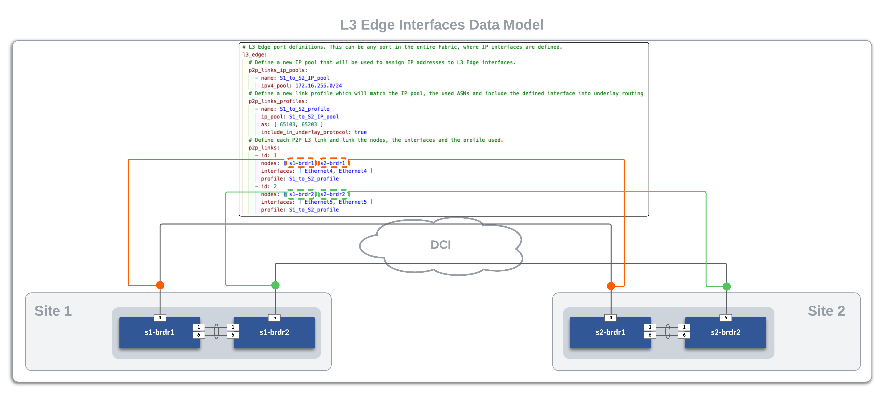

# **Arista CI Workshop - Layer 3 Leaf Spine with EVPN/VXLAN**

This workshop will leverage open-source tools for configuration development, deployment, and documentation of a Layer 3 Leaf Spine network with EVPN and VXLAN. In addition, the open-source tooling enables us to manage our network environment as code.

This section will cover the following:

- Arista Validated Designs (AVD) Ansible Collection
- Network Data Models
- Initial Deployment (Day 0 Provisioning)
- Ongoing Operations (Day 2 and Beyond)

Each attendee will receive a dedicated virtual lab environment with Git, VS Code, and Ansible installed and ready to use.

Attendees will need the following:

- A laptop
- An account on [GitHub](https://github.com/){:target="_blank"}
- Familiarity with the concepts and tools covered in the previous [Automation Fundamentals workshop](https://aristanetworks.github.io/avd-workshops/){:target="_blank"} (Git, VS Code, Jinja/YAML, Ansible)

## **Lab Topology Overview**

Throughout this section, we will use the following dual data center topology. Click on the image to zoom in for details.


## **Basic EOS Switch Configuration**

Basic connectivity between the Ansible controller host and the switches must be established before Ansible can be used to deploy configurations. The following should be configured on all switches:

- Switch Hostname
- IP enabled interface
- Username and Password defined
- Management eAPI enabled

???+ info

    In the ATD environment, cEOS virtual switches use `Management0` in the default VRF. When using actual hardware or vEOS switches, `Management1` is used. The included basic switch configurations may need to be adjusted for your environment.

Below is an example basic configuration file for s1-spine1:

```text
!
no aaa root
!
username admin privilege 15 role network-admin secret sha512 $6$eucN5ngreuExDgwS$xnD7T8jO..GBDX0DUlp.hn.W7yW94xTjSanqgaQGBzPIhDAsyAl9N4oScHvOMvf07uVBFI4mKMxwdVEUVKgY/.
!
hostname s1-spine1
!
management api http-commands
   no shutdown
!
interface Management0
   ip address 192.168.0.10/24
!
ip routing
!
ip route vrf MGMT 0.0.0.0/0 192.168.0.1
!
```

## **Ansible Inventory**

Our lab L3LS topology contains two sites, `Site 1` and `Site 2`. We need to create the Ansible inventory for each site. We have created two separate directories for each site under the `sites` sub-directory in our repo.

``` text
├── sites/
  ├── site_1/
  ├── site_2/
```

The following is a graphical representation of the Ansible inventory groups and naming scheme used for `Site 1` in this example. This is replicated for `Site 2`.


## **AVD Fabric Variables**

To apply AVD variables to the nodes in the fabric, we make use of Ansible group_vars. How and where you define the variables is your choice. The group_vars table below is one example of AVD fabric variables for `Site 1`.

| group_vars/                   | Description                                   |
| ----------------------------- | --------------------------------------------- |
| SITE1_FABRIC.yml              | Fabric, Topology, and Device settings         |
| SITE1_SPINES.yml              | Device type for Spines                        |
| SITE1_LEAFS.yml               | Device type for Leafs                         |
| SITE1_NETWORK_SERVICES.yml    | VLANs, VRFs, SVIs                             |
| SITE1_CONNECTED_ENDPOINTS.yml | Port Profiles and Connected Endpoint settings |

Each group_vars file is listed in the following tabs.

=== "SITE1_FABRIC"
    At the Fabric level (SITE1_FABRIC), the following variables are defined in **group_vars/SITE1_FABRIC.yml**. The fabric name, design type (l3ls-evpn), node type defaults, interface links, and EVPN gateway functionality are defined at this level. Being a Layer 3 Leaf Spine topology, the leaf nodes will require more variables than the spines.  The variables needed for the spines include:

    - loopback_ipv4_pool
    - bgp_as

    The leaf nodes will need the following variables set:

    - spanning_tree_priority
    - spanning_tree_mode
    - loopback_ipv4_pool
    - loopback_ipv4_offset
    - vtep_loopback_ipv4_pool
    - uplink_switches
    - uplink_interfaces
    - uplink_ipv4_pool
    - mlag_interfaces
    - mlag_peer_ipv4_pool
    - mlag_peer_l3_ipv4_pool
    - virtual_router_mac_address

    Variables applied under the node key type (spine/l3leaf) defaults section are inherited by nodes under each type. These variables may be overwritten under the node itself.

    The spine interface used by a particular leaf is defined from the leaf's perspective with a variable called `uplink_switch_interfaces`. For example, s1-leaf1 has a unique variable `uplink_switch_interfaces: [Ethernet2, Ethernet2]` defined. This means that s1-leaf1 is connected to `s1-spine1` Ethernet2 and `s1-spine2` Ethernet2, respectively.

    ``` yaml
    ---
    fabric_name: SITE1_FABRIC

    # Set Design Type to L2ls
    design:
      type: l3ls-evpn

    # Spine Switches
    spine:
      defaults:
        platform: cEOS
        loopback_ipv4_pool: 10.250.1.0/24
        bgp_as: 65100
      nodes:
        - name: s1-spine1
          id: 1
          mgmt_ip: 192.168.0.10/24
        - name: s1-spine2
          id: 2
          mgmt_ip: 192.168.0.11/24

    # Leaf Switches
    l3leaf:
      defaults:
        platform: cEOS
        spanning_tree_priority: 4096
        spanning_tree_mode: mstp
        loopback_ipv4_pool: 10.250.1.0/24
        loopback_ipv4_offset: 2
        vtep_loopback_ipv4_pool: 10.255.1.0/24
        uplink_switches: [ s1-spine1, s1-spine2 ]
        uplink_interfaces: [ Ethernet2, Ethernet3 ]
        uplink_ipv4_pool: 172.16.1.0/24
        mlag_interfaces: [ Ethernet1, Ethernet6 ]
        mlag_peer_ipv4_pool: 10.251.1.0/24
        mlag_peer_l3_ipv4_pool: 10.252.1.0/24
        virtual_router_mac_address: 00:1c:73:00:00:99
      node_groups:
        - group: S1_RACK1
          bgp_as: 65101
          nodes:
            - name: s1-leaf1
              id: 1
              mgmt_ip: 192.168.0.12/24
              uplink_switch_interfaces: [ Ethernet2, Ethernet2 ]
            - name: s1-leaf2
              id: 2
              mgmt_ip: 192.168.0.13/24
              uplink_switch_interfaces: [ Ethernet3, Ethernet3 ]
        - group: S1_RACK2
          bgp_as: 65102
          nodes:
            - name: s1-leaf3
              id: 3
              mgmt_ip: 192.168.0.14/24
              uplink_switch_interfaces: [ Ethernet4, Ethernet4 ]
            - name: s1-leaf4
              id: 4
              mgmt_ip: 192.168.0.15/24
              uplink_switch_interfaces: [ Ethernet5, Ethernet5 ]
        - group: S1_BRDR
          bgp_as: 65103
          evpn_gateway:
             evpn_l2:
               enabled: true
             evpn_l3:
               enabled: true
               inter_domain: true
          nodes:
            - name: s1-brdr1
              id: 5
              mgmt_ip: 192.168.0.100/24
              uplink_switch_interfaces: [ Ethernet7, Ethernet7 ]
              evpn_gateway:
                 remote_peers:
                   - hostname: s2-brdr1
                     bgp_as: 65203
                     ip_address: 10.255.2.7
            - name: s1-brdr2
              id: 6
              mgmt_ip: 192.168.0.101/24
              uplink_switch_interfaces: [ Ethernet8, Ethernet8 ]
              evpn_gateway:
                 remote_peers:
                   - hostname: s2-brdr2
                     bgp_as: 65203
                     ip_address: 10.255.2.8
    ```

=== "SITE1_SPINES"
    In an L3LS design, there are two types of spine nodes: `spine` and `super_spine`. In AVD, the node type defines the functionality and the EOS CLI configuration to be generated. For our L3LS topology, we will use node type `spine`, as we do not have any inter-DC or inter-pod spines.

    ``` yaml
    ---
    type: spine
    ```

=== "SITE1_LEAFS"
    In an L3LS design, we have two types of leaf nodes: `l3leaf` or `l2leaf`. This deployment will utilize `l3leaf` for all leafs as this sets the L3 network services and VTEP functionality for EVPN/VXLAN.

    ``` yaml
    ---
    type: l3leaf
    ```

=== "SITE1_NETWORK_SERVICES"
    You add VLANs, VRFS, and EVPN specific parameters to the Fabric by updating the **group_vars/SITE1_NETWORK_SERVICES.yml**. Within the main tenant we will be configuring, we will supply a **mac_vrf_vni_base** value, which will be used for the VLAN to VNI mapping under the VXLAN interface.  We will then define a VRF our VLANs will be part of and give that a VNI value for the VRF to VNI mapping.  Finally, each VLAN SVI will be configured, given a name, and a single virtual IP address which will end up being configured on all `l3leaf` nodes.

    ``` yaml
    ---
    tenants:
      - name: S1_FABRIC
        mac_vrf_vni_base: 10000
        vrfs:
          - name: OVERLAY
            vrf_vni: 10
            svis:
              - id: 10
                name: 'Ten'
                enabled: true
                ip_address_virtual: 10.10.10.1/24
              - id: 20
                name: 'Twenty'
                enabled: true
                ip_address_virtual: 10.20.20.1/24
    ```

=== "SITE1_CONNECTED_ENDPOINTS"
    Our fabric would only be complete by connecting some devices to it. We define connected endpoints and port profiles in **group_vars/SITE1_CONNECTED_ENDPOINTS.yml**. Each endpoint adapter defines which switch port and port profile to use. Our lab has two hosts connected to the `site 1` fabric. The connected endpoints keys are used for logical separation and apply to interface descriptions. These variables are applied to the spine and leaf nodes since they are a part of this nested inventory group.

    ``` yaml
    ---
    port_profiles:

      - profile: PP-VLAN10
        mode: "access"
        vlans: "10"
        spanning_tree_portfast: edge
      - profile: PP-VLAN20
        mode: "access"
        vlans: "20"
        spanning_tree_portfast: edge

    ###########################################################
    # ---------------- Endpoint Connectivity ---------------- #
    ###########################################################

    servers:

    # --------------------------------------------------------#
    # Site1 RACK1 Endpoints
    # --------------------------------------------------------#

      - name: s1-host1                                      # Server name
        rack: RACK1                                         # Informational RACK (optional)
        adapters:
          - endpoint_ports: [ eth1, eth2 ]                  # Server port to connect (optional)
            switch_ports: [ Ethernet4, Ethernet4 ]          # Switch port to connect server (required)
            switches: [ s1-leaf1, s1-leaf2 ]                # Switch to connect server (required)
            profile: PP-VLAN10                              # Port profile to apply (required)
            port_channel:
              mode: active

    # --------------------------------------------------------#
    # Site1 RACK2 Endpoints
    # --------------------------------------------------------#

      - name: s1-host2                                      # Server name
        rack: RACK2                                         # Informational RACK (optional)
        adapters:
          - endpoint_ports: [ eth1, eth2 ]                  # Server port to connect (optional)
            switch_ports: [ Ethernet4, Ethernet4 ]          # Switch port to connect server (required)
            switches: [ s1-leaf3, s1-leaf4 ]                # Switch to connect server (required)
            profile: PP-VLAN20                              # Port profile to apply (required)
            port_channel:
              mode: active
    ```

## **Global Variables**

In a multi-site environment, some variables can be applied to all sites. They include AAA, Local Users, NTP, Syslog, DNS, and TerminAttr. Instead of updating these same variables in multiple inventory group_vars, we can use a single global variable file and import the variables at playbook runtime. This allows us to make a single change applied to all sites.

For example, in our lab, we use a global variable file `global_vars/global_dc-vars.yml`.

AVD provides a [`global_vars`](https://avd.arista.com/4.10/docs/plugins/Vars_plugins/global_vars.html?h=global_vars#global_vars) plugin that enables the use of global variables.

The `global_vars` plugin must be enabled in the `ansible.cfg` file as shown below:

``` yaml
#enable global vars
vars_plugins_enabled = arista.avd.global_vars, host_group_vars

#define global vars path
[vars_global_vars]
paths = ../../global_vars
```

???+ info

    If a folder is used as in the example above, all files in the folder will be parsed in alphabetical order.

### Example Global Vars File

??? eos-config annotate "global_vars/global_dc_vars.yml"
    ``` yaml
    ---
    # Credentials for CVP and EOS Switches
    ansible_user: arista
    ansible_password: "{{ lookup('env', 'LABPASSPHRASE') }}"
    ansible_network_os: arista.eos.eos
    # Configure privilege escalation
    ansible_become: true
    ansible_become_method: enable
    # HTTPAPI configuration
    ansible_connection: httpapi
    ansible_httpapi_port: 443
    ansible_httpapi_use_ssl: true
    ansible_httpapi_validate_certs: false
    ansible_python_interpreter: $(which python3)
    avd_data_conversion_mode: error
    avd_data_validation_mode: error

    # CVP node variables
    cv_collection: v3
    execute_tasks: true

    # Local Users
    local_users:
      - name: arista
        privilege: 15
        role: network-admin
        sha512_password: "{{ ansible_password | password_hash(salt='workshop') }}"

    # AAA
    aaa_authorization:
      exec:
        default: local

    # OOB Management network default gateway.
    mgmt_gateway: 192.168.0.1
    mgmt_interface_vrf: default

    # NTP Servers IP or DNS name, first NTP server will be preferred, and sourced from Management VRF
    ntp:
      servers:
        - name: 192.168.0.1
          iburst: true
          local_interface: Management0

    # Domain/DNS
    dns_domain: atd.lab

    # TerminAttr
    daemon_terminattr:
      # Address of the gRPC server on CloudVision
      # TCP 9910 is used on on-prem
      # TCP 443 is used on CV as a Service
      cvaddrs: # For single cluster
        - 192.168.0.5:9910
      # Authentication scheme used to connect to CloudVision
      cvauth:
        method: token
        token_file: "/tmp/token"
      # Exclude paths from Sysdb on the ingest side
      ingestexclude: /Sysdb/cell/1/agent,/Sysdb/cell/2/agent
      # Exclude paths from the shared memory table
      smashexcludes: ale,flexCounter,hardware,kni,pulse,strata

    # Point to Point Links MTU Override for Lab
    p2p_uplinks_mtu: 1500

    # Set IPv4 Underlay Routing and EVPN Overlay Routing to use eBGP
    underlay_routing_protocol: ebgp
    overlay_routing_protocol: ebgp

    # Configure password authentication for BGP peerings
    bgp_peer_groups:
      evpn_overlay_peers:
        password: Q4fqtbqcZ7oQuKfuWtNGRQ==
      ipv4_underlay_peers:
        password: 7x4B4rnJhZB438m9+BrBfQ==
      mlag_ipv4_underlay_peer:
        password: 4b21pAdCvWeAqpcKDFMdWw==

    # L3 Edge port definitions. This can be any port in the entire Fabric, where IP interfaces are defined.
    l3_edge:
      # Define a new IP pool that will be used to assign IP addresses to L3 Edge interfaces.
      p2p_links_ip_pools:
        - name: S1_to_S2_IP_pool
          ipv4_pool: 172.16.255.0/24
      # Define a new link profile which will match the IP pool, the used ASNs and include the defined interface into underlay routing
      p2p_links_profiles:
        - name: S1_to_S2_profile
          ip_pool: S1_to_S2_IP_pool
          as: [ 65103, 65203 ]
          include_in_underlay_protocol: true
      # Define each P2P L3 link and link the nodes, the interfaces and the profile used.
      p2p_links:
        - id: 1
          nodes: [ s1-brdr1, s2-brdr1 ]
          interfaces: [ Ethernet4, Ethernet4 ]
          profile: S1_to_S2_profile
        - id: 2
          nodes: [ s1-brdr2, s2-brdr2 ]
          interfaces: [ Ethernet5, Ethernet5 ]
          profile: S1_to_S2_profile
    ```

## **Data Models**

AVD provides a network-wide data model and is typically broken into multiple group_vars files to simplify and categorize variables with their respective functions. We break the data model into three categories: topology, services, and ports.

### Fabric Topology

The physical fabric topology is defined by providing interface links between the spine and leaf nodes. The `group_vars/SITE1_FABRIC.yml` file defines this portion of the data model. In our lab, the spines provide layer 3 routing of SVIs and P2P links using a node type called `l3spines`. The leaf nodes are purely layer 2 and use node type `leaf`. An AVD L2LS design type provides three node type keys: l3 spine, spine, and leaf. AVD Node Type documentation can be found **[here](https://avd.arista.com/4.8/roles/eos_designs/docs/input-variables.html#node-type-variables)**.

#### Spine and Leaf Nodes

The example data model below defines each site's spine and leaf nodes for each site. Refer to the inline comments for variable definitions. Under each node_type_key you have key/value pairs for defaults, node_groups, and nodes. Note that key/value pairs may be overwritten with the following descending order of precedence. The key/value closest to the node will be used.

<node_type_key>

1. defaults
2. node_groups
3. nodes

``` yaml
# Spine Switches
spine:
  defaults:
    platform: cEOS
    loopback_ipv4_pool: 10.250.1.0/24
    bgp_as: 65100
  nodes:
    - name: s1-spine1
      id: 1
      mgmt_ip: 192.168.0.10/24
    - name: s1-spine2
      id: 2
      mgmt_ip: 192.168.0.11/24

# Leaf Switches
l3leaf:
  defaults:
    platform: cEOS
    spanning_tree_priority: 4096
    spanning_tree_mode: mstp
    loopback_ipv4_pool: 10.250.1.0/24
    loopback_ipv4_offset: 2
    vtep_loopback_ipv4_pool: 10.255.1.0/24
    uplink_switches: [ s1-spine1, s1-spine2 ]
    uplink_interfaces: [ Ethernet2, Ethernet3 ]
    uplink_ipv4_pool: 172.16.1.0/24
    mlag_interfaces: [ Ethernet1, Ethernet6 ]
    mlag_peer_ipv4_pool: 10.251.1.0/24
    mlag_peer_l3_ipv4_pool: 10.252.1.0/24
    virtual_router_mac_address: 00:1c:73:00:00:99
  node_groups:
    - group: S1_RACK1
      bgp_as: 65101
      nodes:
        - name: s1-leaf1
          id: 1
          mgmt_ip: 192.168.0.12/24
          uplink_switch_interfaces: [ Ethernet2, Ethernet2 ]
        - name: s1-leaf2
          id: 2
          mgmt_ip: 192.168.0.13/24
          uplink_switch_interfaces: [ Ethernet3, Ethernet3 ]
    - group: S1_RACK2
      bgp_as: 65102
      nodes:
        - name: s1-leaf3
          id: 3
          mgmt_ip: 192.168.0.14/24
          uplink_switch_interfaces: [ Ethernet4, Ethernet4 ]
        - name: s1-leaf4
          id: 4
          mgmt_ip: 192.168.0.15/24
          uplink_switch_interfaces: [ Ethernet5, Ethernet5 ]
    - group: S1_BRDR
      bgp_as: 65103
      evpn_gateway:
        evpn_l2:
          enabled: true
        evpn_l3:
          enabled: true
          inter_domain: true
      nodes:
        - name: s1-brdr1
          id: 5
          mgmt_ip: 192.168.0.100/24
          uplink_switch_interfaces: [ Ethernet7, Ethernet7 ]
          evpn_gateway:
            remote_peers:
              - hostname: s2-brdr1
                bgp_as: 65203
                ip_address: 10.255.2.7
        - name: s1-brdr2
          id: 6
          mgmt_ip: 192.168.0.101/24
          uplink_switch_interfaces: [ Ethernet8, Ethernet8 ]
          evpn_gateway:
            remote_peers:
              - hostname: s2-brdr2
                bgp_as: 65203
                ip_address: 10.255.2.8
```

#### L3 Edge Interfaces

Inside the same global_dc_vars file, we define how each site is linked to each other through their respective border leafs. In our example, the `core` switches are simply configured with layer 2 interfaces so each border leaf connects to its peer in a point to point manner. The `l3_edge` data model for both sites follows.

``` yaml
# L3 Edge port definitions. This can be any port in the entire Fabric, where IP interfaces are defined.
l3_edge:
  # Define a new IP pool that will be used to assign IP addresses to L3 Edge interfaces.
  p2p_links_ip_pools:
    - name: S1_to_S2_IP_pool
      ipv4_pool: 172.16.255.0/24
  # Define a new link profile which will match the IP pool, the used ASNs and include the defined interface into underlay routing
  p2p_links_profiles:
    - name: S1_to_S2_profile
      ip_pool: S1_to_S2_IP_pool
      as: [ 65103, 65203 ]
      include_in_underlay_protocol: true
  # Define each P2P L3 link and link the nodes, the interfaces and the profile used.
  p2p_links:
    - id: 1
      nodes: [ s1-brdr1, s2-brdr1 ]
      interfaces: [ Ethernet4, Ethernet4 ]
      profile: S1_to_S2_profile
    - id: 2
      nodes: [ s1-brdr2, s2-brdr2 ]
      interfaces: [ Ethernet5, Ethernet5 ]
      profile: S1_to_S2_profile
```

The following diagram shows the P2P links between the four border leafs. The DCI Network is pre-configured in our lab with the interfaces facing the border leafs as access ports in VLAN 1000. The l3_edge interfaces for the border leafs in `Site 1` and `Site 2` are configured and deployed with AVD.



### Network Services

Fabric Services, such as VLANs, SVIs, and VRFs, are defined in this section. The following Site 1 example defines VLANs and SVIs for VLANs `10` and `20` in the OVERLAY VRF. We also have specified a mac VRF VNI base mapping of 10000.  This will add the base mapping to the VLAN ID to come up with the VNI for the VLAN to VNI mapping under the VXLAN interface.  Since we have the same VLANs stretched across to Site 2, the network services data model will be exactly the same:

``` yaml
---
tenants:
  - name: S1_FABRIC
    mac_vrf_vni_base: 10000
    vrfs:
      - name: OVERLAY
        vrf_vni: 10
        svis:
          - id: 10
            name: 'Ten'
            enabled: true
            ip_address_virtual: 10.10.10.1/24
          - id: 20
            name: 'Twenty'
            enabled: true
            ip_address_virtual: 10.20.20.1/24
```

### Connected Endpoints

The Fabric must define ports for southbound interfaces toward connected endpoints such as servers, appliances, firewalls, and other networking devices in the data center. This section uses port profiles and connected endpoints called `servers`. Documentation for [port_profiles](https://avd.arista.com/4.10/roles/eos_designs/docs/input-variables.html#port-profiles-settings) and [connected endpoints](https://avd.arista.com/4.10/roles/eos_designs/docs/input-variables.html#connected-endpoints-keys-settings) are available to see all the options available.

The following data model defined two port profiles: PP-VLAN10 and PP-VLAN20. They define an access port profile for VLAN `10` and `20`, respectively. In addition, two server endpoints (s1-host1 and s1-host2) are created to use these port profiles. There are optional and required fields. The optional fields are used for port descriptions in the EOS intended configurations.

``` yaml
---
port_profiles:

  - profile: PP-VLAN10
    mode: "access"
    vlans: "10"
    spanning_tree_portfast: edge
  - profile: PP-VLAN20
    mode: "access"
    vlans: "20"
    spanning_tree_portfast: edge

###########################################################
# ---------------- Endpoint Connectivity ---------------- #
###########################################################

servers:

# --------------------------------------------------------#
# Site1 RACK1 Endpoints
# --------------------------------------------------------#

  - name: s1-host1                                      # Server name
    rack: RACK1                                         # Informational RACK (optional)
    adapters:
      - endpoint_ports: [ eth1, eth2 ]                  # Server port to connect (optional)
        switch_ports: [ Ethernet4, Ethernet4 ]          # Switch port to connect server (required)
        switches: [ s1-leaf1, s1-leaf2 ]                # Switch to connect server (required)
        profile: PP-VLAN10                              # Port profile to apply (required)
        port_channel:
          mode: active

# --------------------------------------------------------#
# Site1 RACK2 Endpoints
# --------------------------------------------------------#

  - name: s1-host2                                      # Server name
    rack: RACK2                                         # Informational RACK (optional)
    adapters:
      - endpoint_ports: [ eth1, eth2 ]                  # Server port to connect (optional)
        switch_ports: [ Ethernet4, Ethernet4 ]          # Switch port to connect server (required)
        switches: [ s1-leaf3, s1-leaf4 ]                # Switch to connect server (required)
        profile: PP-VLAN20                              # Port profile to apply (required)
        port_channel:
          mode: active
```

## **The Playbooks**

Two playbooks, `build.yml` and `deploy.yml` are used in our lab. Expand the tabs below to reveal the content.

??? eos-config annotate "build.yml Playbook"
    ``` yaml
    ---
    - name: Build Switch configuration
      hosts: "{{ target_hosts }}"
      gather_facts: false

      tasks:

        - name: Generate Structured Variables per Device
          import_role:
            name: arista.avd.eos_designs

        - name: Generate Intended Config and Documentation
          import_role:
            name: arista.avd.eos_cli_config_gen
    ```

??? eos-config annotate "deploy.yml Playbook"
    ``` yaml
    ---
    - name: Deploy Switch configuration
      hosts: "{{ target_hosts }}"
      gather_facts: false

      tasks:

        - name: Deploy Configuration to Device
          import_role:
            name: arista.avd.eos_config_deploy_eapi
    ```

To make our lives easier, we use a `Makefile` to create aliases to run the playbooks and provide the needed options. This eliminates mistakes and typing long commands.

??? eos-config annotate "Makefile"
    ``` yaml
    .PHONY: help
    help: ## Display help message
        @grep -E '^[0-9a-zA-Z_-]+\.*[0-9a-zA-Z_-]+:.*?## .*$$' $(MAKEFILE_LIST) | sort | awk 'BEGIN {FS = ":.*?## "}; {printf "\033[36m%-30s\033[0m %s\n", $$1, $$2}'

    ########################################################
    # Site 1
    ########################################################

    .PHONY: build-site-1
    build-site-1: ## Build Configs
        ansible-playbook playbooks/build.yml -i sites/site_1/inventory.yml -e "target_hosts=SITE1_FABRIC"
    # ansible-playbook playbooks/build.yml -i sites/site_1/inventory.yml -e "target_hosts=SITE1_FABRIC" -e "@global_vars/global_dc_vars.yml"

    .PHONY: deploy-site-1
    deploy-site-1: ## Deploy Configs via eAPI
        ansible-playbook playbooks/deploy.yml -i sites/site_1/inventory.yml -e "target_hosts=SITE1_FABRIC"

    ########################################################
    # Site 2
    ########################################################

    .PHONY: build-site-2
    build-site-2: ## Build Configs
        ansible-playbook playbooks/build.yml -i sites/site_2/inventory.yml -e "target_hosts=SITE2_FABRIC"

    .PHONY: deploy-site-2
    deploy-site-2: ## Deploy Configs via eAPI
        ansible-playbook playbooks/deploy.yml -i sites/site_2/inventory.yml -e "target_hosts=SITE2_FABRIC"
    ```

For example, if we wanted to run a playbook to build configs for Site 1, we could enter the following command.

``` bash
ansible-playbook playbooks/build.yml -i sites/site_1/inventory.yml -e "target_hosts=SITE1_FABRIC"
```

Thankfully, a convenient way to simplify the above command is with a Makefile entry like the one below.

``` bash
.PHONY: build-site-1
build-site-1: ## Build Configs
  ansible-playbook playbooks/build.yml -i sites/site_1/inventory.yml -e "target_hosts=SITE1_FABRIC"
```

Now, you can type the following to issue the same ansible-playbook command.

``` bash
make build-site-1
```

In the upcoming lab, we will use the following `make` commands several times. First, review the above `Makefile` to see what each entry does. Then, try building some custom entries.

Build configurations

```bash
# Build configs for Site 1
make build-site-1

# Build configs for Site 2
make build-site-2
```

Deploy configurations

```bash
# Deploy configs for Site 1
make deploy-site-1

# Deploy configs for Site 2
make deploy-site-2
```

## Next Steps

[Continue to Lab Guide](l3ls-lab-guide.md){ .md-button .md-button--primary }
