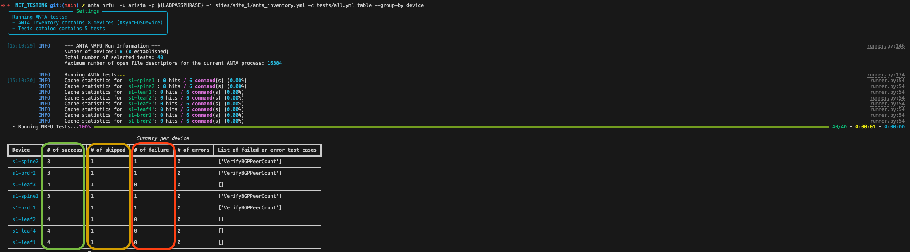

# Getting Started with ANTA Validation

## ANTA Lab Guide Overview

The ANTA Lab Guide is a follow-along set of instructions on leveraging the available network testing modules as either part of CI/AVD labs or independent of those labs. For this lab, you're focus is discovering how Arista Network Test Automation (ANTA) can work to help you validate network state:

- [x] Prepare your Lab
- [x] Build your ANTA inventory
- [x] Build your ANTA test catalog
- [x] Run ANTA for the first time
- [x] Explore ANTA execution options

ANTA can be run against any Arista architecture (L2LS, L3LS, etc). For this lab we will deploy a fabric and use our testing tools to validate it's working. You can either run this lab as a continuation of the available CI/AVD workshops OR start this lab from scratch.

<div class="grid cards" markdown>

- :fontawesome-brands-unity:{ .lg .middle } **Option 1 | CI/AVD Continued**

    ---

    If you have just completed any of the CI/AVD labs ([L2LS](../l2ls/overview.md), [L3LS EVPN/VXLAN](../l3ls/overview.md)), you can continue using that environment and leverage this material to test your newly deployed network! You can **skip to Step 3** and move straight to using ANTA.

    [:octicons-arrow-right-24: Skip to Step 3](./anta_validate.md#step-3-running-anta)

- :fontawesome-brands-unity:{ .lg .middle } **Option 2 | Starting From Scratch**

    ---

    If you **have not completed** the CI/AVD labs, no worries! This lab contains all the steps necessary to test a working fabric using ANTA and AVD. Continue on and prepare your environment! :rocket:

    [:octicons-arrow-right-24: Prepare Your Lab!](#access-the-atd-lab)

</div>

## Step 1 - Prepare Lab Environment

### Access the ATD Lab

Connect to your ATD Lab and start the Programmability IDE. Next, create a new Terminal.

### Fork and Clone Branch to ATD Lab

An ATD Dual Data Center L3LS data model is posted on [GitHub](https://github.com/aristanetworks/ci-workshops-avd).

- Fork this **[repository](https://github.com/aristanetworks/ci-workshops-avd)** to your own GitHub account.
- Next, clone your forked repo to your ATD lab instance.

``` bash
cd /home/coder/project/labfiles
```

``` bash
git clone <your copied HTTPS URL>
```

``` bash
cd ci-workshops-avd
```

Configure your global Git settings.

``` bash
git config --global user.name "FirstName LastName"
```

``` bash
git config --global user.email "name@example.com"
```

### Update AVD

AVD has been pre-installed in your lab environment. However, it may be on an older version (in some cases a newer version). The following steps will update AVD and modules to the valid versions for the lab.

``` bash
pip3 config set global.break-system-packages true
pip3 config set global.disable-pip-version-check true
pip3 install "pyavd[ansible-collection]==4.10.0"
ansible-galaxy collection install -r requirements.yml
```

???+ Warning "Important"
    You must run these commands when you start your lab or a new shell (terminal).

### Setup Lab Password Environment Variable

Each lab comes with a unique password. We set an environment variable called `LABPASSPHRASE` with the following command. The variable is later used to generate local user passwords and connect to our switches to push configs.

``` bash
export LABPASSPHRASE=`cat /home/coder/.config/code-server/config.yaml| grep "password:" | awk '{print $2}'`
```

You can view the password is set. This is the same password displayed when you click the link to access your lab.

``` bash
echo $LABPASSPHRASE
```

???+ Warning "Important"
    You must run this step when you start your lab or a new shell (terminal).

### ANTA Environment Variable

Remove the environment variable set for ANTA if you see it there

```bash
env | grep ANTA_VERSION
```

Remove it using the following

```bash
unset ANTA_VERSION
```

## Step 2 - Build the Fabric

If you are starting this workshop without completing the previous CI/AVD workshops, lets get the fabric built

1. Navigate to the Network Testing lab

    ``` bash
    cd labs/NET_TESTING
    ```

2. Use AVD to build and deploy the Layer 3 Leaf/Spine fabric

    ```bash
    make preplab build-site-1 build-site-2 deploy-site-1 deploy-site-2
    ```

This should deploy a Layer 3 Leaf Spine with EVPN to your lab and will provide some more configuration to work with.

!!! example "What does this all do!?"

    The `make` command above is a combination of AVD playbooks that build the entire environment from scratch! If you're interested in how that all worked, go check out the [Automation Fundamentals (Git, VS Code, Jinja/YAML, Ansible)](../git.md) and [L3LS EVPN/VXLAN](../l3ls/overview.md) Workshops, it will walk you through how this lab was built using Arista Validated Designs (AVD).

## Step 3 - Running ANTA

Ok, you've just deployed a dual data center, Layer 3 VXLAN/EVPN Spine/Leaf fabric in that time using AVD. Of course, visit the CI/AVD labs to learn more about how it all works, but for now we have a supposedly working fabric... lets validate that's true!

### Summary of Steps

- [x] Review ANTA Inventory and Test Catalog
- [x] Run ANTA Network Ready For Use (NRFU)
- [x] Review Reports
- [x] Run Additional Tests
- [x] Review Additional Reports

### ANTA Inventory

ANTA depends on an inventory, like Ansible; it needs a source of target devices against which to run the validation tests. Let's generate that ANTA inventory from your Ansible inventory in your repository!

1. Open the inventory files

    ```bash
    sites/site_1/inventory.yml
    sites/site_2/inventory.yml
    ```

2. These are Ansible inventory files used for AVD; let's generate ANTA-specific inventory from these

    ```bash
    anta get from-ansible \
    --ansible-inventory sites/site_1/inventory.yml \
    --ansible-group SITE1_FABRIC \
    --output sites/site_1/anta_inventory.yml \
    --overwrite
    ```

3. Let's navigate to our new inventory file and see what that looks like under `sites/site_1/anta_inventory.yml`:

    ```yaml
    anta_inventory:
        hosts:
        - host: 192.168.0.10
          name: s1-spine1
        - host: 192.168.0.11
          name: s1-spine2
        - host: 192.168.0.12
          name: s1-leaf1
        - host: 192.168.0.13
          name: s1-leaf2
        - host: 192.168.0.14
          name: s1-leaf3
        - host: 192.168.0.15
          name: s1-leaf4
        - host: 192.168.0.100
          name: s1-brdr1
        - host: 192.168.0.101
          name: s1-brdr2
    ```

4. Great, we've created an inventory file based on our AVD ansible inventory
5. Let's do the same for `site 2`, this time let's use a Make shortcut to do this same thing

    ```bash
    make anta-inv-site-2
    ```

6. Now let's get to building some tests to run against this inventory

### ANTA Test Catalog

We have a set of target devices, we now need to define the set of tests we intend to run against our inventory. Remember, the [ANTA test catalog](https://anta.arista.com/stable/api/tests/) is like a buffet of options, we choose what tests we need to prove our fabric is working as expected!

1. Navigate to the ANTA test catalog provided under `tests/all.yml`

    !!! info "CI/AVD Lab Extension"

        If you are extending one of the CI/AVD labs, copy this directory to your working AVD directory. You can skip this otherwise.

        ```bash
        cp ~/project/labfiles/ci-workshops-avd/labs/NET_TESTING/tests/all.yml <your_avd_proj>
        ```

2. Within that file, we should have three test categories defined
      1. `VerifyUptime`
      2. `VerifyEnvironmentCooling`
      3. `VerifyTerminAttrVersion`

3. To run our first ANTA test, target our new `sites/site_1/anta_inventory.yml` with the `tests/all.yml` test catalog. We must pass our username and password as part of the run, so let's explore the options.

4. Not many tests, but let's use this for our first ANTA NRFU run!

### Running NRFU Tests

To run our first ANTA test, target our new `sites/site_1/anta_inventory.yml` with the `tests/all.yml` test catalog. We must pass our username and password as part of the run, so let's explore the options.

```bash title="Explore the options"
anta nrfu  \
    -u arista \
    -p ${LABPASSPHRASE} \ #(1)!
    -i sites/site_1/anta_inventory.yml \ #(2)!
    -c tests/all.yml \ #(3)!
    table #(4)!
```

1. This is your lab password; we set this environment variable at the beginning of this lab
2. Our new ANTA inventory we generated from our Ansible inventory should target the `SITE1_FABRIC` group
3. We haven't explored this yet, but this describes what we want to test.
4. Print out the results in a table format

Now, let's run the NRFU test

```bash title="Copy/Paste and run"
anta nrfu  -u arista -p ${LABPASSPHRASE} -i sites/site_1/anta_inventory.yml -c tests/all.yml table
```

Great! We should have our first set of results, let's take a look at the output.


You should see similar results, there are two things happening here:

1. ANTA ran each of the tests against your list of inventory
2. ANTA generated a report (in table format) of the success, pass, or skipped tests

Might be wondering, this doesn't look like everything is ok with the lab and you would be right. Let's look at what those results are telling us.

<div class="grid" markdown>

!!! success "Success: VerifyCPUUtilization"

    All your instances of cEOS should be running for more than 10 minutes (600 seconds) at this point, great success!

!!! warning "Skipped: VerifyEnvironmentCooling"

    ANTA skipped tests validating the health of device fans, we are not running physical hardware, so this is expected!

!!! failure "Failure: VerifyTerminAttrVersion"

    It looks like our test failed to validate the TerminAttr version, the lab is running a new version of TerminAttr since this test was last updated. Let's address this below.

</div>

We got our first set of test results, let's adjust our testing to fit our lab instance.

So let's address our failures and skipped tests

1. You should have seen a message similar to this in our test results

    ```bash
    device is running TerminAttr version v1.34.0 and is not in the allowed list: ['v1.32.0']
    ```

2. Let's add that TerminAttr version detected to our test catalog under `tests/all.yml`

    ```yaml hl_lines="5"
    anta.tests.software:
        - VerifyTerminAttrVersion:
            versions:
            - v1.32.0
            - v1.34.0 #(1)!
    ```

    1. Add the version of TerminAttr used in your Arista Test Drive instance

3. You've now instructed ANTA that TerminAttr v1.34.0 is an acceptable version, we should now pass this test. Feel free to run the test at this point

    ```bash
    anta nrfu  -u arista -p ${LABPASSPHRASE} -i sites/site_1/anta_inventory.yml -c tests/all.yml table
    ```

4. We should see we've fixed the failed tasks, if not make sure to revisit Step 2!
5. Now for the skipped tests, ANTA has the intelligence to understand any hardware tests should be skipped when run against virtual instances of EOS. Makes a lot of sense!
6. While there really isn't an issue here, for now we're going to simply skip the tests to make this report easier to read

    ```bash
    anta nrfu  -u arista -p ${LABPASSPHRASE} -i sites/site_1/anta_inventory.yml -c tests/all.yml --hide skipped table
    ```

7. You should have some results that look similar to this now!

    

## Step 4 - Adding ANTA Tests

You've run your first ANTA NRFU test; we've only scratched the surface of ANTA. Let's take a minute to explore what ANTA is capable of when testing different scenarios.

When operating a real-world network, we will curate our tests to an ever-changing environment. Let's build on our current test catalog and provide additional validation.

1. We are testing against a Layer 3 Spine/Leaf using EVPN VXLAN, lets do a basic check and ensure all our devices are configured for multiprotocol BGP.
2. Let's navigate to [anta.arista.com](https://anta.arista.com) and find the test in the documentation
3. You can search at the top for `multi-agent`, but lets open `Tests Documentation > Routing > Generic`
4. We should find there is an ANTA test built for us to verify exactly this using the `VerifyRoutingProtocolModel` under this testing class
5. Let's add this test to our test catalog under `labs/NET_TESTING/tests/all.yml`

    ```yaml
    anta.tests.routing:
        generic:
            - VerifyRoutingProtocolModel: #(1)!
                model: multi-agent
    ```

    1. The test will pass if the configured routing protocol model is the one we expect, in this case `multi-agent`, the alternative is `ribd`.

6. Save the file and re-run the tests

    ```bash
    anta nrfu  -u arista -p ${LABPASSPHRASE} -i sites/site_1/anta_inventory.yml -c tests/all.yml --hide skipped table
    ```

7. You should find that all devices are configured with `multi-agent`, let's verify `site2` now

    ```bash
    anta nrfu  -u arista -p ${LABPASSPHRASE} -i sites/site_2/anta_inventory.yml -c tests/all.yml --hide skipped table
    ```

8. Great! Just like that, we verified all 16 devices are configured for MP-BGP
9. Let's take this further and ensure BGP is peering across the address families and VRFs. If we think about it, there should be

      1. **Default VRF**: 3 Peers, 2 peers to each of the spines and iBGP peer across the MLAG link
      2. **OVERLAY VRF**: 1 Peer, the iBGP peer across the MLAG link
      3. **EVPN Address Family:** 2 peers, both spines are EVPN route servers

10. Ok, back on [ANTA Testing Documentation](https://anta.arista.com/stable/api/tests/) there is a [Routing BGP](https://anta.arista.com/stable/api/tests.routing.bgp/) set of sets
11. Let's find the `VerifyBGPPeerCount` and verify this test's configuration.

12. Let's represent our criteria in the format of the test structure within our catalog under `anta.tests.routing`, our routing tests should look like this now.

    !!! info "Reminder"

        This test is a part of the same test category `anta.tests.routing` we just used for our `multi-agent` test. Be sure to add the sub category under the same key!

    ```yaml
    anta.tests.routing:
      generic: #(1)!
        - VerifyRoutingProtocolModel:
            model: multi-agent
      bgp:
        - VerifyBGPPeerCount: #(2)!
            address_families:
            - afi: "evpn" #(3)!
              num_peers: 2 #(4)!
            - afi: "ipv4"
              safi: "unicast"
              vrf: "OVERLAY"
              num_peers: 1 #(5)!
            - afi: "ipv4"
              safi: "unicast"
              vrf: "default"
              num_peers: 3 #(6)!
    ```

    1. Our previous test was under the `generic` sub-category, this new test is under `bgp`
    2. This test will succeed for each device if the count of BGP peers matches the expected count for each address family and VRF.
    3. Identify the address family, in this case we want to address the EVPN address family
    4. Verify we have BGP peers to both our EVPN route servers
    5. Verify the `OVERLAY` VRF should have 1 peer, this is our designated MLAG peer for this VRF
    6. Verify the underlay is peering to both spines and our MLAG peer

13. Save the file and re-run the tests

    ```bash
    anta nrfu  -u arista -p ${LABPASSPHRASE} -i sites/site_1/anta_inventory.yml -c tests/all.yml --hide skipped table
    ```

14. Alright, now that went to plan... sort of. Looks like there are some failures, let's re-run this test but use the `--group-by` flag to make this easier to visualize what failed.

    ```bash
    anta nrfu  -u arista -p ${LABPASSPHRASE} -i sites/site_1/anta_inventory.yml -c tests/all.yml table --group-by device
    ```

    ??? tip "Skipped tests are coming back"

        We'll remove the `--hide skipped`, we can visualize all tests much easier using `--group-by`. You can group by both `device` and `test`, check out the documentation for more information [ANTA Command Overview](https://anta.arista.com/stable/cli/nrfu/#command-overview_1)

15. Much better, looks like the `spine` and `brdr` devices are failing the BGP count tests, can you think of why? 🤔

    !!! danger ":material-alert: We have failures!!! :material-alert:"

        **YES!** We have failures and **THAT'S OK**... at least here. In an attempt to simulate a fictitious world where networks are flawed, we are starting with failures **we will fix**! 😉

    

16. Before continuing to the next lab, run all these tests against `site2` if you have not already. We will address these failures in the next step!

Great, in this section, we covered the following:

- [x] How to find new tests on [anta.arista.com](https://anta.arista.com)
- [x] Adding tests to our catalog
- [x] Additional flag to group test results
- [x] Verifying test results

## Step 5 - Tagging Tests

We added some tests in the last step that worked great, albeit it failed on the spines and borders. Let's validate what's on the spines and borders and troubleshoot why our tests failed.

1. Login to `s1-spine`
2. Let's check the default BGP peers we defined as part of our `VerifyBGPPeerCount` test

    ```yaml
    show ip bgp summary

    # This command will give you the count of Established peers
    show ip bgp summary | grep "Estab" | wc -l
    ```

    ```yaml hl_lines="6-11 14"
    s1-spine1#sh ip bgp summary
    BGP summary information for VRF default
    Router identifier 10.250.1.1, local AS number 65100
    Neighbor Status Codes: m - Under maintenance
      Description              Neighbor    V AS           MsgRcvd   MsgSent  InQ OutQ  Up/Down State   PfxRcd PfxAcc
      s1-leaf1_Ethernet2       172.16.1.1  4 65101            110       111    0    0 01:17:54 Estab   3      3
      s1-leaf2_Ethernet2       172.16.1.5  4 65101            107       111    0    0 01:17:55 Estab   3      3
      s1-leaf3_Ethernet2       172.16.1.9  4 65102            105       113    0    0 01:17:54 Estab   3      3
      s1-leaf4_Ethernet2       172.16.1.13 4 65102            104       112    0    0 01:17:54 Estab   3      3
      s1-brdr1_Ethernet2       172.16.1.17 4 65103              0         0    0    0 01:17:58 Active
      s1-brdr2_Ethernet2       172.16.1.21 4 65103            111       100    0    0 01:17:54 Estab   14     14

    s1-spine1#show ip bgp summary | grep "Estab" | wc -l
    5
    ```

3. First, let's take note of the fact we have an Active BGP peer (not Established), we will troubleshoot that in a bit.
4. More concerning, the count of BGP peers we specified as part of our test is not correct. Reminder this is the test we supplied for the default vrf

    ```yaml hl_lines="6-7"
    anta.tests.routing:
        bgp:
            - VerifyBGPPeerCount:
                - afi: "ipv4"
                  safi: "unicast"
                  vrf: "default"
                  num_peers: 3 #(1)!
    ```

    1. We have more than 3 peers, more like 6 peers! (well 1 active 😃)

5. Ok, let's check our other two tests, verify the number of BGP peers for our `vrf OVERLAY` and `address-family evpn`:

    ```yaml
    show ip bgp summary vrf OVERLAY
    show bgp evpn summary
    ```

6. So you should notice a few things

      1. `vrf OVERLAY`: The vrf doesn't exist on the spines, remember spines are simple L3 transports for VXLAN/EVPN and thus don't participate in VRF routing.
      2. `address-family evpn`: The leafs have 2 EVPN peers, these are spines acting as route servers. The spines themselves are peered to all leaves/borders, so we get `2 * 3 leaf pairs = 6 peers`

7. So now know why this test is failing on `s1-spine1`, run the same for `s1-spine2`, `s1-border1`, and `s1-border2` to note the differences.
8. We've discovered an issue on the spines, address the failure of peer counts!
9. We are going to use [ANTA device and test tags](https://anta.arista.com/stable/usage-inventory-catalog/#test-tags) to curate some tests to our device roles.
10. Let's first update our `sites/site_1/anta_inventory.yml` file and add some tags to our devices.
11. Add a tag for each device role: `spine`, `leaf`, and `border` as such

    ```yaml hl_lines="5 8 11 14 17 20 23 26"
    anta_inventory:
      hosts:
      - host: 192.168.0.10
        name: s1-spine1
        tags: ['spine']
      - host: 192.168.0.11
        name: s1-spine2
        tags: ['spine']
      - host: 192.168.0.12
        name: s1-leaf1
        tags: ['leaf']
      - host: 192.168.0.13
        name: s1-leaf2
        tags: ['leaf']
      - host: 192.168.0.14
        name: s1-leaf3
        tags: ['leaf']
      - host: 192.168.0.15
        name: s1-leaf4
        tags: ['leaf']
      - host: 192.168.0.100
        name: s1-brdr1
        tags: ['border']
      - host: 192.168.0.101
        name: s1-brdr2
        tags: ['border']
    ```

12. Let's now create some additional tests in our test catalog and tag them for each device type
13. Open your test catalog in `tests/all.yml` and add tag our existing tests for `leaf`

    ```yaml hl_lines="14-15"
    bgp:
    - VerifyBGPPeerCount:
        address_families:
        - afi: "evpn"
          num_peers: 2
        - afi: "ipv4"
          safi: "unicast"
          vrf: "OVERLAY"
          num_peers: 1
        - afi: "ipv4"
          safi: "unicast"
          vrf: "default"
          num_peers: 3
        filters:
            tags: ['leaf']
    ```

14. Before we add our new tests, let's re-run our tests and see how that has changed our results. Feel free to run with and without the `--group-by`

    ```bash title="Run and hide skipped tests"
    anta nrfu  -u arista -p ${LABPASSPHRASE} -i sites/site_1/anta_inventory.yml -c tests/all.yml --hide skipped table
    ```

    ```bash title="Run and group by device"
    anta nrfu  -u arista -p ${LABPASSPHRASE} -i sites/site_1/anta_inventory.yml -c tests/all.yml table --group-by device
    ```

15. We should see there are no more failed tests?! That's right, we are no longer running these tests against the borders or spines, we have a gap now, let's fix that.
16. Let's add another test under `bgp:` that matches the expected spine peers like we saw in a previous validation step

    ```yaml hl_lines="4 8 10"
    - VerifyBGPPeerCount:
        address_families:
        - afi: "evpn"
          num_peers: 6
        - afi: "ipv4"
          safi: "unicast"
          vrf: "default"
          num_peers: 6
        filters:
          tags: ['spine']
    ```

17. Let's add the same for the border.

    ```yaml hl_lines="4 8 12 14"
    - VerifyBGPPeerCount:
        address_families:
        - afi: "evpn"
          num_peers: 2
        - afi: "ipv4"
          safi: "unicast"
          vrf: "OVERLAY"
          num_peers: 1
        - afi: "ipv4"
          safi: "unicast"
          vrf: "default"
          num_peers: 3
        filters:
          tags: ['border']
    ```

18. If formatting is a bit of a problem, copy the following into your `tests/all.yml` file.

    ??? "All ANTA Tests Available for Copy"

        ```yaml
        anta.tests.system:
          - VerifyUptime:
              minimum: 600

        anta.tests.hardware:
          # Verifies the status of power supply fans and all fan trays.
          - VerifyEnvironmentCooling:
              states:
                - ok

        anta.tests.software:

            # Verifies the device is running one of the allowed TerminAttr version.
            - VerifyTerminAttrVersion:
                versions:
                - v1.32.0
                - v1.34.0

        anta.tests.routing:
          generic:
            - VerifyRoutingProtocolModel:
                model: multi-agent
          bgp:
            - VerifyBGPPeerCount:
                address_families:
                - afi: "evpn"
                  num_peers: 2
                - afi: "ipv4"
                  safi: "unicast"
                  vrf: "OVERLAY"
                  num_peers: 1
                - afi: "ipv4"
                  safi: "unicast"
                  vrf: "default"
                  num_peers: 3
                filters:
                    tags: ['leaf']
            - VerifyBGPPeerCount:
                address_families:
                - afi: "evpn"
                  num_peers: 6
                - afi: "ipv4"
                  safi: "unicast"
                  vrf: "default"
                  num_peers: 6
                filters:
                  tags: ['spine']
            - VerifyBGPPeerCount:
                address_families:
                - afi: "evpn"
                  num_peers: 2
                - afi: "ipv4"
                  safi: "unicast"
                  vrf: "OVERLAY"
                  num_peers: 1
                - afi: "ipv4"
                  safi: "unicast"
                  vrf: "default"
                  num_peers: 3
                filters:
                  tags: ['border']
        ```

19. Re-run the ANTA tests, we should see both `s1-spine1` and `s1-spine2` are passing now! (4 tests pass per device)

    ```bash title="Run and group by device"
    anta nrfu  -u arista -p ${LABPASSPHRASE} -i sites/site_1/anta_inventory.yml -c tests/all.yml table --group-by device
    ```

    !!! danger "My **Borders** Are Still Failing"

        Remember the steps above, we caught a BGP peer in `Active` state on the spines. We will address this soon!

    !!! tip "My **Spines** Are Still Failing"

        If your tests are failing for some reason, run this command without the `--group-by` and you will get the `Message(s)` column that will give you a hint as to why!

20. Let's pause here, make sure all your tests are successful. If not, ensure your tags and peer counts are correct, otherwise CONGRATS, you did it!

    

### ANTA Custom Tests

You might think yourself at this point, that's cool, the testing ideas start flowing and you wonder if a specific test might exist in ANTA. Answer is probably yes, to start, but you might start finding yourself in a situation where ANTA doesn't provide a built in test that validates exactly what you want. Well, ANTA is a framework, and while there are built in tests, it was built on top of a framework you can customize.

We will not explore the depths of customizing ANTA, but like we've explored before the [ANTA documentation for creating custom tests](https://anta.arista.com/stable/advanced_usages/custom-tests/) provides some great guidance! As an example, recall our hardware test we added for `VerifyEnvironmentCooling`, well here's that source code and some insight in how to ANTA works under the hood!

```python
class VerifyEnvironmentCooling(AntaTest): #(1)!
    """Verifies the status of power supply fans and all fan trays."""

    name = "VerifyEnvironmentCooling" #(2)!
    description = "Verifies the status of power supply fans and all fan trays."
    categories: ClassVar[list[str]] = ["hardware"] #(3)!
    commands: ClassVar[list[AntaCommand | AntaTemplate]] = [AntaCommand(command="show system environment cooling", revision=1)] #(4)!

    class Input(AntaTest.Input):
        states: list[str] #(5)!

    @skip_on_platforms(["cEOSLab", "vEOS-lab", "cEOSCloudLab"]) #(6)!
    @AntaTest.anta_test
    def test(self) -> None:
        command_output = self.instance_commands[0].json_output #(7)!
        self.result.is_success()
        # First go through power supplies fans
        for power_supply in command_output.get("powerSupplySlots", []):
            for fan in power_supply.get("fans", []):
                if (state := fan["status"]) not in self.inputs.states: #(8)
                    self.result.is_failure(f"Fan {fan['label']} on PowerSupply {power_supply['label']} is: '{state}'") #(9)
        # Then go through fan trays
        for fan_tray in command_output.get("fanTraySlots", []):
            for fan in fan_tray.get("fans", []):
                if (state := fan["status"]) not in self.inputs.states:
                    self.result.is_failure(f"Fan {fan['label']} on Fan Tray {fan_tray['label']} is: '{state}'")
```

1. This is the ANTA class provided to write your own tests, you could write a `VerifyMyVeryOwnTest(AntaTest)` as an example
2. This should look familiar, this is the name of the test we called out in our test catalog
3. This test will fall under the `hardware` category, just like we saw in our test catalog: `anta.tests.hardware:`
4. Here we provide the EOS CLI command to be run on the device
5. Remember, we provided states we wanted to validate, in this case `ok` was the only state given
6. Remember our skipped tests, this is how ANTA is instructed to skip this test on specific platforms
7. The output from the command in #4 is stored here as JSON data, we use that to evaluate the response below (like power supply state)
8. If any of the power supply states don't match `ok`, then we fail!
9. We set the result to `is_failure()` and pass it a message, this is the message you see on failure.

## Step 6 - Let's Move to AVD

We've now built onto the concepts, specifically using tags to group devices to specific tests. Of course, we've done this all manually, and, as you might imagine, the overhead it would take to maintain an ever-changing real-world network. That is precisely where Arista Validated Designs helps you build your validation based on your data models! Let's go check it out.

[AVD Validate Lab :fontawesome-solid-greater-than:](./avd_validate.md){ .md-button }
