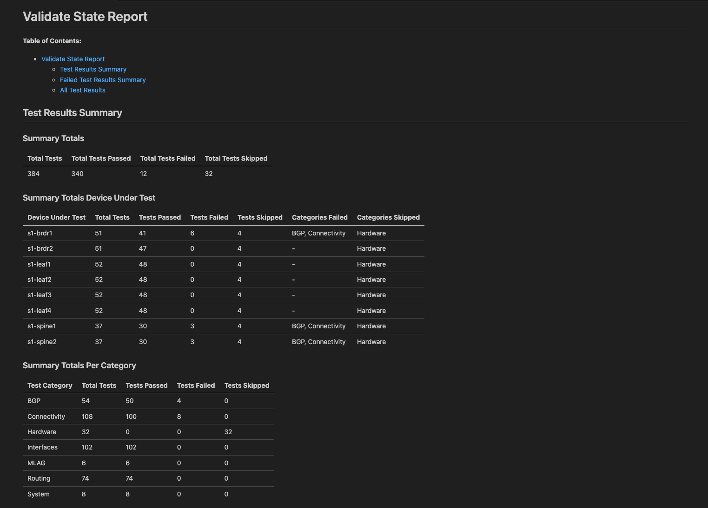
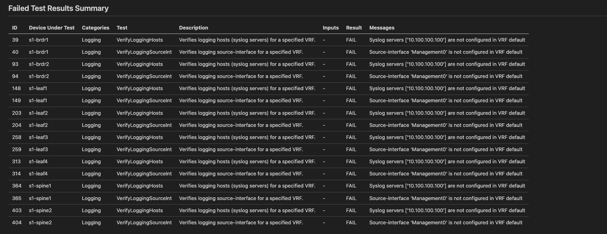

# AVD Validation

You should have completed the [Getting Started with ANTA Validation](./anta_validate.md) lab. If not, it's highly suggested that you complete that before continuing. This lab is intended to build on your understanding of ANTA and Arista Validated Designs (AVD) and give you the tools to test and validate a network fabric through automation.

While these are not hard requirements, these are the recommended prerequisites to gain the most from this lab:

- [x] Completed the [Automation Fundamentals Lab](../git.md)
- [x] Completed either the [CI/AVD L2LS](../l2ls/overview.md) or the [CI/AVD L3LS EVPN/VXLAN](../l3ls/overview.md) labs
- [x] Completed the [Getting Started with ANTA Validation](./anta_validate.md)

## Review of ANTA

At this point, we've explored the [ANTA Framework](https://anta.arista.com) and the capabilities to test our network fabric. You should also be somewhat familiar with the AVD constructs, it has been used to deploy this lab if you are coming from the [Getting Start with ANTA Validation](./anta_validate.md). So what does AVD and ANTA have to do with each other and how does this work.

Reminder, we are operating within the `labs/NET_TESTING/` directory for this lab, please change to this directory if you haven't already

```bash
cd ~/project/labfiles/ci-workshops-avd/labs/NET_TESTING
```

## Step 1 - AVD Validate State

Before we dive into ANTA, lets look at AVD [validate state](https://avd.sh/en/stable/roles/eos_validate_state/index.html) module called `eos_validate_state`.

1. Lets look at the validation playbook in `playbooks/validate.yml`
2. This playbook used the AVD `eos_validate_state` module; click the annotations below to discover what the critical lines do:

    ```yaml hl_lines="3 11"
    ---
    - name: Validate Network State
      hosts: "{{ target_hosts }}" #(1)!
      connection: httpapi
      gather_facts: false

      tasks:

        - name: validate states on EOS devices
          ansible.builtin.import_role:
            name: arista.avd.eos_validate_state #(2)!
    ```

    1. We will pass the `SITE1_FABRIC` as an extra variable to tell this playbook to validate SITE 1
    2. Here we import the role `eos_validate_state` which will run validations based on the AVD data models

3. Before we run this, lets summarize what this role is performing
      1. First, this role requires an AVD build to have been completed. Those intended configurations generated within `sites/site_1/intended/` are used to understand what to validate
      2. Second, the role will rely heavily on Ansible to gather device details and validate the device state is healthy based on AVD
4. Ok, lets run this playbook, we can use the `make` shortcut

    ```bash
    make validate-site-1
    ```

5. So a lot happened! If you look at the Ansible play recap, we see there are a number of tests it performs

    ```bash
    Wednesday 04 September 2024  19:43:14 +0000 (0:00:00.964)       0:00:38.051 ***
    ===============================================================================
    eos_validate_state ----------------------------------------------------- 37.93s
    ~~~~~~~~~~~~~~~~~~~~~~~~~~~~~~~~~~~~~~~~~~~~~~~~~~~~~~~~~~~~~~~~~~~~~~~~~~~~~~~
    total ------------------------------------------------------------------ 37.93s
    Wednesday 04 September 2024  19:43:14 +0000 (0:00:00.964)       0:00:38.051 ***
    ===============================================================================
    arista.avd.eos_validate_state : Gather ip reachability state between devices (loopback0 <-> loopback0) ----------------- 6.09s
    arista.avd.eos_validate_state : Run show ip route lo0 ------------------------------------------------------------------ 5.67s
    arista.avd.eos_validate_state : Gather ip reachability state (directly connected interfaces) --------------------------- 4.63s
    arista.avd.eos_validate_state : Run show ip route VTEP IP -------------------------------------------------------------- 2.20s
    arista.avd.eos_validate_state : Create required output directories if not present -------------------------------------- 1.38s
    arista.avd.eos_validate_state : Gather EOS platform and version details ------------------------------------------------ 1.26s
    arista.avd.eos_validate_state : Create Validation report - Markdown ---------------------------------------------------- 0.96s
    arista.avd.eos_validate_state : Gather bgp summary (ip and evpn) ------------------------------------------------------- 0.95s
    arista.avd.eos_validate_state : Generate variables for testing --------------------------------------------------------- 0.93s
    arista.avd.eos_validate_state : Create Validation report - CSV --------------------------------------------------------- 0.90s
    arista.avd.eos_validate_state : Gather ntp status ---------------------------------------------------------------------- 0.89s
    arista.avd.eos_validate_state : Gather mlag status --------------------------------------------------------------------- 0.87s
    arista.avd.eos_validate_state : Gather ip route summary and ArBGP state ------------------------------------------------ 0.86s
    arista.avd.eos_validate_state : Gather lldp topology ------------------------------------------------------------------- 0.83s
    arista.avd.eos_validate_state : Gather interfaces state ---------------------------------------------------------------- 0.83s
    arista.avd.eos_validate_state : Generate Results (Set eos_validate_state_report) --------------------------------------- 0.73s
    arista.avd.eos_validate_state : Validate ip bgp neighbors peer state --------------------------------------------------- 0.33s
    arista.avd.eos_validate_state : Validate bgp evpn neighbors peer state ------------------------------------------------- 0.33s
    arista.avd.eos_validate_state : Validate loopback reachability --------------------------------------------------------- 0.30s
    arista.avd.eos_validate_state : Validate lldp topology when there is a domain name ------------------------------------- 0.30s
    Playbook run took 0 days, 0 hours, 0 minutes, 38 seconds
    ```

6. The play recap is great, but this role produces a report as a part of the run. This report details all tests that succeeded or failed.
7. Before we dig into the reports, run the validation against `site2` as well.

    ```bash
    make validate-site-2
    ```

## Step 2 - Analyzing Results

Ok, we have run validation, what just happened?! So remember:

1. The AVD data models in this lab have described how you **intend** to configure this network, from physical connectivity to protocols used.
2. AVD Validate state generated tests based on what it understands from an AVD build of the topology and configuration to generate tests

YES, AVD just generated tests for you, lets take a look!

1. Open `sites/site_1/reports/SITE1_FABRIC-state.md` and take a look at what the first part of this report shows

    === "Validation Report"

        

    === "Validation Report Failures"

        

2. So first off note it generated over **300+ tests** for a single 8 node site!
3. If you haven't already, click the "Validation Report Failures" tab above, we can note a few things here
      1. Quickly we realize there are test failures in the **Summary Totals**
      2. In the device summary, we can quickly discern that we have failures on the `s1-brdr1` and both `spine` devices. The categories even give us hints as to what might be wrong here.
      3. Last we the tests grouped by category, verifying what we seeing failing in our environment: LLDP issues + BGP issues = IP Reachability :thinking:
4. We could analyze more of this report, but first, **let's run this report again using ANTA**!

## Step 3 - AVD Validate State (ANTA)

Ok, we just ran AVD validate state, we have produced a report, and looks like we've identified an issue already. Validate state heavily relies on Ansible modules (like the [assert module](https://docs.ansible.com/ansible/latest/collections/ansible/builtin/assert_module.html)) and while it works great, it can prove challenging to maintain performance while trying to achieve more complex and larger scale testing.

!!! tip "AVD 5.0.0+"

    Moving forward, AVD 5.0.0 and beyond will use ANTA as it's default testing framework. ANTA is developed in python and gives AVD the ability to scale while maintaining performance as testing catalogs grow.

Let's go ahead and enable ANTA and see it in action:

1. Open your validation playbook `playbooks/validate.yml`
2. Uncomment the `vars` below, we will enable ANTA and instruct the role to save the generated test catalogs

    ```yaml
    - name: validate states on EOS devices
      ansible.builtin.import_role:
        name: arista.avd.eos_validate_state
      vars:
        use_anta: true
        save_catalog: true
        eos_validate_state_md_report_path: "{{ eos_validate_state_dir }}/{{ fabric_name }}-state-anta.md"
    ```

    !!! note "ANTA Report"

        We are saving the report to a new file, that way you can go back and review the differences between the two reports!

3. Make sure the file is saved and run our validation again

    ```bash
    make validate-site-1
    ```

4. Ok, you may have noticed this play was not nearly as verbose in output, and it ran much faster! These runs were done for the creation of this lab (as of AVD 4.10.0) ANTA was over **30 seconds faster.**

    ```bash
    Wednesday 04 September 2024  20:10:08 +0000 (0:00:00.168)       0:00:06.034 ***
    ===============================================================================
    eos_validate_state ------------------------------------------------------ 5.93s
    ~~~~~~~~~~~~~~~~~~~~~~~~~~~~~~~~~~~~~~~~~~~~~~~~~~~~~~~~~~~~~~~~~~~~~~~~~~~~~~~
    total ------------------------------------------------------------------- 5.93s
    Wednesday 04 September 2024  20:10:08 +0000 (0:00:00.168)       0:00:06.034 ***
    ===============================================================================
    arista.avd.eos_validate_state : Run eos_validate_state_runner leveraging ANTA ------------------------------------------ 3.47s
    arista.avd.eos_validate_state : Create required output directories if not present -------------------------------------- 1.21s
    arista.avd.eos_validate_state : Include ANTA tasks --------------------------------------------------------------------- 0.67s
    arista.avd.eos_validate_state : Include Ansible assert tests report tasks ---------------------------------------------- 0.17s
    arista.avd.eos_validate_state : Include device intended structured configuration variables ----------------------------- 0.13s
    arista.avd.eos_validate_state : Include Ansible assert tests ----------------------------------------------------------- 0.11s
    arista.avd.eos_validate_state : Create validation reports from ANTA tests ---------------------------------------------- 0.09s
    arista.avd.eos_validate_state : Verify Requirements -------------------------------------------------------------------- 0.08s
    Playbook run took 0 days, 0 hours, 0 minutes, 6 seconds
    ```

5. Remember creating an ANTA test catalog in the ANTA lab, well we enabled `save_catalog`, AVD generated and saved that catalog for you to look at! It creates a catalog per device under the `sites/site_1/intended/test_catalogs/` directory.

    !!! tip "That's a large catalog!"

        AVD generated over 2700 lines of test catalog configuration for you! If you look closely, many of those tests are specific peer to peer connectivity or neighborship tests.

6. Let's open the new ANTA report, remember we changed the name for this report, it should be `sites/site_1/reports/SITE1_FABRIC-state-anta.md`

    === "Validation Report"

        

    === "Validation Report Failures"

        

    === "Old Validation Report Failures"

        

7. Click the "Validation Report Failures" tab above, we can see we get very similar summaries of the failures. We note we still have an issue with `s1-brdr1` and both `spine` devices. One key difference is the test categories, but it still points us to a BGP/Connectivity issue!
8. If you haven't already, you can compare the failure results of the two reports by clicking the "Old Validation Report Failures" above.
9. Let's review the section called "Failed Test Results Summary," we get a list of all failed tests with a bit more verbosity
    

10. There seems to be three tests within the **BGP** and **Connectivity** ANTA test categories failing
      1. `VerifyBGPSpecificPeers`
      2. `VerifyReachability`
      3. `VerifyLLDPNeighbors`
11. Let's start with layer 1 and look at this `VerifyLLDPNeighbors` test failure, lets focus on the **Inputs** and **Messages**
        1.  Inputs (Intended): this is what AVD told the test framework what our fabric SHOULD look like, this is supposed to be source of truth
        2.  Messages (Actual): what ANTA has told AVD ACTUALLY exists in the network by querying the device

12. So that being said, looks like `s1-brdr1:Ethernet2` should be connected to `s1-spine1:Ethernet6`, but it detected it's actually detected `s1-spine1:Ethernet7`. Remember AVD would have configured `s1-spine1:Ethernet6` for peer connectivity, something isn't right.

13. Looks like we have one of two scenarios
        1. **AVD Typo:** We have a typo in what we consider our intended configuration in AVD
        2. **Cabling Issue:** We've cabled the links between `s1-brdr1` and our `spine` devices wrong

14. In a real-world scenario, this would have caught a use case of the links being transposed or a typo in the AVD repository! This is a virtual lab, so mistakes in cabling are most likely not the cause. Let's go fix AVD :smile:

15. Under `sites/site_1/group_vars/SITE1_FABRIC.yml` let's fix our border node `s1-brdr1` up link interfaces, update the `uplink_switch_inerfaces` key.

    ```yaml hl_lines="5"
      nodes:
        - name: s1-brdr1
          id: 5
          mgmt_ip: 192.168.0.100/24
          uplink_switch_interfaces: [ Ethernet6, Ethernet6 ] #(1)!
          evpn_gateway:
            remote_peers:
              - hostname: s2-brdr1
                bgp_as: 65203
                ip_address: 10.250.2.7
    ```

    1. Update this to `Ethernet7`, we are going to trust the border is cabled correctly and we just made a mistake here.
16. Ok, we're updated. We need to push this change into our environment now. Let's do that!

    ```bash
    make build-site-1 deploy-site-1
    ```

17. Perfect, give it a second for things to converge and let's try to validate! We should expect our validation to verify this peering is healthy now that we've fixed the layer 1 mix up 👍

    ```bash
    make validate-site-1
    ```

18. CONGRATS! You've now validated the fabric, caught an issue, resolved it, and run over 1000 tests in this time with a click of a button (or several 😀)

## Step 4 - Day 2 Validation

Well you've come a long way at this point, AVD is now generating all our tests for us and we can validate our fabric with a single playbook, A SINGLE TASK! That's great, we have confidence now, but we always want more testing! Let's dive into adding new tests to our environment and how AVD behaves with what we'll consider Day 2 Changes.

### Day 2 - Dynamic Tests

The first scenario we'll address is simply adding a VLAN. Adding VLANs/SVIs across a fabric can be automated, as you've seen with AVD, but ensuring that all those leaf switches take the change and/or that VLAN is actually up is another story. Let's try this out:

1. Let's navigate to `sites/site_1/group_vars/SITE1_NETWORK_SERVICES.yml`
2. Go ahead and uncomment VLAN 30; this will add the VLAN to the EVPN/VXLAN environment. That means each leaf should get this new VLAN/SVI
3. First, let's validate our network is still healthy; validation is great after a change, but it's just as important before a change!

    ```bash
    make validate-site-1
    ```

4. Great, we shouldn't see any changes.
5. Lets run our AVD build only and validate

    ```bash
    make build-site-1 validate-site-1
    ```

6. Let's check our validation report `sites/site_1/reports/SITE1_FABRIC-state-anta.md`
7. There's a new test for VLAN 30! Yes, AVD generated a test for you based on your AVD change. Yes, it failed because we told our validation to make sure the network has VLAN 30 configured and up... well we haven't deployed yet!

    

8. Let's fix that, let's deploy the changes and re-run our validation

    ```bash
    make deploy-site-1 validate-site-1
    ```

9. Awesome, you changed 4 lines of configuration and look at that testing at work for day 2 operations!

### Day 2 - Add Tests

Ok, lets take a new scenario that we've got an ask from our enterprise monitoring and compliance teams to add a new logging server to our environment. Compliance would like us to prove all our switches are pointed to this logging server and are using the Management interface.

Great, let's solve this:

1. First, let's take our first action, add the new logging server to the fabric
2. Open `sites/global_vars/global_dc_vars.yml` and uncomment the logging server. We are using global vars to enable the logging server globally, across both SITE1 and SITE2
3. Ok, like before, let's build and validate

    ```bash
    make build-site-1 validate-site-1
    ```

4. Let's check our validation report `sites/site_1/reports/SITE1_FABRIC-state-anta.md`
5. Interesting, we don't see a new test like we did with Vlan 30. We would expect a failure based on the fact we defined a new logging server but haven't deployed it yet. Let's fix this

    !!! tip "AVD and ANTA Tests"

        It's fair to have maybe expected a test and if you check the [ANTA Documentation](https://anta.arista.com/stable/api/tests.logging/) there is a number of logging tests available! AVD is always introducing new AVD tests that can be generated based on structured configuration. You can always search open feature requests (or open your own) on the AVD repository to see if it's been requested or staged for the next release!

        While it's not generated, we can still add it!

6. Let's fix this lack of test, we're going to leverage an AVD construct to provide our own tests.
7. Navigate to `sites/site_1/custom_anta_catalogs/SITE1_FABRIC.yml` and let's look at the contents here
8. This directory is where you can place files to add additional tests to your existing generated tests. The file names themselves behave the same way `group_vars` files behave; the file name maps to an ansible inventory group, and those tests in that file will be run against those devices. In this case, `SITE1_FABRIC.yml` is used, so every device in the fabric will get this test!
9. Uncomment the logging tests for now and let's re-run our validation

    !!! tip "No AVD Build?"

        We haven't changed anything that changes configuration, simply adding tests, so no need to build again!

    ```bash
    make validate-site-1
    ```

10. Ok, now we're seeing the failures, because we have not deployed the logging servers to our switches just yet. However, we know we have the test now.

    

11. Let's deploy and validate again!

    ```bash
    make deploy-site-1 validate-site-1
    ```

12. Awesome, you should no longer see any failures, we deployed the change and our test validated our entire SITE1 fabric is configured correctly. We can hand this automation and report to prove we've configured logging servers correctly!

### Day 2 - Leaf Tests

You've successfully added tests to prove global changes, but what if you want to target some tests for possible areas of interest. Management understand our **spines are serving as route reflectors** for our entire EVPN/VXLAN fabric and there is growing concern this could result in an outage. How might we address this?

Well let's see what we can do to build some confidence we're not only monitoring this, but ensuring that before any change to the spines they are healthy.

!!! tip "Monitoring should have caught this"

    As we go through this, of course monitoring should catch the tests we're about to present. We are simply double checking nothing was missed and of course ANTA can do some unique checks that aren't always caught in logs or traps!

1. Before we begin, let's run our validation and check our report on the number of total tests per device

    ```bash
    make validate-site-1
    cat sites/site_1/reports/SITE1_FABRIC-state-anta.md | grep -EA 12 "Summary.*Under Test"
    ```

2. Take note of the number of spine tests, we should see 3 additional tests during our next run
3. Let's navigate back to our custom ANTA catalog and open the `SITE1_SPINES.yml` file
4. In there, we have several system tests we can uncomment
5. We can add these to ONLY the spines to ensure their role as a route server hasn't caused any adverse effects. Critically we want to know before and after a change if anything changes here
6. Let's go ahead and run our new tests

    ```bash
    make validate-site-1
    cat sites/site_1/reports/SITE1_FABRIC-state-anta.md | grep -EA 12 "Summary.*Under Test"
    ```

7. Great! You've added tests to only the spines; you may even see your tests catch the virtual environment running high on CPU and Memory! That's what Management wants to avoid 😄

## Step 5 - AVD Adjustments

Last thing we're going to do is explore some options available to us and documented within the [AVD Validation Documentation](https://avd.sh/en/stable/roles/eos_validate_state/anta_integration.html#input-variables).

We are not going to go too deep into this topic, however it's important to note you can customize aspects of the validation framework, it can be molded to your operational workflows and needs.

### Skip Tests

Let's explore a use case where you need to pull specific tests out of a report to deliver to Management. For example, they are uninterested in test results related to hardware. You can skip the [AVD Test Categories](https://avd.sh/en/stable/roles/eos_validate_state/anta_integration.html#test-categories) using the `skip_tests` flag

1. Open the playbook `playbooks/validate.yml`
2. Replace your `vars` section with the following

    ```yaml hl_lines="4-6"
      vars:
        use_anta: true
        save_catalog: true
        eos_validate_state_md_report_path: "{{ eos_validate_state_dir }}/{{ fabric_name }}-no-harwdare.md" #(1)!
        skip_tests:
            - category: AvdTestHardware #(2)!
    ```

    1. Save to a new unique report file
    2. Skip the AVD hardware test category

3. This will skip all hardware tests!

### Test Tags

Let's take the opposite and there is a recent project that has just finished a large cabling exercise. Your project manager wants evidence the network team has signed off on all the cabling. Well good news, you can run specific tests using the tags!

We will actually just manipulate the way we run our validation playbook and add a tag at the end

```bash
ansible-playbook playbooks/validate.yml -i sites/site_1/inventory.yml -e "target_hosts=SITE1_FABRIC" --tags lldp_topology
```

This will produce a report of the LLDP topology as understood by AVD!

!!! success "Great Success"

    Congratulations. You have now successfully completed the ANTA and AVD Network Testing without interacting with any switch CLI!
