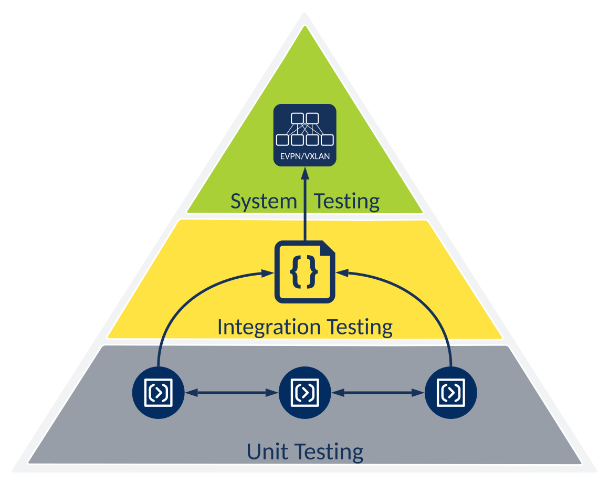
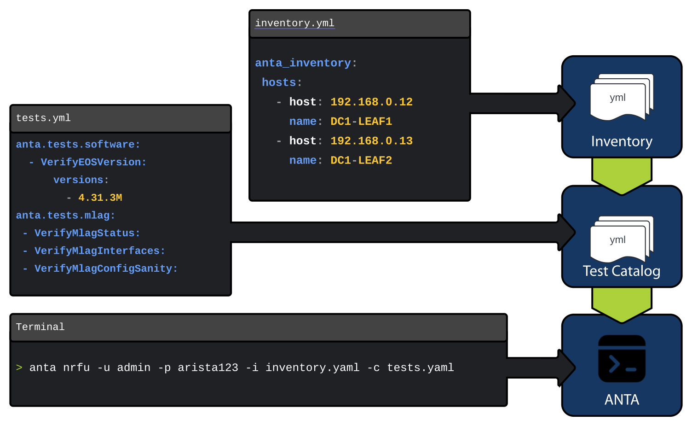

# Getting Started with Network Testing

## Introduction

Designing, developing, and deploying a network fabric through automation can be extremely powerful, but how do you ensure that the product of your work actually does what you designed it to do? In the software world, we write tests. Well, what tests do we write, and where should these tests be run?

This workshop will leverage Arista's open-source testing framework, Arista Network Test Automation (ANTA), to build a network testing strategy.

This section will cover the following:

- Software Testing
- Arista Network Test Automation (ANTA)
- Arista Validated Designs (AVD) Validate State

Each attendee will receive a dedicated virtual lab environment with Git, VS Code, Ansible/AVD, and ANTA installed and ready to use.

Attendees will need the following:

- [x] A laptop
- [x] An account on GitHub
- [x] Familiarity with some of the concepts and tools covered in both the
    - [x] [Automation Fundamentals workshop (Git, VS Code, Jinja/YAML, Ansible)](../git.md)
    - [x] [CI/AVD L2LS](../l2ls/overview.md) or [CI/AVD L3LS EVPN/VXLAN](../l3ls/overview.md) workshops

## Lab Topology

We will be testing against the same topology provided in [CI/AVD L3LS EVPN/VXLAN](../l3ls/overview.md#lab-topology-overview). While this is specific to an L3LS, the ANTA testing framework concepts used throughout this lab applies to any fabric or Arista Validated Design.

## Software Testing

When building, deploying, or operating a network, we consistently go through a degree of testing. Whether that testing is effective or scales with our network is debatable, but we try our best to test our networks. If you've walked through the automation fundamentals labs, you may have learned networks can be represented as code. For this upcoming lab, this code for all intents and purposes, is software and will be tested as such.

We are not going to dive too deep into software testing frameworks, methodologies and techniques in this lab. However, it is important to get familiar with some of the software testing vocabulary. Our focus will be on the fundamental building blocks used in software testing: Unit, Integration, and System Testing.

<div class="grid cards" markdown>

- :fontawesome-brands-unity:{ .lg .middle } **Unit Testing**

    ---

    When testing the most atomic components of a piece of software, think of it as units of code. Test software functions work as intended. For example, the `valid_ip_address()` function actually validates IP address formats and will throw clear messaging if it fails.

- :octicons-git-merge-24:{ .lg .middle } **Integration Testing**

    ---

    Testing the different units of code together as a combined entity, the integration between these units can be validated. For example, all the units of code properly integrate together to generate a valid network configuration.

- :octicons-globe-24:{ .lg .middle } **System Testing**

    ---

    Testing the software as whole, assessing the system's functionality and performance meets expectations. For example, this could be thought of as my software (automation) generates and deploys configuration that builds a working EVPN/VXLAN fabric!

</div>

Let's apply these concepts to our network and furthermore into our network automation. These workshops have focused on using software to define our network configuration using a combination of YAML files, Jinja templates, and Ansible. We can and should test these!

Well good news, all these pieces of the puzzle have been wrapped into Arista Validated Designs (AVD) Ansible collection and it's all tested! The data models, templates, and logic to generate EOS configuration go through hundreds of unit and integration tests.

So what does it mean that AVD has been tested?! At a high level, that means testing ensures:

<div class="grid" markdown>

- AVD `arista.avd.eos_designs` generates valid data models for our configuration generation
- AVD `arista.avd.eos_cli_config_gen` renders `eos_design` data models to produce valid EOS configuration
- AVD filter plugins (like `arista.avd.range_expand`) is tested that both user input and resulting EOS interface ranges are valid

{ width="600" }

</div>

This suite of unit and integration tests result in the AVD Ansible Collection producing valid EOS configuration you can trust to readily deploy to your network!

!!! tip "Testing is the MOST important thing"

    If you have yet to hear it, you certainly will at some point. Testing Arista's Extensible Operating System (EOS) uses the same fundamental building blocks. Hundreds of thousands of tests run against EOS every day!

### Testing the Network

Generating and applying configuration to the network is only half of the problem. We want to test that the physical (or virtual) network is actually behaving as expected. Automated testing frameworks are nothing new to the network industry. Tools like Batfish and Robot are two of the more popular open-source options used in the industry today.

ANTA is similar, but catered to Arista EOS! All these testing frameworks approach the problem slightly differently, but all are trying to test whether a network is doing what it's intended to do. Let's explore some of the differences between these options.

<div class="grid cards" markdown>

- :anta:{ .lg .middle } **ANTA**

    ---

    Arista's open-source automation framework for acceptance testing, supported as a part of Arista Validated Designs (AVD). ANTA, similar to Robot, relies on a test library (or catalog) that instructs ANTA on **what tests** to run against **what set of devices**, **what thresholds** evaluate a pass/fail and deliver a report.

    !!! example "Python/YAML"

    [:octicons-arrow-right-24: Arista Network Test Automation](https://anta.arista.com){ target="_blank" }

- :batfish:{ .lg .middle } **Batfish**

    ---

    An open-source configuration analysis tool entirely based on modeling network operating systems, it relies on predicting network state based on network configuration files before it is deployed to a network. It requires a Batfish server to run the modeling software and evaluate configuration files from that vendor.

    !!! example "Python/Pandas Query"

    [:octicons-arrow-right-24: Batfish](https://batfish.org/){ target="_blank" }

- :simple-robotframework:{ .lg .middle } **Robot Framework**

    ---

    Open-source automation testing framework for test automation and robotic process automation (RPA). Robot relies on a test library that includes a collection of files on **what commands** to run against **what set of network devices**, **how to interpret** those results for pass/fail, and deliver a report.

    !!! example "Python/Robot Syntax"

    [:octicons-arrow-right-24: Robot Framework](https://robotframework.org/){ target="_blank" }

</div>

These testing frameworks offer solutions to the problem of testing network state, either through modeling or direct device interrogation. However, integration with any network operating system still needs work.

## Arista Network Testing Automation (ANTA)

[Arista Network Test Automation (ANTA)](https://anta.arista.com) is a Python framework that automates the testing of your network and natively understands how to interact and leverage the output of any Arista EOS device. In this section, we will explore the key components of ANTA and how to get started.

As we walk through executing ANTA for the first time, there will be references back to ANTA documentation. If you would like to explore any of the topics deeper, visit **[anta.arista.com](https://anta.arista.com)**.

### Components

ANTA is easy to get started with because a lot of functionality is built into the framework upon installation. To begin, you only need to provide two YAML files: one describing the devices you want to test and another specifying the tests to run on those devices.

<div class="grid cards" markdown>

- :fontawesome-brands-unity:{ .lg .middle } **Inventory**

    ---

    The minimum requirements for the [ANTA inventory](https://anta.arista.com/stable/usage-inventory-catalog/#device-inventory-file) include the `host` and `name` of the device.

    ```yaml title="inventory.yml"
    anta_inventory:
      hosts:
      - host: 192.168.0.10 #(1)!
          name: s1-spine1  #(2)!

      - host: 192.168.0.11
          name: s1-spine2

      - host: 192.168.0.12
          name: s1-leaf1

      - host: 192.168.0.13
          name: s1-leaf2
    ```

    1. IP address or hostname
    2. Recommended to use the device hostname, however this can be any string to represent the device

- :fontawesome-brands-unity:{ .lg .middle } **Test Catalog**

    ---

    Instruct ANTA to run a set of tests against a specific set of inventory using an [ANTA Test Catalog](https://anta.arista.com/stable/usage-inventory-catalog/#test-catalog).

    ```yaml title="tests.yml"

    anta.tests.system:
    - VerifyUptime:
        minimum: 86400 #(1)!

    anta.tests.software:
    - VerifyEOSVersion: #(2)!
        versions:
            - 4.31.3M

    anta.tests.mlag: #(3)!
    - VerifyMlagStatus:
    - VerifyMlagInterfaces:
    - VerifyMlagConfigSanity:
    ```

    1. Has the device been up for over 24 hours?
    2. Verifies the device is running one of the allowed EOS versions.
    3. Validate MLAG state is healthy

</div>

### Testing Catalog

The ANTA test catalog has several built-in tests that understand Arista EOS. Pick the tests you want, add them to a file using familiar YAML syntax, and run them against your list of devices!

While the framework gives you a lot upfront, these labs will explore the flexibility in altering the tests for your network, including how custom tests can be written. All these tests can be grouped into some high level classifications:

- **Hardware**: physical hardware state is reporting healthy within user-defined thresholds
- **Software Compliance:** software versions meet user criteria
- **Configuration**: specific features or functions are enabled or disabled
- **Protocol**: configuration results in features or functions are behaving as expected

### Network Ready For Use (NRFU)

Once both the ANTA inventory and test catalog have been defined, ANTA provides the command "Network Ready For Use" or `anta nrfu` to execute the defined tests against the inventory. That's it! This is all it takes to get started with running your first tests against the network.



```bash title="terminal"
anta nrfu -u admin -p arista123 -i inventory.yaml -c tests.yaml table
```


The output of any ANTA test run is straight forward, the test is either a pass, fail, or skipped all together. That's what we want from any testing so we can address those failures.

<div class="grid" markdown>

!!! success "Success"

    The test passed test criteria, this includes user defined thresholds if applicable.

!!! warning "Skipped"

    The test was skipped, because the platform may not support the feature (for example, vEOS does not contain physical temperature sensors)

!!! failure "Failure"

    The test failed the test criteria, this includes user defined thresholds if applicable.

</div>

ANTA is simple in it's most basic form, but like anything there is much more to the framework. You will dive into some of the powerful tools built within ANTA!

## AVD Validate State

If you've completed any of the CI/AVD workshops leading up to this, you'll understand AVD at it's core is a set of data modeling that describe your network. This data model doesn't give us a lot of value until its transformed into something useful, like configuration files or documentation. Even more important, those configuration files need to make it onto our switches! So what else can we use the data models for? Really anything, but what if we could use these to generate the two ANTA components we need: an inventory and a catalog of tests.

If you can describe your network as code (via AVD data models), why shouldn't you be able to drive network testing as code. Simple example, in AVD we define the ports used between the spines and each leaf, we're describing a physical topology.

```yaml title="SITE1_FABRIC.yml" hl_lines="4 5 11 14 15 18"
l3leaf: #(1)!
  defaults:
    platform: cEOS
    uplink_switches: [ s1-spine1, s1-spine2 ] #(2)!
    uplink_interfaces: [ Ethernet2, Ethernet3 ] #(3)!
    ...
  node_groups:
    - group: S1_RACK1
      bgp_as: 65101
      nodes:
        - name: s1-leaf1 #(4)!
          id: 1
          mgmt_ip: 192.168.0.12/24
          uplink_switch_interfaces: [ Ethernet2, Ethernet2 ] #(5)!
        - name: s1-leaf2
          id: 2
          mgmt_ip: 192.168.0.13/24
          uplink_switch_interfaces: [ Ethernet3, Ethernet3 ]
```

1. Everything we're configuring below is in context to our leaf switch
2. Any of these leaf switches defined should up link to `s1-spine1` and `s1-spine2`
3. The leaf should use `Ethernet2` and `Ethernet3` to up link to these spines
4. Defining our leaf `s1-leaf1`
5. Defining the destination port that should be used, in this case `Ethernet2` on `s1-spine1` and `s1-spine2`

Similar to the way AVD converts these data models to Arista EOS configuration, AVD has the ability to transform this data into an ANTA test catalog via the [AVD Validate State](https://avd.sh/en/stable/roles/eos_validate_state/anta_integration.html) role. We understand what we intend the network to looks like, we deploy our configurations to our network, now we want to test our actual network looks this way. Like you run the AVD EOS configuration build and generation, AVD provides the `eos_validate_state`!

```yaml title="playbooks/validate.yml" hl_lines="11 13"
---
- name: Validate Network State
  hosts: "{{ target_hosts }}" #(1)!
  connection: httpapi
  gather_facts: false

  tasks:

    - name: validate states on EOS devices
      ansible.builtin.import_role:
        name: arista.avd.eos_validate_state #(2)!
      vars:
        use_anta: true
```

1. Supply ANTA our inventory via our target hosts
2. This role will convert the AVD data models into an ANTA test catalog

We would prefer to not write tests, we'd rather focus our efforts to configure our network. Running the `eos_validate_state` role will write those tests for you, so you can focus on building your AVD configuration! Just as described in the AVD data model above, AVD has now converted our layer 1 connectivity into a

=== "s1-leaf1"

    ```yaml title="s1-leaf1-catalog.yml" hl_lines="3-6 10-13"
    anta.tests.connectivity:
       - VerifyLLDPNeighbors:
           neighbors:
           - neighbor_device: s1-spine1.atd.lab
           neighbor_port: Ethernet2
           port: Ethernet2
           result_overwrite:
              custom_field: 'Local: Ethernet2 - Remote: s1-spine1 Ethernet2'
       - VerifyLLDPNeighbors:
           neighbors:
           - neighbor_device: s1-spine2.atd.lab
           neighbor_port: Ethernet2
           port: Ethernet3
           result_overwrite:
              custom_field: 'Local: Ethernet3 - Remote: s1-spine2 Ethernet2'
    ```

=== "s1-leaf2"

    ```yaml title="s1-leaf2-catalog.yml" hl_lines="3-6 10-13"
    anta.tests.connectivity:
       - VerifyLLDPNeighbors:
           neighbors:
           - neighbor_device: s1-spine1.atd.lab
           neighbor_port: Ethernet3
           port: Ethernet2
           result_overwrite:
              custom_field: 'Local: Ethernet2 - Remote: s1-spine1 Ethernet3'
       - VerifyLLDPNeighbors:
           neighbors:
           - neighbor_device: s1-spine2.atd.lab
           neighbor_port: Ethernet3
           port: Ethernet3
           result_overwrite:
              custom_field: 'Local: Ethernet3 - Remote: s1-spine2 Ethernet3'
    ```

## Start the Labs

Hopefully you now know a bit more about how ANTA and AVD play a big role in the MOST important thing we commonly neglect, **TESTING**!! Don't stop here, get started with using ANTA in the lab and see it in action!

[Getting Started with ANTA:fontawesome-solid-greater-than:](./anta_validate.md){ .md-button }
