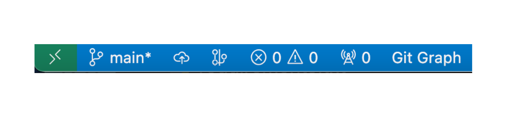
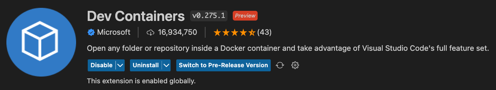

# Welcome to VS Code

{: style="width:130px"}

## What is VS Code?

Visual Studio Code (VS Code), written by Microsoft, is a lightweight but powerful source code editor which runs on your desktop and is available for Windows, macOS and Linux. It comes with built-in support for JavaScript, TypeScript and Node.js and has a rich ecosystem of extensions for other languages and runtime environments (such as C++, C#, Java, Python, PHP, Go, .NET).

VS Code integrates directly with Git and allows Network Engineers to efficiently perform the following tasks:

- Edit Files
- Drag and Drop Files into the Explorer
- Visually Compare File Diffs
- Write & Test Scripts
- Open Terminals for various shells
- Execute various Git commands (such as: status, init, log, commit, switch, add, etc...)
- Connect to Remote Hosts

VS Code is your personal Git Genie making automation workflows effortless. Once you learn to use VS Code, you will wonder why it took so long to get on the bandwagon.

## System Requirements

Visual Studio Code is a small download (< 200 MB) and has a disk footprint of < 500 MB. VS Code is lightweight and should run on today's hardware.

Recommend Hardware:

- 1.6 GHz or faster processor
- 1 GB of RAM

Support Platforms:

- macOS X (10.11+)
- Windows 8.0, 8.1 and 10, 11 (32-bit and 64-bit)
- Linux (Debian): Ubuntu Desktop 16.04, Debian 9
- Linux (Red Hat): Red Hat Enterprise Linux 7, CentOS 7, Fedora 34

## Download & Installation

VS Code downloads for Windows, Linux and Mac can be found [here](https://code.visualstudio.com/download).

## VS Code GUI Walk-through

The four main areas of the VS Code GUI are:

- Activity Bar
- Status Bar
- Editor
- Terminal Window

{: style="width:1000px"}

???+ note
    Your `Activity Bar` may have different icons for the extensions you have installed.

## Extensions

There are tons of extensions to enhance your experience with VS Code. Below is a list of recommended extensions that are commonly used. For a full list of available extensions visit the [VS Code Marketplace](https://marketplace.visualstudio.com/vscode).

- Markdown All-in-One (Yu Zhang)
- YAML (Red Hat)
- Better Jinja (Samuel Colvin)
- Peacock (John Papa)
- Remote - SSH (Microsoft)
- Development Containers (Microsoft)

## Using Git source control in VS Code

Visual Studio Code has integrated source control management (SCM) and includes Git support out-of-the-box. In the previous section we ran all Git commands from the command-line. Now we will use VS Code to perform the same operations.

## Start over with clean slate

Previously we downloaded and created a repository called `samplefiles`. Reset this repository to a directory by removing the hidden sub-directory `.git`.  This will remove any version control settings for the repository.

``` bash
cd /home/coder/project/labfiles/samplefiles
rm -rf .git
```

## The Basics

### Initialize Repository

There are multiple ways to initialize a repository from VS Code. We will explore one of the methods.

First open the folder `/home/coder/project/labfiles/samplefiles` from within the VS Code Explorer.

{: style="width:400px"}

Re-open a new terminal window.

Next click on the `Source Control` icon in the Activity Bar, and then click `Initialize Repository`.

{: style="width:300px"}

This is equivalent to running `git init` from within that directory.

Several things just happened. VS Code gives us a visual representation of the newly created Git repository. The `Source Control` icon now shows a blue dot with a `6`. This indicates six untracked, represented by the capital `U` next to each file.

Also, in the bottom left corner of status bar we can see we are on the `main`* branch.

{: style="width:400px"}

## VS Code Workflow

Use VS Code to perform the following actions.

- Stage files
    - Source Control > Source Control (heading) > click plus icon in the section heading for staging all files
    - (alternatively use the plus icon next to file name to only stage certain files)
- Commit staged files
    - Source Control > Source Control (heading) > Commit button
- Check the log - git log
    - File Explorer > Timeline > click on an event
    - The above isn't quite the same as `git log` command from terminal
- Verify current branches
    - Source Control > Branches
- Create and switch to new branch called `change-usernames`
    - Source Control > Branches > click plus icon
- Update username `arista` to `admin`
    - Use VS Code Replace in files via Search (username arista > username admin)
    - Show file diff via Source Control > click on a file to see its diff
- Stage and commit changes to new branch
- Switch back to `main` branch
    - Source Control > Branches > curved arrow to `Switch to Branch...`
- Merge `change-usernames` into `main`
    - [Command-Palette](https://code.visualstudio.com/docs/getstarted/userinterface#_command-palette) Type in `>git merge`
        - Or Source Control > Source Control (heading) > ... > Branch > Merge Branch
        - Verify files have new names in the `main` branch
- Be a good citizen and clean up old branch
    - Source Control > Branches > right click on branch name > Delete Branch...
- Publish repo to GitHub

## Dev Containers

{: style="width:750px"}

The [Dev Container extension](https://marketplace.visualstudio.com/items?itemName=ms-vscode-remote.remote-containers) allows you to use containers as a development environment. It lets you use a [Docker container](https://www.docker.com/) as a full-featured development environment. Whether you deploy to containers or not, containers make a great development environment because you can:

- Develop with a consistent, easily reproducible toolchain on the same operating system you deploy to.
- Quickly swap between different, separate development environments and safely make updates without worrying about impacting your local machine.
- Make it easy for new team members / contributors to get up and running in a consistent development environment.
- Try out new technologies or clone a copy of a code base without impacting your local setup.

The extension starts (or attaches to) a development container running a well defined tool and runtime stack. Workspace files can be mounted into the container from the local file system, or copied or cloned into it once the container is running. Extensions are installed and run inside the container where they have full access to the tools, platform, and file system.

### Dev Container System Requirements

Local:

- Windows: Docker Desktop 2.0+ on Windows 10 Pro/Enterprise. Windows 10 Home (2004+) requires Docker Desktop 2.2+ and the WSL2 back-end. (Docker Toolbox is not supported.)
- macOS: Docker Desktop 2.0+.
- Linux: Docker CE/EE 18.06+ and Docker Compose 1.21+. (The Ubuntu snap package is not supported.)

Containers:

- x86_64 / ARMv7l (AArch32) / ARMv8l (AArch64) Debian 9+, Ubuntu 16.04+, CentOS / RHEL 7+
- x86_64 Alpine Linux 3.9+

!!! Note
    Docker must be installed on your host for Dev Containers to work.
